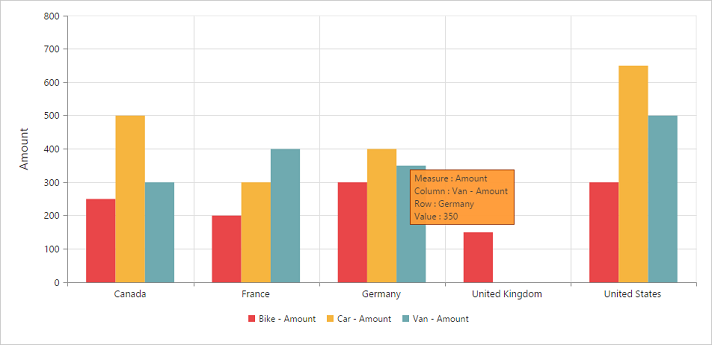
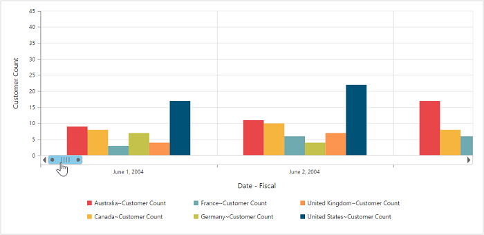

# User interactions

## Tooltip

### Enable tooltips for data points
Tooltips for data points can be enabled by using the **"visible"** of the [`tooltip`](/api/js/ejchart#members:commonseriesoptions-tooltip-visible) property under the **"commonSeriesOptions"** in the pivot chart.


$(function()
{
    $("#PivotChart1").ejPivotChart(
    {
        ....
        commonSeriesOptions:
        {
            //....
            //Enabling tooltip for data points
            tooltip:
            {
                visible: true
            }
        },
        //....
    });
});


### Tooltip template
HTML elements can be displayed in the tooltip by using the [`template`](/api/js/ejchart#members:commonseriesoptions-tooltip-template) option. The template option takes the value of the “id” attribute from the HTML element. You can use the **#point.x#** and **#point.y#** as place holders in the HTML element to display the X and Y values of the corresponding data points.



<body>
    

    

        <label id="cc1">In </label>
        <label id="fyvalue">&nbsp;#point.x# </label>
        <label id="cc2">, customer count is</label>
        <label id="ccvalue">&nbsp;#point.y# </label>
    

    
</body>



### Tooltip customization
By using the [`fill`](/api/js/ejchart#members:commonseriesoptions-tooltip-fill) and [`border`](/api/js/ejchart#members:commonseriesoptions-tooltip-border) properties of the tooltip, you can customize its background color, border color, and border width.



$(function()
{
    $("#PivotChart1").ejPivotChart(
    {
        ....
        commonSeriesOptions:
        {
            //....
            tooltip:
            {
                visible: true,
                //Customize tooltip background color and border
                fill: '#FF9933',
                border:
                {
                    width: 1,
                    color: "#993300"
                }
            }
        },
        //....
    });
});



### Tooltip with rounded corners
The tooltip properties [`rx`](/api/js/ejchart#members:commonseriesoptions-tooltip-rx) and [`ry`](/api/js/ejchart#members:commonseriesoptions-tooltip-ry) are used to customize its corner radius.



$(function()
{
    $("#PivotChart1").ejPivotChart(
    {
        ....
        commonSeriesOptions:
        {
            //....
            tooltip:
            {
                visible: true,
                //Customize the corner radius of the tooltip rectangle
                rx: "20",
                ry: "20"
            }
        },
        //....
    });
});



## Zooming and panning

### Enable zooming

There are two ways to zoom the chart:

* When [`zooming.enable`](/api/js/ejpivotchart#members:zooming-enable) is set to true, you can zoom the chart by using the rubber band selection.
* When the [`zooming.enableMouseWheel`](/api/js/ejchart#members:zooming-enablemousewheel) is set to true, you can zoom the chart by scrolling the mouse wheel.



$(function()
{
    $("#PivotChart1").ejPivotChart(
    {
        ....
        //Enable zooming in Chart
        zooming:
        {
            enable: true
        }
        //....
    });
});



After zooming the chart, a zooming toolbar will appear with options to *zoom, pan, and reset*. Selecting the **“Pan”** will allow to view the chart and selecting **“Reset”** will reset the zoomed chart.

### Types of zooming
You can zoom a particular axis, like the horizontal axis or the vertical axis or both axis by using the [`type`](/api/js/ejchart#members:zooming-type) when zooming.

N> By default, the value for the `type` when zooming is “x,y” (indicating both axes) in the pivot chart.



$(function()
{
    $("#PivotChart1").ejPivotChart(
    {
        ....
        //Enable zooming in Chart
        zooming:
        {
            enable: true,
            //Enable horizontal zooming
            type: 'x'
        }
        //....
    });
});


### Enable scrollbar

* When [`enableScrollbar`](/api/js/ejpivotchart#members:zooming-enablescrollbar) under [`zooming`](/api/js/ejpivotchart#members:zooming) is set to true, the pivot chart is rendered along with scroll bars for a precise view of the data. The data can be viewed by using the scroll bar or by scrolling the mouse wheel.



$(function()
{
    $("#PivotChart1").ejPivotChart(
    {
        ....
        //Enable zooming in Chart
        zooming:
        {
            enableScrollbar: true
        }
        //....
    });
});



## Marker and crosshair

### Marker shape customization
In the pivot chart, you can customize the marker [`shape`](/api/js/ejchart#members:series-marker-shape) with the following symbols:

* Rectangle
* Circle
* Cross
* Diamond
* Pentagon
* Hexagon
* Star
* Ellipse
* Triangle



$(function()
{
    $("#PivotChart1").ejPivotChart(
    {
        ....
        commonSeriesOptions:
        {
            type: ej.PivotChart.ChartTypes.Line
        },
        seriesRendering: "onSeriesRender"
    });
});

function onSeriesRender(args)
{
    for (var seriescount = 0; seriescount < this.model.series.length; seriescount++)
    this.model.series[seriescount].marker.shape = "Triangle";
}



### Enable crosshair and crosshair label
The crosshair allows you to view values at mouse position or touch contact point. The crosshair can be enabled by using the [`visible`](/api/js/ejchart#members:crosshair-visible) in the [`crosshair`](/api/js/ejchart#members:crosshair) property. The crosshair label can be enabled by using the **“visible”** in the [`crosshairLabel`](/api/js/ejchart#members:primaryxaxis-crosshairlabel) property within its corresponding axis.



$(function()
{
    $("#PivotChart1").ejPivotChart(
    {
        //...
        //Initializing Crosshair
        crosshair:
        {
            visible: true
        },
        primaryXAxis:
        {
            //Enable Crosshair Label in X-Axis
            crosshairLabel:
            {
                visible: true
            }
        },
        primaryYAxis:
        {
            //Enable Crosshair Label to Y-Axis
            crosshairLabel:
            {
                visible: true
            }
        },
    });
});



### Crosshair line and label customization
By using the [`line`](/api/js/ejchart#members:crosshair-line) property of the crosshair, you can customize its line color and width. By using `fill` and `border` properties of the [`crosshairLabel`](/api/js/ejchart#members:primaryxaxis-crosshairlabel) in its corresponding axis, you can customize its background color, border color, and border width.



$(function()
{
    $("#PivotChart1").ejPivotChart(
    {
        //...
        //Initializing Crosshair
        crosshair:
        {
            visible: true,
            //Customizing the crosshair line
            line:
            {
                color: 'gray',
                width: 2
            }
        },
        primaryXAxis:
        {
            //Enable Crosshair Label in X-Axis
            crosshairLabel:
            {
                visible: true,
                //Customizing the crosshair label background color and border
                fill: "red",
                border:
                {
                    color: "green",
                    width: 2
                }
            }
        },
        primaryYAxis:
        {
            //Enable Crosshair Label in Y-Axis
            crosshairLabel:
            {
                visible: true
            }
        },
    });
});



## Trackball

### Enable trackball
The trackball can be enabled by setting both - ['visible'](/api/js/ejchart#members:crosshair-visible) of the crosshair to true and [`type`](/api/js/ejchart#members:crosshair-type) of the crosshair to **“trackball”.** The default value of type is **“crosshair”.**



$(function()
{
    $("#PivotChart1").ejPivotChart(
    {
        //...
        //Initializing Crosshair
        crosshair:
        {
            visible: true,
            //Change crosshair type to trackball
            type: 'trackball'
        },
    });
});



### Trackball marker and line customization
The shape and size of the trackball marker can be customized by using the [`shape`](/api/js/ejchart#members:commonseriesoptions-marker-shape) and [`size`](/api/js/ejchart#members:crosshair-marker-size) options of the crosshair marker. The color and width of the trackball line can be customized by using the **“line”** in the crosshair.



$(function()
{
    $("#PivotChart1").ejPivotChart(
    {
        //...
        //Initializing Crosshair
        crosshair:
        {
            visible: true,
            //Change crosshair type to trackball
            type: 'trackball',
            //Customize the trackball line color and width
            line:
            {
                color: '#800000',
                width: 2
            },
            //Customize the trackball marker shape, size and visibility
            marker:
            {
                shape: 'pentagon',
                size:
                {
                    height: 9,
                    width: 9
                },
                visible: true
            }
        },
    });
});



## Highlight
The pivot chart provides highlighting support for the series and data points by hovering the pointer. To enable highlighting, set the **“enable”** property to true in the [`highlightsettings`](/api/js/ejchart#members:series-highlightsettings-enable) of the series.



$(function()
{
    $("#PivotChart1").ejPivotChart(
    {
        ....
        commonSeriesOptions:
        {
            type: ej.PivotChart.ChartTypes.Column
        },
        seriesRendering: "onSeriesRender"
    });
});

function onSeriesRender(args)
{
    for (var seriescount = 0; seriescount < this.model.series.length; seriescount++)
    this.model.series[seriescount].highlightSettings.enable = true
}



### Highlight mode
You can set three different modes for highlighting data points and series by using the [`mode`](/api/js/ejchart#members:series-highlightsettings-mode) property of the [`highlightsettings`](/api/js/ejchart#members:series-highlightsettings).

* series
* points
* cluster



$(function()
{
    $("#PivotChart1").ejPivotChart(
    {
        ....
        commonSeriesOptions:
        {
            type: ej.PivotChart.ChartTypes.Column
        },
        seriesRendering: "onSeriesRender"
    });
});

function onSeriesRender(args)
{
    for (var seriescount = 0; seriescount < this.model.series.length; seriescount++)
    {
        this.model.series[seriescount].highlightSettings.enable = true;
        this.model.series[seriescount].highlightSettings.mode = "series";
    }
}



### Customize the highlight styles
To customize the highlighted series, use the [`border.color`](/api/js/ejchart#members:series-highlightsettings-border-color), [`border.width`](/api/js/ejchart#members:series-highlightsettings-border-width), and [`opacity`](/api/js/ejchart#members:series-highlightsettings-opacity)
 options in the [`highlightSettings`](/api/js/ejchart#members:series-highlightsettings) property.



$(function()
{
    $("#PivotChart1").ejPivotChart(
    {
        ....
        commonSeriesOptions:
        {
            type: ej.PivotChart.ChartTypes.Column
        },
        seriesRendering: "onSeriesRender"
    });
});

function onSeriesRender(args)
{
    for (var seriescount = 0; seriescount < this.model.series.length; seriescount++)
    {
        this.model.series[seriescount].highlightSettings.enable = true;
        this.model.series[seriescount].highlightSettings.opacity = "0.5";
        this.model.series[seriescount].highlightSettings.border.width = "1.5";
        this.model.series[seriescount].highlightSettings.border.color = "red";
    }
}



### Patterns to highlight
The pivot chart provides pattern support for highlighting the data by setting an appropriate value to the [`pattern`](/api/js/ejchart#members:series-highlightsettings-pattern) property of the [`highlightSettings`](/api/js/ejchart#members:series-highlightsettings). The different types of highlight patterns are as follows:

* chessboard
* crosshatch
* dots
* packman
* grid
* turquoise
* star
* triangle
* circle
* tile
* horizontalDash
* verticalDash
* rectangle
* box
* verticalStripe
* horizontalStripe
* bubble
* diagonalBackward
* diagonalForward



$(function()
{
    $("#PivotChart1").ejPivotChart(
    {
        ....
        commonSeriesOptions:
        {
            type: ej.PivotChart.ChartTypes.Column
        },
        seriesRendering: "onSeriesRender"
    });
});

function onSeriesRender(args)
{
    for (var seriescount = 0; seriescount < this.model.series.length; seriescount++)
    {
        this.model.series[seriescount].highlightSettings.enable = true;
        this.model.series[seriescount].highlightSettings.pattern = "chessboard";
    }
}



## Selection
The pivot chart provides selection support for the series and data points by clicking the mouse. To enable selection, set the **“enable”** property to true in the [`selectionSettings`](/api/js/ejchart#members:series-selectionsettings-enable) of the series.



$(function()
{
    $("#PivotChart1").ejPivotChart(
    {
        ....
        commonSeriesOptions:
        {
            type: ej.PivotChart.ChartTypes.Column
        },
        seriesRendering: "onSeriesRender"
    });
});

function onSeriesRender(args)
{
    for (var seriescount = 0; seriescount < this.model.series.length; seriescount++)
    {
        this.model.series[seriescount].selectionSettings.enable = true;
    }
}



### Selection mode

You can set three different selection modes for highlighting the data points and series by using the [`mode`](/api/js/ejchart#members:series-selectionsettings-mode) property of the [`selectionSettings`](/api/js/ejchart#members:series-selectionsettings).

* series
* points
* cluster



$(function()
{
    $("#PivotChart1").ejPivotChart(
    {
        ....
        commonSeriesOptions:
        {
            type: ej.PivotChart.ChartTypes.Column
        },
        seriesRendering: "onSeriesRender"
    });
});

function onSeriesRender(args)
{
    for (var seriescount = 0; seriescount < this.model.series.length; seriescount++)
    {
        this.model.series[seriescount].selectionSettings.enable = true;
        this.model.series[seriescount].selectionSettings.mode = "series";
    }
}



### Customize the selection styles
To customize the selection styles, use the [`border.color`](/api/js/ejchart#members:commonseriesoptions-selectionsettings-border-color), [`border.width`](/api/js/ejchart#members:commonseriesoptions-selectionsettings-border-width), and [`opacity`](/api/js/ejchart#members:commonseriesoptions-selectionsettings-opacity) options in the [`selectionSettings`](/api/js/ejchart#members:series-selectionsettings).



$(function()
{
    $("#PivotChart1").ejPivotChart(
    {
        ....
        commonSeriesOptions:
        {
            type: ej.PivotChart.ChartTypes.Column
        },
        seriesRendering: "onSeriesRender"
    });
});

function onSeriesRender(args)
{
    for (var seriescount = 0; seriescount < this.model.series.length; seriescount++)
    {
        this.model.series[seriescount].selectionSettings.enable = true;
        this.model.series[seriescount].selectionSettings.border.width = "1.5";
        this.model.series[seriescount].selectionSettings.border.color = "red";
    }
}



### Patterns for selection
The pivot chart provides pattern support for selecting data by setting an appropriate value to the [`pattern`](/api/js/ejchart#members:series-selectionsettings-pattern) property of the [`selectionSettings`](/api/js/ejchart#members:series-selectionsettings). The different types of selection patterns are as follows:

* chessboard
* crosshatch
* dots
* packman
* grid
* turquoise
* star
* triangle
* circle
* tile
* horizontalDash
* verticalDash
* rectangle
* box
* verticalStripe
* horizontalStripe
* bubble
* diagonalBackward
* diagonalForward



$(function()
{
    $("#PivotChart1").ejPivotChart(
    {
        ....
        commonSeriesOptions:
        {
            type: ej.PivotChart.ChartTypes.Column
        },
        seriesRendering: "onSeriesRender"
    });
});

function onSeriesRender(args)
{
    for (var seriescount = 0; seriescount < this.model.series.length; seriescount++)
    {
        this.model.series[seriescount].selectionSettings.enable = true;
        this.model.series[seriescount].selectionSettings.pattern = "chessboard";
    }
}



