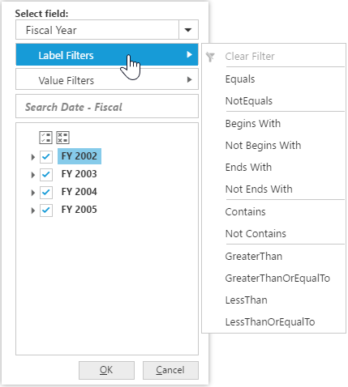
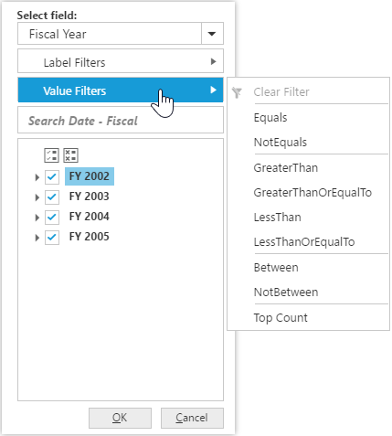

# Advanced Filtering & Sorting

N> These features are applicable only for OLAP datasource.

## Sorting

Sorting provides an option to sort the members of a hierarchy either in ascending or descending order. You can enable sorting option in PivotClient by setting the [`enableAdvancedFilter`](/api/js/ejpivotclient#members:enableAdvancedFilter) property under [`dataSource`] to true.

I> This feature is applicable only for OLAP datasource bound from client-side. 





## Label Filtering

Label filtering provides an option to filter the members of a hierarchy purely based on their caption. 

### Client Mode

You can enable label filtering option in PivotClient by setting the [`enableAdvancedFilter`](/api/js/ejpivotclient#members:enableAdvancedFilter) property under [`dataSource`] to true.





### Server Mode

In server mode, you can enable label filtering option in PivotClient by setting the [`enableAdvancedFilter`](/api/js/ejpivotclient#members:enableAdvancedFilter) property to true.





## Value Filtering

Value filtering provides an option to filter members based on the total values of the appropriate measure between the members of the level. 

### Client Mode

You can enable the value filtering option in PivotClient by setting the [`enableAdvancedFilter`](/api/js/ejpivotclient#members:enableAdvancedFilter) property under [`dataSource`] to true .





### Server Mode

In server mode, you can enable the value filtering option in PivotClient by setting the [`enableAdvancedFilter`](/api/js/ejpivotclient#members:enableAdvancedFilter) property to true





