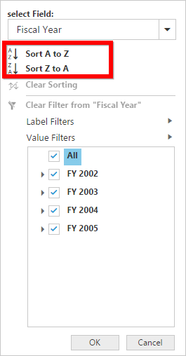
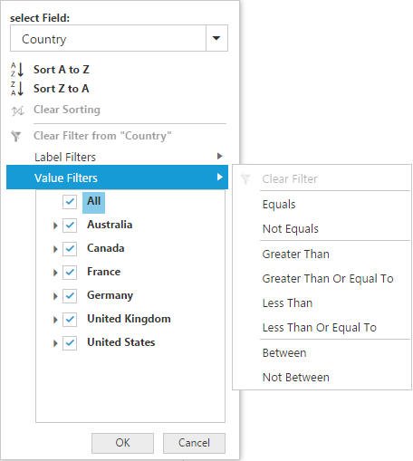

# Advanced filtering and sorting

It allows you to filter and sort the field members in the pivot client.

### Client mode

In client mode, you can enable the advanced filtering and sorting option in the pivot client by setting the [`enableAdvancedFilter`](/api/js/ejpivotclient#members:datasource-enableadvancedfilter) property under the [`dataSource`](/api/js/ejpivotclient#members:datasource) to true.





### Server mode

In server mode, you can enable the advanced filtering and sorting option in the pivot client by setting the [`enableAdvancedFilter`](/api/js/ejpivotclient#members:enableadvancedfilter) property to true.





## Sorting

Sorting provides an option to sort the members of the field either in the ascending or descending order.

## Label filtering

The label filtering provides an option to filter the members of the field purely based on their caption.

## Value filtering

The value filtering provides an option to filter the members based on total values of the appropriate measure between the members of the level.

