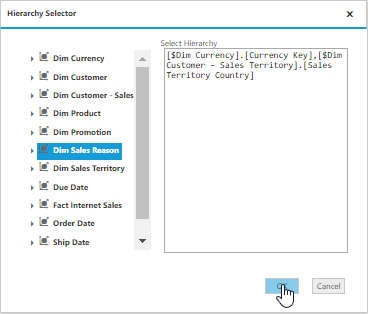
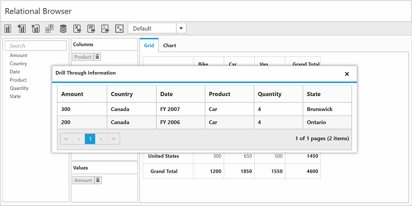

# Drill Through

## OLAP

The drill-through retrieves raw items that are used to create a specified cell of the pivot grid. To enable drill-through support, set [`enableDrillThrough`](/api/js/ejpivotclient#members:enabledrillthrough) property to true. Raw items are obtained through the [`drillThrough`](/api/js/ejpivotclient#events:drillthrough) event, using which user can bind them to an external widget for precise view.

N> The drill-through is supported in the pivot grid only when you configure and enable the drill-through action at the cube.

On clicking any value cell, the "Drill Through Information" dialog will be opened. It consists of grid with data which are associated with the measure values of the clicked value cell. In this example, the measure behind the respective cell is “Sales Amount” and the values of the dimensions which are associated with this measure are alone displayed in the grid.

On clicking the "Hierarchy Selector" button which is displayed below the Grid, the "Hierarchy Selector" dialog will be opened. It consists of dimensions that are associated with the measure of clicked value cell. In this example, the measure behind the respective cell is “Sales Amount” and the dimensions associated with this measure are alone displayed in the dialog.

By dragging and dropping the respective hierarchies and click “OK”, the drill through MDX query will be framed and executed internally, and it provides the raw items back through the "drillThrough" event. In this example, the obtained raw items were bound to the ejGrid widget. Please refer the following code sample and screenshot:

## Client mode



<!--Create a tag which acts as a container for PivotClient-->



## Server Mode



<!--Create a tag which acts as a container for PivotClient-->



When the pivot client is rendered in the server mode, the following service methods should be added to WCF/WebAPI for the drill through operation.

For WebAPI controller, the following methods should be added.



[System.Web.Http.ActionName("DrillThroughHierarchies")]
[System.Web.Http.HttpPost]
public string DrillThroughHierarchies(Dictionary<string, object> jsonResult)
{
    OlapDataManager DataManager = new OlapDataManager(connectionString);
    DataManager.SetCurrentReport(OLAPUTILS.Utils.DeserializeOlapReport(jsonResult["currentReport"].ToString()));
    return pivotClientHelper.DrillthroughHierarchies(DataManager, jsonResult["layout"].ToString(), jsonResult["cellPos"].ToString());
}

[System.Web.Http.ActionName("DrillThroughDataTable")]
[System.Web.Http.HttpPost]
public Dictionary<string, object> DrillThroughDataTable(Dictionary<string, object> jsonResult)
{
    OlapDataManager DataManager = new OlapDataManager(connectionString);
    DataManager.SetCurrentReport(OLAPUTILS.Utils.DeserializeOlapReport(jsonResult["currentReport"].ToString()));
    return pivotClientHelper.DrillthroughDataTable(DataManager, jsonResult["layout"].ToString(), jsonResult["cellPos"].ToString(), jsonResult["selector"].ToString());
}



For WCF service, the following methods should be added.



public string DrillThroughHierarchies(string currentReport, string layout, string cellPos)
{
    OlapDataManager DataManager = new OlapDataManager(connectionString);
    DataManager.SetCurrentReport(OLAPUTILS.Utils.DeserializeOlapReport(currentReport));
    return pivotClientHelper.DrillthroughHierarchies(DataManager, layout, cellPos);
}

public Dictionary<string, object> DrillThroughDataTable(string currentReport, string layout, string cellPos, string selector)
{
    OlapDataManager DataManager = new OlapDataManager(connectionString);
    DataManager.SetCurrentReport(OLAPUTILS.Utils.DeserializeOlapReport(currentReport));
    return pivotClientHelper.DrillthroughDataTable(DataManager, layout, cellPos, selector);
}



## Relational

To enable drill-through support, set the [`enableDrillThrough`](/api/js/ejpivotclient#members:enabledrillthrough) property to true. Raw items are obtained through the [`drillThrough`](/api/js/ejpivotclient#events:drillthrough) event.





