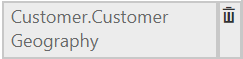
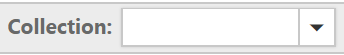

# How To

## Public Methods

### Refresh the PivotClient with specified page number
The [`refreshPagedPivotClient`](../api/ejpivotclient#methods:refreshpagedpivotclient) method is used to re-render the pivot client component with given axis and page number.





### Refresh the PivotClient with modified report
The [`refreshControl`](../api/ejpivotclient#methods:refreshcontrol) method is used to re-render the pivot client control with the report at that instant.





### Generating JSON Records to render the control
The [`generateJSON`](../api/ejpivotclient#methods:generatejson) method is used to render the pivot chart and pivot grid controls in pivot client with the JSON data provided.





### Explicit asynchronous invoke
The [`doAjaxPost`](../api/ejpivotclient#methods:doajaxpost) method is used to perform an asynchronous HTTP (AJAX) request.





### Destroying the object of PivotClient
The [`destroy`](../api/ejpivotclient#methods:destroy) method is used to destroy the pivot client widget all events bound using this._on will be unbind automatically and bring the control to pre-init state.





### Getting JSON records from control object
The [`getJSONRecords`](../api/ejpivotclient#methods:getjsonrecords) method is used to return the JSON records formed to render the control.





### Setting JSON records to control object
The [`setJSONRecords`](../api/ejpivotclient#methods:setjsonrecords) method is used to set the JSON records formed to render the control to a property.





### Refresh the PivotClient with paging
The [`refreshPagedPivotClientSuccess`](../api/ejpivotclient#methods:refreshpagedpivotclientsuccess) method is used to update the PivotClient component with the JSON data fetched from the service on navigating between pages.





### Getting active tab from PivotClient
The [`getActiveTab`](../api/ejpivotclient#methods:getactivetab) method is used to return the control tab string that displays currently in pivot client.




## Events

### Triggering event before saving the Reports
The [`saveReport`](../api/ejpivotclient#events:savereport) event is triggered to save the current collection of reports.





### Triggering event before fetching the Report from database
The [`fetchReport`](../api/ejpivotclient#events:fetchreport) event is triggered before fetching the report collection from storage.





### Triggering event on value cell click
The [`valueCellHyperlinkClick`](../api/ejpivotclient#events:valuecellhyperlinkclick) event is triggered on clicking any value cell in pivot grid.





### Triggering event on row header click
The [`rowHeaderHyperlinkClick`](../api/ejpivotclient#events:rowheaderhyperlinkclick) event is triggered on clicking any row header cell in pivot grid.





### Triggering event on column header click
The [`columnHeaderHyperlinkClick`](../api/ejpivotclient#events:columnheaderhyperlinkclick) event is triggered on clicking any column header cell in pivot grid.





### Triggering event on summary cell click
The [`summaryCellHyperlinkClick`](../api/ejpivotclient#events:summarycellhyperlinkclick) event is triggered on clicking any summary cell in pivot grid.





### Triggering event on cell right click in PivotGrid
The [`cellContext`](../api/ejpivotclient#events:cellcontext) event is triggered when right click on any cell in the pivot grid.





### Triggering event before selecting the cells in PivotGrid
The [`cellSelection`](../api/ejpivotclient#events:cellselection) event is triggered when select/click any of the cell in the pivot grid.





### Triggering event before editing the cell in PivotGrid
The [`cellEdit`](../api/ejpivotclient#events:celledit) event is triggered when any of the value cell edited in the pivot grid.





### Triggering event on cell double click in PivotGrid
The [`cellDoubleClick`](../api/ejpivotclient#events:celldoubleclick) event is triggered when double click on any of the cell in the pivot grid.





### Triggering event on point region click in PivotChart
The [`pointRegionClick`](../api/ejpivotclient#events:celldoubleclick) event is triggered when clicking on any Chart series points in the pivot chart.





### Triggering event before rendering of axes lables in PivotChart
The [`axesLabelRendering`](../api/ejpivotclient#events:axeslabelrendering) event is triggered before Chart label rendering in the pivot chart.





### Invoking event in client-side after service invoke
The [`afterServiceInvoke`](../api/ejpivotclient#events:afterserviceinvoke) event is triggered when it is reached client-side after any AJAX request.





### Invoking event in client-side before service invoke
The [`beforeServiceInvoke`](../api/ejpivotclient#events:beforeserviceinvoke) event is triggered before any AJAX request is passed from client-side to service methods.





### Triggering event before exporting
The [`beforeExport`](../api/ejpivotclient#events:beforeexport) event is triggered before exporting the control.





### Triggering event after performing drill operation in PivotGrid
The [`gridDrillSuccess`](../api/ejpivotclient#events:griddrillsuccess) event is triggered on performing drill up/down on row/columns headers.





### Triggering event after performing drill operation in PivotChart
The [`chartDrillSuccess`](../api/ejpivotclient#events:chartdrillsuccess) event is triggered on performing drill operation on Chart series.





### Triggering event after performing drill operation in PivotTreeMap
The [`treeMapDrillSuccess`](../api/ejpivotclient#events:treemapdrillsuccess) event is triggered on performing drill operation on TreeMap.





### Triggering event before the PivotSchemaDesigner loaded
The [`schemaLoad`](../api/ejpivotclient#events:schemaload) event is triggered before rendering the PivotSchemaDesigner.





### Triggering event before the PivotTreeMap loaded
The [`treeMapLoad`](../api/ejpivotclient#events:treemapload) event is triggered before rendering the pivot treemap.





### Triggering event before the PivotChart loaded
The [`chartLoad`](../api/ejpivotclient#events:chartload) event is triggered before rendering the pivot chart.





### Triggering event before the PivotClient loaded
The [`load`](../api/ejpivotclient#events:load) event is triggered while we initiate loading of the widget.





## Members

### Grid Layout in PivotClient
The [`gridLayout`](../api/ejpivotclient#members:gridlayout) is used to set the summary layout for pivot grid OLAP server-end. Following are the ways in which summary can be positioned: normal summary (bottom), top summary, no summary and excel-like summary.





### Showing Unique Name on Pivot Button
The [`showUniqueNameOnPivotButton`](../api/ejpivotclient#members:showuniquenameonpivotbutton) property  allows you to show unique name on pivot button for OLAP datasource.





### Showing Report Collection in toolbar
The [`showReportCollection`](../api/ejpivotclient#members:showreportcollection) property allows you to load the saved report collection from the database and show it in Toolbar.





## Setting Custom Name to Service Methods
The [`serviceMethodSettings`](/api/js/ejpivotclient#members:servicemethodsettings) allows you to set the custom name for the methods in WebAPI/WCF, communicated during AJAX post.

### Common Service Methods to OLAP and Relational datasource

| Service Methods | Description |
|---|---|
|[initialize](/api/js/ejpivotclient#members:servicemethodsettings-initialize)|It fetches the data required to initialize the control.|
|[nodeDropped](/api/js/ejpivotclient#members:servicemethodsettings-nodedropped)|It fetches the data required to render the control on performing node drop action.|
|[toolbarServices](/api/js/ejpivotclient#members:servicemethodsettings-toolbarservices)|It fetches the data required to render the control on performing toolbar operations.|
|[saveReport](/api/js/ejpivotclient#members:servicemethodsettings-savereport)|It saves the current report to database with the specified name.|
|[exportPivotClient](/api/js/ejpivotclient#members:servicemethodsettings-exportpivotclient)|It exports the PivotGrid or PivotChart or both to the selected format.|
|[fetchReportList](/api/js/ejpivotclient#members:servicemethodsettings-fetchreportlist)|It fetches the list of names of reports stored in database.|
|[loadReport](/api/js/ejpivotclient#members:servicemethodsettings-loadreport)|It loads the report with specified name from the database to the control.|
|[filterElement](/api/js/ejpivotclient#members:servicemethodsettings-filterelement)|It fetches the filtered data required to render the control after performing filtering.|

### OLAP

| Service Methods | Description |
|---|---|
|[removeSplitButton](/api/js/ejpivotclient#members:servicemethodsettings-removesplitbutton)|It fetches the drilled data required to render the PivotChart on removing an item from report.|
|[fetchMemberTreeNodes](/api/js/ejpivotclient#members:servicemethodsettings-fetchmembertreenodes)|It fetches the details of the members to render the member editor dialog.|
|[cubeChanged](/api/js/ejpivotclient#members:servicemethodsettings-cubechanged)|It fetches the data required to render the control on changing the cube.|
|[measureGroupChanged](/api/js/ejpivotclient#members:servicemethodsettings-measuregroupchanged)|It fetches the data required to render the control on changing the measure group.|
|[memberExpand](/api/js/ejpivotclient#members:servicemethodsettings-memberexpand)|It fetches the children nodes on expanding a node in Member Editor.|
|[updateReport](/api/js/ejpivotclient#members:servicemethodsettings-updatereport)|It updates the report in server side.|
|[exportPivotClient](/api/js/ejpivotclient#members:servicemethodsettings-exportpivotclient)|It exports the PivotGrid or PivotChart or both with OLAP data to the selected format.|
|[mdxQuery](/api/js/ejpivotclient#members:servicemethodsettings-mdxquery)|It retrieves the MDX query formed to fetch the data at that instant.|
|[toggleAxis](/api/js/ejpivotclient#members:servicemethodsettings-toggleaxis)|It fetches the data after interchanging the elements in row and column axes.|
|[paging](/api/js/ejpivotclient#members:servicemethodsettings-paging)|It fetches the data on navigating between pages in PivotClient with OLAP data.|
|[drillThroughHierarchies](/api/js/ejpivotgrid#members:servicemethodsettings-drillthroughhierarchies)|It is responsible for performing drill through operation.|
|[drillThroughDataTable](/api/js/ejpivotgrid#members:servicemethodsettings-drillthroughdatatable)|It is responsible for performing drill through operation in data table.|
|[calculatedMember](/api/js/ejpivotgrid#members:servicemethodsettings-calculatedmember)|It is used for updating report with calculated member.|

