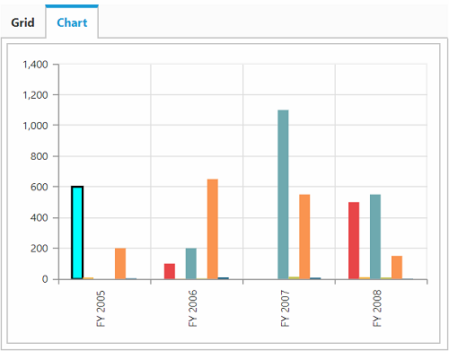
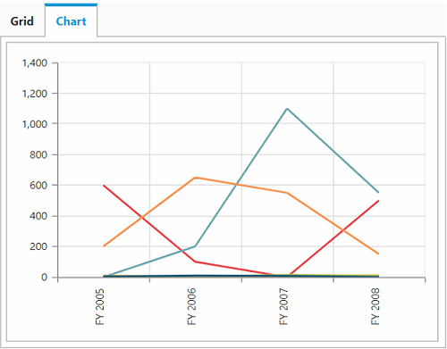

# How to

## Public methods

### Refresh the pivot client with specified page number
The [`refreshPagedPivotClient`](/api/js/ejpivotclient#methods:refreshpagedpivotclient) method is used to re-render the pivot client component with the given axis and page number.





### Refresh the pivot client with modified report
The [`refreshControl`](/api/js/ejpivotclient#methods:refreshcontrol) method is used to re-render the pivot client control with the report at that instant.





### Generating JSON records to render the control
The [`generateJSON`](/api/js/ejpivotclient#methods:generatejson) method is used to render the pivot chart and pivot grid controls in the pivot client with the provided JSON data.





### Explicit asynchronous invoke
The [`doAjaxPost`](/api/js/ejpivotclient#methods:doajaxpost) method is used to perform an asynchronous HTTP (AJAX) request.





### Destroying the object of pivot client
The [`destroy`](/api/js/ejpivotclient#methods:destroy) method is used to destroy the pivot client widget associated events bound using "this._on" and bring the control to pre-init state.





### Getting JSON records from control object
The [`getJSONRecords`](/api/js/ejpivotclient#methods:getjsonrecords) method is used to return the JSON records that is formed to render the control.





### Setting JSON records to control object
The [`setJSONRecords`](/api/js/ejpivotclient#methods:setjsonrecords) method is used to set the JSON records that are formed to render the control to a property.





### Refresh the pivot client with paging
The [`refreshPagedPivotClientSuccess`](/api/js/ejpivotclient#methods:refreshpagedpivotclientsuccess) method is used to update the pivot client component with the JSON data that is fetched from the service while navigating between pages.





### Getting active tab from pivot client
The [`getActiveTab`](/api/js/ejpivotclient#methods:getactivetab) method is used to return the control tab string that displays currently in the pivot client.




### Getting the current OLAP report
You can get the current OLAP report along with axis information using the [`getOlapReport`](/api/js/ejpivotclient#methods:getolapreport) method.





### Setting the OLAP report
You can set the OLAP report along with axis information using the [`setOlapReport`](/api/js/ejpivotclient#methods:setolapreport) method.





### Explicit asynchronous post

The [`doPostBack`](/api/js/ejpivotclient#methods:dopostback) method is used to perform an asynchronous HTTP (AJAX) post operation.




## Events

### Triggering event before saving the reports
The [`saveReport`](/api/js/ejpivotclient#events:savereport) event is triggered to save the current collection of reports.





### Triggering event before fetching the report from database
The [`fetchReport`](/api/js/ejpivotclient#events:fetchreport) event is triggered before fetching the report collection from the storage.





### Triggering event on value cell click
The [`valueCellHyperlinkClick`](/api/js/ejpivotclient#events:valuecellhyperlinkclick) event is triggered when you click any value cell in the pivot grid.





### Triggering event on row header click
The [`rowHeaderHyperlinkClick`](/api/js/ejpivotclient#events:rowheaderhyperlinkclick) event is triggered when you click any row header cell in the pivot grid.





### Triggering event on column header click
The [`columnHeaderHyperlinkClick`](/api/js/ejpivotclient#events:columnheaderhyperlinkclick) event is triggered when you click any column header cell in the pivot grid.





### Triggering event on summary cell click
The [`summaryCellHyperlinkClick`](/api/js/ejpivotclient#events:summarycellhyperlinkclick) event is triggered when you click any summary cell in the pivot grid.





### Triggering event on cell right-click in pivot grid
The [`cellContext`](/api/js/ejpivotclient#events:cellcontext) event is triggered when you right-click any cell in the pivot grid.





### Triggering event before selecting the cells in pivot grid
The [`cellSelection`](/api/js/ejpivotclient#events:cellselection) event is triggered when you select/click any cell in the pivot grid.





### Triggering event before editing the cell in pivot grid
The [`cellEdit`](/api/js/ejpivotclient#events:celledit) event is triggered when the value cell is edited in the pivot grid.





### Triggering event on cell double-click in pivot grid
The [`cellDoubleClick`](/api/js/ejpivotclient#events:celldoubleclick) event is triggered when you double-click any cell in the pivot grid. It can be enabled through the [`enableCellDoubleClick`](/api/js/ejpivotclient#members:enablecelldoubleclick) property.





### Triggering event on point region click in PivotChart
The [`pointRegionClick`](/api/js/ejpivotclient#events:pointregionclick) event is triggered when you click any chart series points in the pivot chart.





### Triggering event before rendering of axes labels in pivot chart
The [`axesLabelRendering`](/api/js/ejpivotclient#events:axeslabelrendering) event is triggered before rendering the chart label in the pivot chart.





### Invoking event in client-side after service invoke
The [`afterServiceInvoke`](/api/js/ejpivotclient#events:afterserviceinvoke) event is triggered when it is reached the client-side after any AJAX request.





### Invoking event in client-side before service invoke
The [`beforeServiceInvoke`](/api/js/ejpivotclient#events:beforeserviceinvoke) event is triggered before any AJAX request is passed from the client-side to service methods.





### Triggering event before exporting
The [`beforeExport`](/api/js/ejpivotclient#events:beforeexport) event is triggered before exporting the control.





### Triggering event after performing drill operation in pivot grid
The [`gridDrillSuccess`](/api/js/ejpivotclient#events:griddrillsuccess) event is triggered when performing the drill up/down operation on row/columns headers.





### Triggering event after performing drill operation in pivot chart
The [`chartDrillSuccess`](/api/js/ejpivotclient#events:chartdrillsuccess) event is triggered when performing the drill operation on the chart series.





### Triggering event after performing drill operation in pivot tree map
The [`treeMapDrillSuccess`](/api/js/ejpivotclient#events:treemapdrillsuccess) event is triggered when performing the drill operation on the tree map.





### Triggering event before the pivot schema designer loaded
The [`schemaLoad`](/api/js/ejpivotclient#events:schemaload) event is triggered before rendering the pivot schema designer.





### Triggering event before the pivot tree map loaded
The [`treeMapLoad`](/api/js/ejpivotclient#events:treemapload) event is triggered before rendering the pivot tree map.





### Triggering event before the pivot chart loaded
The [`chartLoad`](/api/js/ejpivotclient#events:chartload) event is triggered before rendering the pivot chart.





### Triggering event before the pivot client loaded
The [`load`](/api/js/ejpivotclient#events:load) event is triggered while you initiate loading of the widget.





### Triggering event on successful completion of AJAX request

The [`renderSuccess`](/api/js/ejpivotclient#events:rendersuccess) event is triggered when the AJAX request returns successfully at the client-side.



    $("#PivotClient1").ejPivotClient ({

            //render success event
            renderSuccess: function(args) {

        },

            //...
    });



### Triggering event after the control rendered

The [`renderComplete`](/api/js/ejpivotclient#events:rendercomplete) event is triggered after the pivot client is rendered completely.



    $("#PivotClient1").ejPivotClient({

            //render complete event
            renderComplete: function(args) {

        },

            //...
    });



### Triggering event while loading the saved report

The [`loadReport`](/api/js/ejpivotclient#events:loadreport) event is triggered while loading the saved reports collection from the database.



    $("#PivotClient1").ejPivotClient({

            //load report event
            loadReport: function(args) {

        },

            //...
    });



### Triggering event on failure of AJAX request

The [`renderFailure`](/api/js/ejpivotclient#events:renderfailure) event is triggered when any error occurred during the AJAX request.



    $("#PivotClient1").ejPivotClient({

            //render complete event
            renderFailure: function(args) {

        },

            //...
    });



## Members

### Grid layout in pivot client
The [`gridLayout`](/api/js/ejpivotclient#members:gridlayout) is used to set the summary layout for the pivot grid OLAP server-end. The following are the ways in which the summary can be positioned: normal summary (bottom), top summary, no summary, and Microsoft Excel summary.





### Showing unique name on pivot button
The [`showUniqueNameOnPivotButton`](/api/js/ejpivotclient#members:showuniquenameonpivotbutton) property  allows you to show a unique name on the pivot button for the OLAP datasource.





### Showing report collection in toolbar
The [`showReportCollection`](/api/js/ejpivotclient#members:showreportcollection) property allows you to load the saved report collection from the database and show it in the toolbar.





### Getting JSON format by triggering cell click event
Cell click on the pivot grid allows you to get JSON format of the cell which is clicked. To enable cell click event in the pivot client, you can use the [`enableCellClick`](/api/js/ejpivotclient#members:enablecellclick) property. You can get the JSON format of the value cell through the [`cellClick`](/api/js/ejpivotclient#events:cellclick) event.



$("#PivotClient1").ejPivotClient({

        enableCellClick: true,

        cellClick: function (args) {

        }

    });



### Enabling XMLHttpRequest object for CORS
This feature allows you to enable the “withCredentials” property in the XMLHttpRequest object for CORS(Cross-Origin Resource Sharing) request. It can be enabled by the [`enableXHRCredentials`](/api/js/ejpivotclient#members:enableXHRCredentials) property.



$("#PivotClient1").ejPivotClient({

        enableXHRCredentials: true

    });



### Enabling complete data export on pivot client
This feature allows you to export the entire data instead of current page data, while paging option is enabled. It can be enabled by the [`enableCompleteDataExport`](/api/js/ejpivotclient#members:enableCompleteDataExport) property.



$("#PivotClient1").ejPivotClient({

          enableCompleteDataExport: true

 });



### Maximum Node limit in Member Editor
This feature allows you to set the maximum number of nodes and child nodes to be displayed in the member editor. It can be enabled by using the [`maxNodeLimitInMemberEditor`](/api/js/ejpivotclient#members:maxNodeLimitInMemberEditor) property.



$("#PivotClient1").ejPivotClient({

         maxNodeLimitInMemberEditor: 1500

    });



### Setting custom theme
You can render the pivot client with one of the built-in themes using the [`cssClass`](/api/js/ejpivotclient#members:cssclass) property.



    



## Customizing Pivot Grid properties in Pivot Client

### Applying conditional formatting in Pivot Client
The conditional formatting in the pivot client allows you to highlight the particular cells in the pivot grid with certain color, font-style, font-family, etc., based on the applied condition. Also, the condition can be applied for certain measure.
The conditional formatting is enabled by setting the `enableConditionalFormatting` property to true in the `renderSuccess` event and the formatting dialog is launched when the `openConditionalFormattingDialog` method is invoked.



   

      

        <button class="customBtn" id="Btn1">
           Apply
         </button>
         <button class="customBtn" id="Btn2">
           Reset
        </button>
       

    





$("#PivotClient").ejPivotClient({
//Datasource bound to PivotClient control.
renderSuccess: "successEvent"
});
function successEvent(args) {
//…
   this._pivotGrid.model.enableConditionalFormatting = true;
   pivotGridObj = this._pivotGrid;
   $("#Btn1").ejButton({
   roundedCorner: true,
   size: "small",
   type: ej.ButtonType.Button,
   click: "ApplyChanges"
 });
   $("#Btn2").ejButton({
   roundedCorner: true,
   size: "small",
   type: ej.ButtonType.Button,
   click: "Reset"
 });
}
function ApplyChanges() {
  if (pivotGridObj.model.enableConditionalFormatting) {
  pivotGridObj.openConditionalFormattingDialog();
}
}
function Reset() {
  pivotGridObj._removeCellFormatting(true, false);
  pivotGridObj._list = ["Add New"];
}



### Enabling/Disabling Tooltip

You can enable or disable the Tooltip in the pivot grid using the `renderSuccess` event of pivot client.



 





$("#PivotClient").ejPivotClient({
  //Datasource bound to PivotClient control.
    renderSuccess: "successEvent"
});
function successEvent(args) {
    this._pivotGrid.model.enableToolTip = false;
}



N> The default value of the `enableToolTip` is true.

### Enabling/Disabling frozen headers

You can enable or disable the `frozenHeaderSettings` of the pivot grid through the `renderSuccess` event of pivot client.



 





$("#PivotClient").ejPivotClient({
  //Datasource bound to PivotClient control.
    renderSuccess: "successEvent"
});
function successEvent(args) {
    this._pivotGrid.model.frozenHeaderSettings = {
            enableFrozenHeaders : true
    }

    //this._pivotGrid.model.frozenHeaderSettings: {
    //        enableFrozenRowHeaders: true      //To Freeze the Row headers only
    //}

    //this._pivotGrid.model.frozenHeaderSettings: {
    //        enableFrozenColumnHeaders: true  //To Freeze the Column headers only
    //}

    //this._pivotGrid.model.frozenHeaderSettings: {
    //        scrollerSize: 18  // To set the scroller size
    //}
}



## Customizing Pivot Chart properties in Pivot Client

### Enabling/Disabling legend

You can enable or disable the legend of the pivot chart through the `renderSuccess` event of pivot client.



 





$("#PivotClient").ejPivotClient({
  //Datasource bound to PivotClient control.
    renderSuccess: "successEvent"
});
function successEvent(args) {
    this._pivotChart.model.legend.visible = false;
}



N> Default value of the `legend.visible` is `true`.

### Enabling/Disabling multilevel labels

You can enable or disable the `enableMultiLevelLabels` property of the pivot chart through the `renderSuccess` event of the pivot client.



 





$("#PivotClient").ejPivotClient({
  //Datasource bound to PivotClient control.
    renderSuccess: "successEvent"
});
function successEvent(args) {
    this._pivotChart.model.enableMultiLevelLabels = true;
}



For more details, [`click here`](https://help.syncfusion.com/js/pivotchart/multilevellabels)

### Enabling/Disabling 3D Charts

You can enable or disable the `enable3D` property of the pivot chart through the `renderSuccess` event of pivot client.



 





$("#PivotClient").ejPivotClient({
  //Datasource bound to PivotClient control.
    renderSuccess: "successEvent"
});
function successEvent(args) {
    this._pivotChart.model.enable3D = true;
}



For more details, [`click here`](https://help.syncfusion.com/js/pivotchart/3d-visualization).

### Series customization

You can customize the series of the pivot chart by triggering the `seriesRendering` event in `renderSuccess` of pivot client.



 





$("#PivotClient").ejPivotClient({
  //Datasource bound to PivotClient control.
    renderSuccess: "successEvent"
});
function successEvent(args) {
    this._pivotChart.model.seriesRendering = "seriesRendering";
}

function seriesRendering(args) {
    this.model.series[0].points[0].fill = "aqua";
    this.model.series[0].points[0].border = {
    color: "black",
    width: 2
    };
}



### Changing chart type through code-behind

You can change the chart type of the pivot chart in the `renderSuccess` event of pivot client.



 





$("#PivotClient").ejPivotClient({
  //Datasource bound to PivotClient control.
    renderSuccess: "successEvent"
});
function successEvent(args) {
    this._pivotChart.model.commonSeriesOptions.type = "line";
}



## Setting custom name to service methods
The [`serviceMethodSettings`](/api/js/ejpivotclient#members:servicemethodsettings) allows you to set the custom name for methods in the WebAPI/WCF, communicated during the AJAX post.

### Common service methods to OLAP and relational data source

| Service Methods | Description |
|---|---|
|[initialize](/api/js/ejpivotclient#members:servicemethodsettings-initialize)|It fetches the data required to initialize the control.|
|[nodeDropped](/api/js/ejpivotclient#members:servicemethodsettings-nodedropped)|It fetches the data required to render the control when performing the node drop action.|
|[toolbarServices](/api/js/ejpivotclient#members:servicemethodsettings-toolbarservices)|It fetches the data required to render the control when performing toolbar operations.|
|[saveReport](/api/js/ejpivotclient#members:servicemethodsettings-savereport)|It saves the current report to database with the specified name.|
|[exportPivotClient](/api/js/ejpivotclient#members:servicemethodsettings-exportpivotclient)|It exports the pivot grid or pivot chart or both to the selected format.|
|[fetchReportList](/api/js/ejpivotclient#members:servicemethodsettings-fetchreportlist)|It fetches the list of names of reports stored in the database.|
|[loadReport](/api/js/ejpivotclient#members:servicemethodsettings-loadreport)|It loads the report with specified name from the database to the control.|
|[removeDBReport](/api/js/ejpivotclient#members:servicemethodsettings-removedbreport)|It is responsible to remove a report collection from the database.|
|[renameDBReport](/api/js/ejpivotclient#members:servicemethodsettings-renamedbreport)|It is responsible for renaming the report collection in the database.|
|[filterElement](/api/js/ejpivotclient#members:servicemethodsettings-filterelement)|It fetches the filtered data that is required to render the control after performing filtering.|
|[valueSorting](/api/js/ejpivotclient#members:servicemethodsettings-valuesorting)|It is responsible for performing value sorting operation in the pivot client.|

### OLAP

| Service methods | Description |
|---|---|
|[removeSplitButton](/api/js/ejpivotclient#members:servicemethodsettings-removesplitbutton)|It fetches the drilled data required to render the pivot chart when removing an item from the report.|
|[fetchMemberTreeNodes](/api/js/ejpivotclient#members:servicemethodsettings-fetchmembertreenodes)|It fetches the details of members to render the member editor dialog.|
|[cubeChanged](/api/js/ejpivotclient#members:servicemethodsettings-cubechanged)|It fetches the data that is required to render the control when changing the cube.|
|[measureGroupChanged](/api/js/ejpivotclient#members:servicemethodsettings-measuregroupchanged)|It fetches the data that is required to render the control when changing the measure group.|
|[memberExpand](/api/js/ejpivotclient#members:servicemethodsettings-memberexpand)|It fetches the children nodes when expanding a node in the member editor.|
|[updateReport](/api/js/ejpivotclient#members:servicemethodsettings-updatereport)|It updates the report in the server-side.|
|[exportPivotClient](/api/js/ejpivotclient#members:servicemethodsettings-exportpivotclient)|It exports the pivot grid or pivot chart or both with OLAP data to the selected format.|
|[mdxQuery](/api/js/ejpivotclient#members:servicemethodsettings-mdxquery)|It retrieves the MDX query that is formed to fetch the data at that instant.|
|[toggleAxis](/api/js/ejpivotclient#members:servicemethodsettings-toggleaxis)|It fetches the data after interchanging the elements in row and column axes.|
|[paging](/api/js/ejpivotclient#members:servicemethodsettings-paging)|It fetches the data when navigating between pages in the pivot client with the OLAP data.|
|[drillThroughHierarchies](/api/js/ejpivotclient#members:servicemethodsettings-drillthroughhierarchies)|It is responsible for performing the drill through operation.|
|[drillThroughDataTable](/api/js/ejpivotclient#members:servicemethodsettings-drillthroughdatatable)|It is responsible for performing the drill through operation in the data table.|
|[calculatedMember](/api/js/ejpivotclient#members:servicemethodsettings-calculatedmember)|It is used for updating the report with the calculated member.|

