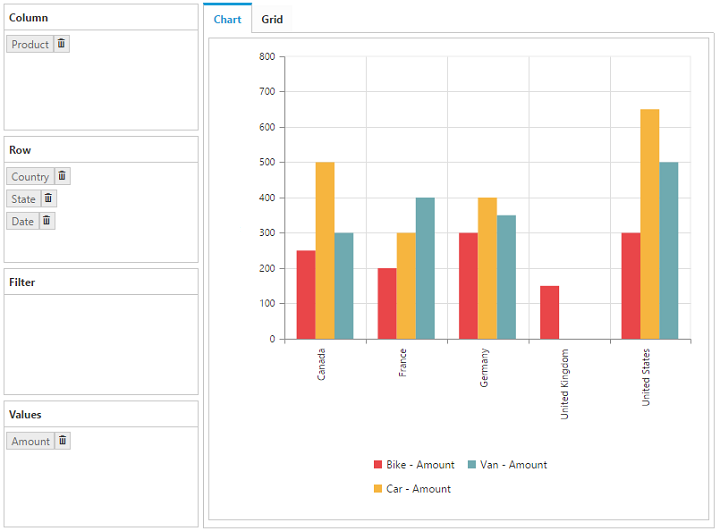

# Layout Customization

## Control Placement

### Tab View
In Tab View representation, both Grid and Chart will be displayed in separate tabs. This could be set by using the [`controlPlacement`](/js/api/ejpivotclient#members:displaysettings-controlplacement) property under the [`displaySettings`](/js/api/ejpivotclient#members:displaysettings) option.  By default, **Tab** value is set.



    $("#PivotClient1").ejPivotClient({
        //...
        displaySettings: {
            controlPlacement: ej.PivotClient.ControlPlacement.Tab
        }
    });



 

### Tile View
In Tile View representation, both Grid and Chart will be displayed one above the other, in the same layout. Tile view can be set by using the [`controlPlacement`](/js/api/ejpivotclient#members:displaysettings-controlplacement) property under the [`displaySettings`](/js/api/ejpivotclient#members:displaysettings) option.



    $("#PivotClient1").ejPivotClient({
        //...
        displaySettings: {
            controlPlacement: ej.PivotClient.ControlPlacement.Tile
        }
    });



## Default View

### Grid View
To display Grid control by default, set [`defaultView`](/js/api/ejpivotclient#members:displaysettings-defaultview) property under [`displaySettings`](/js/api/ejpivotclient#members:displaysettings) option to **Grid**, which is the default value of the property.



    $("#PivotClient1").ejPivotClient({
        //...
        displaySettings: {
            defaultView: ej.PivotClient.DefaultView.Grid
        }
    });



### Chart View
To display Chart control by default, set the property [`defaultView`](/js/api/ejpivotclient#members:displaysettings-defaultview) property to **Chart**.



    $("#PivotClient1").ejPivotClient({
        //...
        displaySettings: {
            defaultView: ej.PivotClient.DefaultView.Chart
        }
    });



## Display Mode

### Grid Only
By setting the [`mode`](/js/api/ejpivotclient#members:displaysettings-mode) property under [`displaySettings`](/js/api/ejpivotclient#members:displaysettings) option to **GridOnly**, PivotGrid component alone will get rendered and PivotChart will not be rendered.



    $("#PivotClient1").ejPivotClient({
        //...
        displaySettings: {
            mode: ej.PivotClient.DisplayMode.GridOnly
        }
    });



### Chart Only
By setting the [`mode`](/js/api/ejpivotclient#members:displaysettings-mode) property under [`displaySettings`](/js/api/ejpivotclient#members:displaysettings) option to **ChartOnly**, PivotChart component alone will get rendered and PivotGrid will not be rendered.



    $("#PivotClient1").ejPivotClient({
        //...
        displaySettings: {
            mode: ej.PivotClient.DisplayMode.ChartOnly
        }
    });



### Both Chart and Grid
By setting the [`mode`](/js/api/ejpivotclient#members:displaysettings-mode) property under [`displaySettings`](/js/api/ejpivotclient#members:displaysettings) option to **ChartAndGrid**, data is displayed in both Grid and Chart.  This is the default value of the property.



    $("#PivotClient1").ejPivotClient({
        //...
        displaySettings: {
            mode: ej.PivotClient.DisplayMode.ChartAndGrid
        }
    });



## Toggle Panel
Toggle panel option lets the user to toggle the visibility of Axis Element Builder and Cube Dimension Browser panels in PivotClient with a use of a button. The button could be added to the control by enabling the [`enableTogglePanel`](/js/api/ejpivotclient#members:displaysettings-enabletogglepanel) property under [`displaySettings`](/js/api/ejpivotclient#members:displaysettings) option.  This property is disabled by default.



    $("#PivotClient1").ejPivotClient({
        //...
        displaySettings: {
            enableTogglePanel: true
        }
    });



## Maximized/Full Screen View
Full screen view helps to visualize the PivotGrid and PivotChart controls inside PivotClient precisely according to the browser window size.  By selecting full screen icon in the toolbar, the control which is in the view gets maximized.  Drilldown action can also be performed in both PivotGrid and PivotChart in the maximized view.  This option is enabled by setting the [`enableFullScreen`](/js/api/ejpivotclient#members:displaysettings-enablefullscreen) property under [`displaySettings`](/js/api/ejpivotclient#members:displaysettings)  option to true.  The value is false by default.



    $("#PivotClient1").ejPivotClient({
        //...
        displaySettings: {
            enableFullScreen: true
        }
    });



The following screenshot shows the maximized view of PivotGrid.

## Chart Types
While loading the PivotClient initially, the PivotChart widget can be rendered in any one of the available chart types using the [`chartType`](/js/api/ejpivotclient#members:charttype) property.



    $("#PivotClient1").ejPivotClient({
        //...
        chartType: ej.PivotChart.ChartTypes.Area
    });

 

The [`chartType`](/js/api/ejpivotclient#members:charttype) property takes Column Chart by default. The types available are Column, Stacking Column, Bar, Stacking Bar, Line, Spline, Step Line, Area, Spline Area, Step Area, Stacking Area, Pie, Funnel and Pyramid.

The Chart Type can also be changed dynamically through the toolbar icon. 

