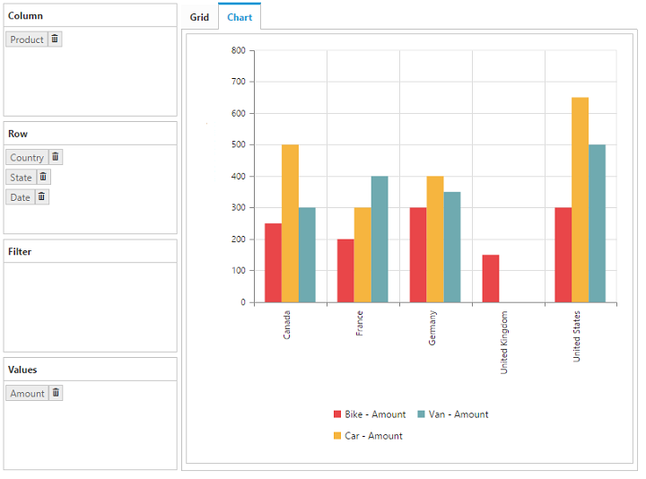
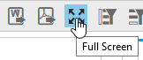

# Layout customization

## Size

Allows you to render the pivot client in different sizes. You can set the height and width under the [`size`](/api/js/ejpivotclient#members:size) property.

## Set size in pixels





Th pivot client with decreased size from default size.

## Set size in percentage

You can also set the pivot client size in percentage.

N> The size of the parent container should be set in pixels.



  

    
  



N> The pivot client is set with minimum height and width to show the decent UI.
## Control placement

### Tab view
In tab view representation, both the grid and the chart will be displayed in separate tabs. This can be set by using the [`controlPlacement`](/api/js/ejpivotclient#members:displaysettings-controlplacement) property under the [`displaySettings`](/api/js/ejpivotclient#members:displaysettings) option.  By default, the **Tab** value is set.



$("#PivotClient1").ejPivotClient({
    //...
    displaySettings: {
        controlPlacement: ej.PivotClient.ControlPlacement.Tab
    }
});



### Tile view
In tile view representation, both the grid and the chart will be displayed one above the other, in the same layout. The tile view can be set by using the [`controlPlacement`](/api/js/ejpivotclient#members:displaysettings-controlplacement) property under the [`displaySettings`](/api/js/ejpivotclient#members:displaysettings) option.



$("#PivotClient1").ejPivotClient({
    //...
    displaySettings: {
        controlPlacement: ej.PivotClient.ControlPlacement.Tile
    }
});



## Default view

### Grid view
To display the grid control by default, set the [`defaultView`](/api/js/ejpivotclient#members:displaysettings-defaultview) property under the [`displaySettings`](/api/js/ejpivotclient#members:displaysettings) option to **Grid**, which is the default value of the property.



    $("#PivotClient1").ejPivotClient({
        //...
        displaySettings: {
            defaultView: ej.PivotClient.DefaultView.Grid
        }
    });



### Chart view
To display chart control by default, set the [`defaultView`](/api/js/ejpivotclient#members:displaysettings-defaultview) property to **Chart**.



    $("#PivotClient1").ejPivotClient({
        //...
        displaySettings: {
            defaultView: ej.PivotClient.DefaultView.Chart
        }
    });



## Display mode

### Grid only
By setting the [`mode`](/api/js/ejpivotclient#members:displaysettings-mode) property under the [`displaySettings`](/api/js/ejpivotclient#members:displaysettings) option to **GridOnly**, the pivot grid component alone will get rendered and the pivot chart will not be rendered.



    $("#PivotClient1").ejPivotClient({
        //...
        displaySettings: {
            mode: ej.PivotClient.DisplayMode.GridOnly
        }
    });



### Chart Only
By setting the [`mode`](/api/js/ejpivotclient#members:displaysettings-mode) property under the [`displaySettings`](/api/js/ejpivotclient#members:displaysettings) option to **ChartOnly**, the pivot chart component alone will get rendered and the pivot grid will not be rendered.



    $("#PivotClient1").ejPivotClient({
        //...
        displaySettings: {
            mode: ej.PivotClient.DisplayMode.ChartOnly
        }
    });



### Both chart and grid
By setting the [`mode`](/api/js/ejpivotclient#members:displaysettings-mode) property under the [`displaySettings`](/api/js/ejpivotclient#members:displaysettings) option to **ChartAndGrid**, the data is displayed in both the grid and chart.  This is the default value of the [`mode`](/api/js/ejpivotclient#members:displaysettings-mode) property.



    $("#PivotClient1").ejPivotClient({
        //...
        displaySettings: {
            mode: ej.PivotClient.DisplayMode.ChartAndGrid
        }
    });



## Toggle panel
The toggle panel option allows you to toggle the visibility of axis element builder and cube dimension browser panels in the pivot client with a use of a button. The button can be added to the control by enabling the [`enableTogglePanel`](/api/js/ejpivotclient#members:displaysettings-enabletogglepanel) property under the [`displaySettings`](/api/js/ejpivotclient#members:displaysettings) option.  This property is disabled by default.



    $("#PivotClient1").ejPivotClient({
        //...
        displaySettings: {
            enableTogglePanel: true
        }
    });



## Collapse toggle panel by default

Allows you to hide the “Cube Browser” and “Axis Element Builder” panels while initiating the widget. You can enable this option in the pivot client by setting the [`collapseCubeBrowserByDefault`](/api/js/ejpivotclient#members:collapsecubebrowserbydefault) property to true.



    $("#PivotClient1").ejPivotClient({
        //...
        collapseCubeBrowserByDefault: true
    });



## Maximized/full screen view
Full screen view helps to visualize the pivot grid and pivot chart controls in the pivot client precisely according to the browser window size.  By selecting full screen icon in the toolbar, the control which is in the view gets maximized. The drill down action can also be performed in both the pivot grid and the pivot chart in the maximized view.  This option is enabled by setting the [`enableFullScreen`](/api/js/ejpivotclient#members:displaysettings-enablefullscreen) property under the [`displaySettings`](/api/js/ejpivotclient#members:displaysettings)  option to true.  The value is false by default.



    $("#PivotClient1").ejPivotClient({
        //...
        displaySettings: {
            enableFullScreen: true
        }
    });



The following screenshot shows the maximized view of the pivot grid:

## Chart types
While loading the pivot client initially, the pivot chart widget can be rendered in any one of the available chart types using the [`chartType`](/api/js/ejpivotclient#members:charttype) property.



    $("#PivotClient1").ejPivotClient({
        //...
        chartType: ej.PivotChart.ChartTypes.Area
    });



The [`chartType`](/api/js/ejpivotclient#members:charttype) property takes column chart by default. The available chart types are column, stacking column, bar, stacking bar, line, spline, step line, area, spline area, step area, stacking area, pie, funnel, and pyramid.

The chart type can also be changed dynamically through the toolbar icon.

### Pivot tree map

I> This feature is applicable only for the OLAP data source bound from the server-side.

You can include the pivot tree map component as one of the chart type by setting the [`enablePivotTreeMap`](/api/js/ejpivotclient#members:enablepivottreemap) property to true.



    $("#PivotClient1").ejPivotClient({
        //...
        enablePivotTreeMap: true
    });



## Report Toolbar

You can customize the display of toolbar by enabling/disabling the visibility of each icon.  This can be achieved by setting the properties under the [`toolbarIconSettings`](/api/js/ejpivotclient#members:toolbariconsettings) option to false. The values are true by default.



    $("#PivotClient1").ejPivotClient({
        //...
        //Disable toolbar icon in PivotClient.
        toolbarIconSettings: {
            enableAddReport: false,
            enableNewReport: false,
            enableRemoveReport: false
        }
    });



The following screenshot will be displayed after disabling the toolbar icons.

The following table will explain you the available properties for the customization of the report toolbar.

| Property | Description
|---|---|
| [`enableNewReport`](/api/js/ejpivotclient#members:toolbariconsettings-enablenewreport) | Allows you to set the visibility of `New Report` icon in the toolbar panel.|
| [`enableAddReport`](/api/js/ejpivotclient#members:toolbariconsettings-enableaddreport) | Allows you to set the visibility of `Add Report` icon in the toolbar panel.|
| [`enableRemoveReport`](/api/js/ejpivotclient#members:toolbariconsettings-enableremovereport) | Allows you to set the visibility of `Remove Report` icon in the toolbar panel.|
| [`enableRenameReport`](/api/js/ejpivotclient#members:toolbariconsettings-enablerenamereport) | Allows you to set the visibility of `Rename Report` icon in the toolbar panel.|
| [`enableDBManipulation`](/api/js/ejpivotclient#members:toolbariconsettings-enabledbmanipulation) | Allows you to set the visibility of `DB Manipulation` icon in the toolbar panel.|
| [`enableMDXQuery`](/api/js/ejpivotclient#members:toolbariconsettings-enablemdxquery) | Allows you to set the visibility of `MDX Query` icon in the toolbar panel.|
| [`enableDeferUpdate`](/api/js/ejpivotclient#members:toolbariconsettings-enabledeferupdate) | Allows you to set the visibility of `Defer Update` icon in the toolbar panel.|
| [`enableExcelExport`](/api/js/ejpivotclient#members:toolbariconsettings-enableexcelexport) | Allows you to set the visibility of `Excel Export` icon in the toolbar panel.|
| [`enableWordExport`](/api/js/ejpivotclient#members:toolbariconsettings-enablewordexport) | Allows you to set the visibility of `Word Export` icon in the toolbar panel.|
| [`enablePdfExport`](/api/js/ejpivotclient#members:toolbariconsettings-enablepdfexport)| Allows you to set the visibility of `PDF Export` icon in the toolbar panel.|
| [`enableFullScreen`](/api/js/ejpivotclient#members:toolbariconsettings-enablefullscreen)| Allows you to set the visibility of `Full Screen` icon in the toolbar panel.|
| [`enableSortOrFilterColumn`](/api/js/ejpivotclient#members:toolbariconsettings-enablesortorfiltercolumn)| Allows you to set the visibility of `Sort/Filter Column` icon in the toolbar panel.|
| [`enableSortOrFilterRow`](/api/js/ejpivotclient#members:toolbariconsettings-enablesortorfilterrow)| Allows you to set the visibility of `Sort/Filter Row` icon in the toolbar panel.|
| [`enableToggleAxis`](/api/js/ejpivotclient#members:toolbariconsettings-enabletoggleaxis)| Allows you to set the visibility of `Toggle Axis` icon in the toolbar panel.|
| [`enableChartTypes`](/api/js/ejpivotclient#members:toolbariconsettings-enablecharttypes)| Allows you to set the visibility of `Chart Types` icon in the toolbar panel.|
| [`enableCalculatedMember`](/api/js/ejpivotclient#members:toolbariconsettings-enablecalculatedmember)| Allows you to set the visibility of `Calculated Member` icon in the toolbar panel.|