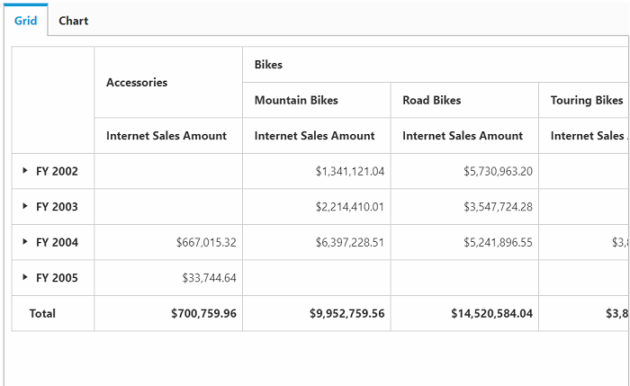

# Named set

Named set is a multidimensional expression (MDX) that returns a set of dimension members, which can be created by combining the cube data, arithmetic operators, numbers, and functions. You can set the named set option in the pivot client by setting the [`isNamedSets`](/api/js/ejpivotclient#members:datasource-columns-isnamedsets) property to true for client mode.

## Client mode

You can bind the named sets in the pivot client by setting it's unique name in the [`fieldName`](/api/js/ejpivotclient#members:datasource-columns-fieldname) property either in row or column axis and [`isNamedSets`](/api/js/ejpivotclient#members:datasource-columns-isnamedsets) Boolean property to true.



<!--Create a tag which acts as a container for PivotGrid-->
 



## Server mode

You can add the named sets in the pivot client by using the `NamedSetElement` Class in the OLAP report.



OlapReport olapReport = new OlapReport();
olapReport.Name = "Customer Report";
olapReport.CurrentCubeName = "Adventure Works";

DimensionElement dimensionElementRow = new DimensionElement();
dimensionElementRow.Name = "Date";
dimensionElementRow.AddLevel("Fiscal", "Fiscal Year");

MeasureElements measureElementColumn = new MeasureElements();
measureElementColumn.Elements.Add(new MeasureElement {
Name = "Internet Sales Amount"
});

NamedSetElement dimensionElementColumn = new NamedSetElement();
dimensionElementColumn.Name = "Core Product Group";

olapReport.CategoricalElements.Add(dimensionElementColumn);
olapReport.CategoricalElements.Add(measureElementColumn);
olapReport.SeriesElements.Add(dimensionElementRow);



