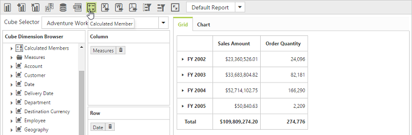
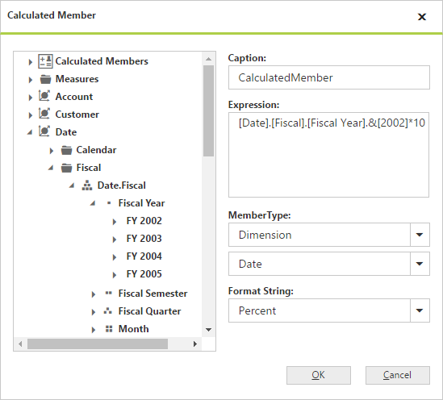
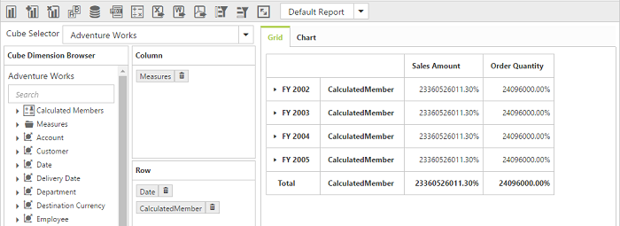

# Calculated members

I> This feature is applicable only for the server mode bound with the OLAP data source.

Calculated members are the customized dimension members or measures that are defined based on the cube data. Values for calculated members are computed at run-time.

The two types of calculated members are as follows:

Calculated measure – Calculated measure created from a measure element.

Calculated dimension – Calculated member created from a dimension element.

The pivot client provides support to insert new calculated members based on the existing OLAP field members either through UI dialog or code behind.

## Through UI

To show the icon in the toolbar panel, you need to set the property `enableCalculatedMember` to `true` under the `toolbarIconSettings` object.



    $(function() {
        $("#PivotClient1").ejPivotClient({
            //...
            toolbarIconSettings: { enableCalculatedMember: true }
        });
    });



To insert a new calculated member, open the calculated member dialog by clicking the icon available in the toolbar panel. You can define the following options in the dialog:

    Caption - To set the name for the calculated member.
    Expression - To set the formula for the calculated member, where you can insert required members through the cube dimension browser by a simple drag and drop option with required operators to make formula.
    Member type - To specify the hierarchy of the member set in an expression.
    Format string - To set the format for the calculated member.

## Through code behind

For code-behind, you can create the calculated members by defining formula in the OLAP report with the following definitions:

    Name – Name of the calculated member.
    Expression – Expression to form the calculated member.
    Measure/dimension element – You should add a measure or dimension element from which the calculated member should be created.

The following steps explain how to create and add a calculated member in an OLAP report:

    1. Create a dimension measure or element from which the calculated member has to be created.
    2. Create a calculated member by giving the name and expression.
    3. Add the created dimension element to the calculated member.
    4. After defining the calculated member, add that member to the calculated members collection in the OLAP report.
    5. Add the newly created calculated members in categorical or series axes of the OLAP report.

Th following code snippet describes the creation and addition of a calculated members in the OLAP report:

### Calculated measure



    MeasureElement measureElement = new MeasureElement();

    measureElement.Name = "Order Quantity";

    CalculatedMember calculatedMeasure = new CalculatedMember();

    calculatedMeasure.Name = "Oder on Discount";

    calculatedMeasure.Expression = "[Measures].[Order Quantity] + ([Measures].[Order Quantity] * 0.10)";

    calculatedMeasure.AddElement(measureElement);

    olapReport.CalculatedMembers.Add(calculatedMeasure);

    olapReport.CategoricalElements.Add(calculatedMeasure);



### Calculated dimension



     DimensionElement internalDimension = new DimensionElement();

    internalDimension.Name = "Product";

    internalDimension.AddLevel("Product Categories", "Category");

    // Calculated Dimension

    CalculatedMember calculatedDimension = new CalculatedMember();

    calculatedDimension.Name = "Bikes & Components";

    calculatedDimension.Expression = "([Product].[Product Categories].[Category].[Bikes] + [Product].[Product Categories].[Category].[Components] )";

    calculatedDimension.AddElement(internalDimension);

    olapReport.CalculatedMembers.Add(calculatedDimension);

    olapReport.CategoricalElements.Add(calculatedDimension);



