# Pivot client: Elements

## Cube selector
The cube selector allows you to select any one of the cubes available in the connected database. This can be achieved with a drop-down list displaying the list of cube names. By selecting a cube from the drop-down list, the corresponding cube elements get loaded.

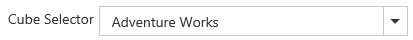

## Cube dimension browser
The cube dimension browser is a tree view like structure that organizes the cube elements such as dimensions, hierarchies, measures, etc., from the selected cube into independent logical groups.

### Drag and drop

You can alter the report on fly through the drag-and-drop operation.

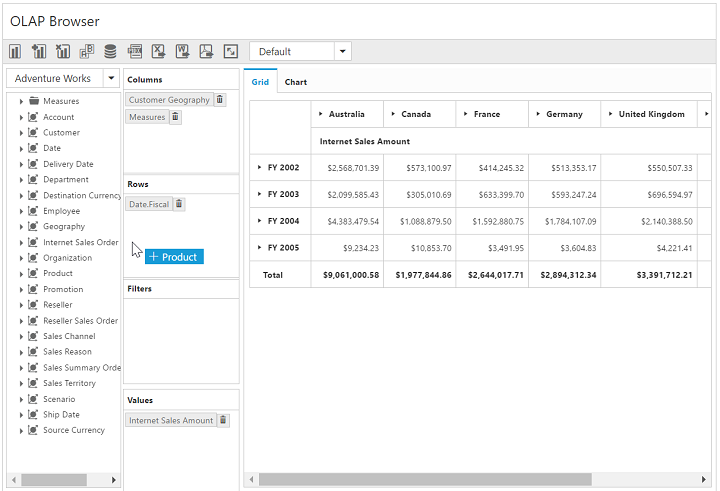

### Context menu

You can also alter the report by using the context menu.

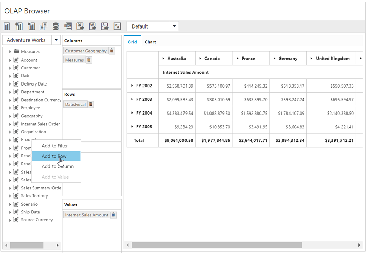

### Types of node in cube dimension browser

* **Display folder**: A folder that contains a set of similar elements.
* **Measure**: Quantity available for analysis.
* **Dimension**: A name given to the parts of the cube that categorizes data.
* **Attribute Hierarchy**: Level of attributes down the hierarchy.
* **User-defined Hierarchy**: Members of a dimension in a hierarchical structure.
* **Level**: Denotes a specific level in the category.
* **Named Set**: A collection of tuples and members, that can be defined and saved as a part of cube definition.

### Attribute hierarchy
Attribute hierarchy contains the following levels:

* A leaf level contains distinct attribute member, and each member of the leaf level is known as a leaf member.
* Intermediate levels if the attribute hierarchy is a parent-child hierarchy.
* An optional (all) level (IsAggregatable=True) contains the aggregated value of the attribute hierarchy's leaf members, with the member of the (all) level also known as the (all) member.

### User-defined hierarchy
User-defined hierarchy organizes the members of a dimension into hierarchical structure and provides navigation paths in a cube. For example, take a dimension table that supports three attributes such as year, quarter, and month. The year, quarter, and month attributes are used to construct a user-defined hierarchy, named Calendar, in the time dimension that relates to all levels.

### Differentiating user-defined hierarchy and attribute hierarchy

* User-defined hierarchy contains more than one level whereas attribute hierarchy contains only one level.
* User-defined hierarchy provides the navigation path between the levels taken from attribute hierarchies of the same dimension.
* The attribute hierarchy and the user-defined hierarchy are represented in different ways as shown in the following table.

### Symbolic representation of the nodes inside cube dimension browser

<table>
<tr>
<th>
Icon</th><th>
Name</th><th>
Node type</th><th>
Is Draggable</th></tr>
<tr>
<td>
{{ '' | markdownify }}</td><td>
Display Folder</td><td>
Display Folder</td><td>
False</td></tr>
<tr>
<td>
{{ '' | markdownify }}</td><td>
Measure</td><td>
Measure</td><td>
True</td></tr>
<tr>
<td>
{{ '' | markdownify }}</td><td>
Dimension</td><td>
Dimension</td><td>
True</td></tr>
<tr>
<td>
{{ '' | markdownify }}</td><td>
User Defined Hierarchy</td><td>
Hierarchy</td><td>
True</td></tr>
<tr>
<td>
{{ '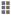' | markdownify }}</td><td>
Attribute Hierarchy</td><td>
Hierarchy</td><td>
True</td></tr>
<tr>
<td>
{{ '' | markdownify }} 
{{ '' | markdownify }} 
{{ '' | markdownify }}</td><td>
Levels (in order)</td><td>
Level Element</td><td>
True</td></tr>
<tr>
<td>
{{ '' | markdownify }}</td><td>
Named Set</td><td>
Named Set</td><td>
True</td></tr>
</table>

## Axis element builder
The axis element builder allows you to build the elements in the axes of pivot client. This supports three axes namely categorical, series, and slicer. Based on the construction of axes, the pivot grid and the OLAP chart will display the resultant data.

### Categorical (column)
The categorical axis defines one or more elements that are displayed along the chart’s y-axis as labels and in the columns of the grid. If more than one dimension is present on the categorical axis, then the chart/grid will stack each dimension. The stacking order of the dimensions is based on the order that they appear on the categorical axis.

### Series (row)
The series axis defines one or more dimensions that are displayed along the chart’s x-axis as labels and in the rows of the grid. If more than one dimension is present on the series axis, then the chart/grid will stack each dimension. The stacking order of the dimensions is based on the order that they appear on the series axis.

### Slicer
The slicer axis filters the multidimensional data displayed in the chart/grid. It allows you to analyze a member of the dimension in-depth. To display the member’s data in the slicer, the corresponding member should not be present on both the categorical axis and the series axis.

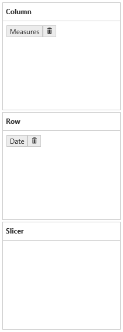

### Split button
The split button highlights the elements in the axis element builder and holds measures, dimensions, and named sets. When a dimension/hierarchy/level/named set node is dragged and dropped from the cube dimensional browser into the axis element builder, a split button is created and displayed along with the corresponding dimension/named set caption.

When a measure node is dragged and dropped, the axis element builder will create a split button for holding the measures. The next time, a measure is added, it will maintain the same single split button to hold the entire measure collection.

The split buttons can be removed with the help of the remove button which is available on its side.

### Addition elements to an axis
The measure, dimension, hierarchy, level, and named set elements can be dragged from the cube dimension browser and dropped into the axis element builder at the desired position using the drag-and-drop operation. These elements can be moved from one axis to another by dragging an appropriate split button and dropping them at the desired position.

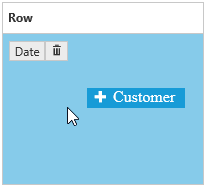

### Remove elements from an axis
To remove measures, dimension, hierarchy, level, and named set elements from the axis element builder, click the remove button available next to the split button.

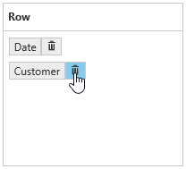

### Rearrange elements in an axis
Rearranging can be done by dragging and dropping the elements at desired position.

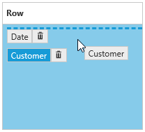

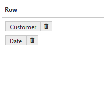

### Context menu
You can alter the report by using the context menu.

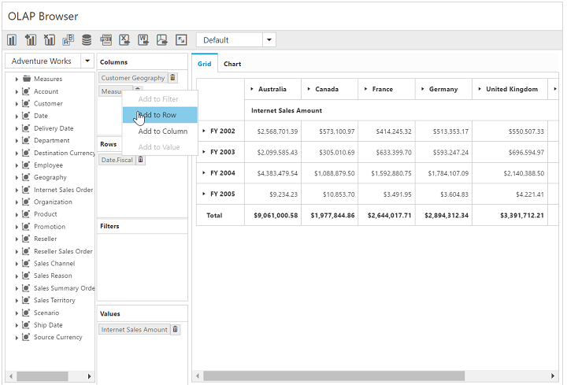

## Elements editor

### Measure editor
The measure editor is a dialog that displays the collection of measures in the current report.

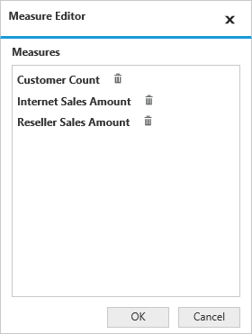

To remove a measure, click the remove icon next to the corresponding measure. To avoid removing the current selection, click Cancel.

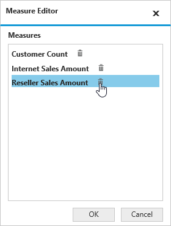

### Member editor
The member editor is a dialog which displays the members of the current hierarchy in a tree view structure.

The check all and uncheck all options in the dialog allows the user to select and unselect entire nodes for filtering. For more details, about filtering, [click here](https://help.syncfusion.com/js/pivotclient/olap-data-exploration#filtering-by-member).

## Toolbar

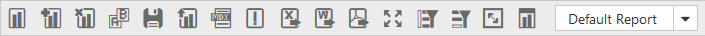

The options available in the toolbar are,

* **New report**: Creates a new reports list, and clears the existing report collection to provide a new platform for new deployment based on the existing cube elements.
* **Add report**: Adds a new report to the existing list of reports.
* **Remove report**: Removes the current report from the report list. If the report list contains only one report, you cannot remove it.
* **Rename Report**: The rename option allows you to change the name of the current report.
* **Report manipulation in DB**: Contains options to manipulate the reports in the database.
* **MDX Query**: This option displays the MDX query executed to retrieve the data at that instant.
* **Defer Update**: Allows you to update the widget on-demand rather than updating it for every interaction.
* **Export to Excel**: Export the grid and chart to an Excel worksheet.
* **Export to Word**: Exports the grid and chart to a Word document.
* **Export to PDF**: Exports the grid and chart to a PDF document.
* **Full Screen View**: Displays the active control (chart/grid) in full/maximized view.
* **Filter/sort column**: Filters/sorts the data in the OLAP report with respect to the column.
* **Filter/sort row**: Filters/sorts the data in the OLAP report with respect to the row.
* **Toggle axis**: Interchanges the items between categorical and series axes.
* **Chart types**: Allows you to change the chart type dynamically.
* **Report List**: Holds all reports of the current session of the pivot client control and displays in a drop-down list. You can select a report from the the drop-down list.

Following are the options available for database report manipulation:

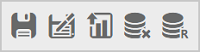

* **Save**: Saves the report collection by only one name in a database.
* **Save As**: Save the report collection by more than one name in the database.
* **Load**: Picks the saved report collection from the database and loads it by clearing the existing collection of reports.
* **Remove**: Removes the selected report from the saved report list in the database.
* **Rename**: The rename option allows you to change the name of the selected report from the saved report list in the database.

## Report manipulation

### New report
This option allows you to create a new report collection with a single report by clearing the existing report collection. By clicking the new report icon in the toolbar, the new report dialog opens as follows:

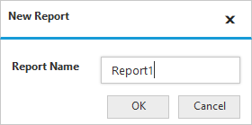

After giving the required name and click OK, the report collection gets loaded with only one empty report with the entered name. By clicking Cancel, the report creation gets canceled.

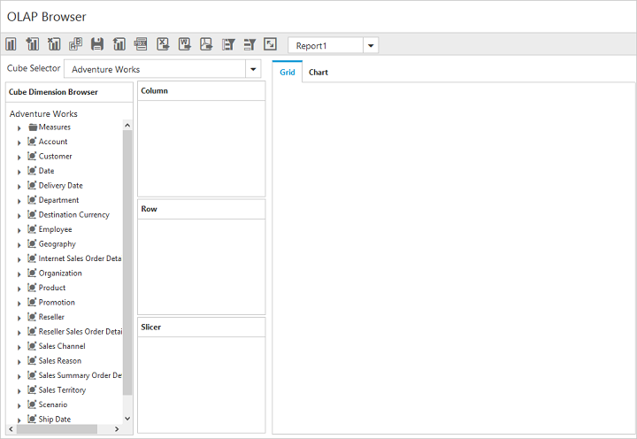

### Add report
This option allows you to add a report to the existing report collection. By clicking the add report icon in toolbar, the Add Report dialog opens to provide a name for the report to be added as shown below:

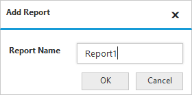

After an appropriate name has been provided in the respective column, click OK. A report with the entered name is added to the collection. By clicking Cancel, the report creation gets canceled.

### Remove report
This option allows you to remove the current/active report from the report collection. By clicking the icon on the toolbar, a dialog will open for user’s confirmation on removal of report as shown below:

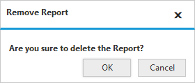

Click OK to remove the report from the collection or click Cancel to withdraw the removing operation.

This option works only if the report collection has more than one report.  If not, the following dialog will open:

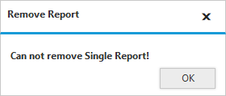

### Rename report
This option allows you to rename the current/active report. By clicking the rename icon on the toolbar, the following dialog will open:

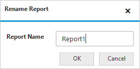

After an appropriate name has been provided clicking OK. The active report is refreshed with the new name.

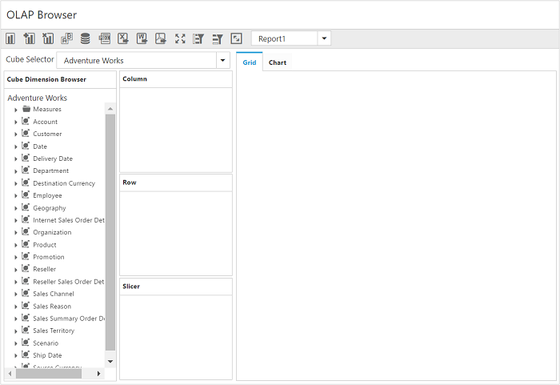

### Save
The save option saves the entire report collection by only one name to the database. The database is connected to the application through a connection string provided in the service.

By clicking the save icon, the following save dialog will open:

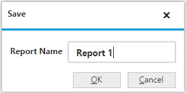

After an appropriate name has been provided, click OK. The report collection will be saved to the connected database. Otherwise, clicking Cancel to withdraw the saving operation.

### Save As
This option allows you to save the entire report collection by two or more names in the database. The database is connected to the application through the connection string provided in the service.

By clicking the save as icon, the following save as dialog will open:

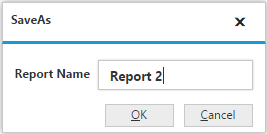

After an appropriate name has been provided, click OK. The report collection will be saved to the connected database. Otherwise click Cancel to withdraw the saving operation.

### Load
The load option allows you to load the saved report collection from the database through the service. By clicking the lad icon on the toolbar, the following load dialog will open:

Select a report from the report collection through the drop-down list and click OK for loading the selected report collection. Otherwise, click Cancel to abort the report loading operation.

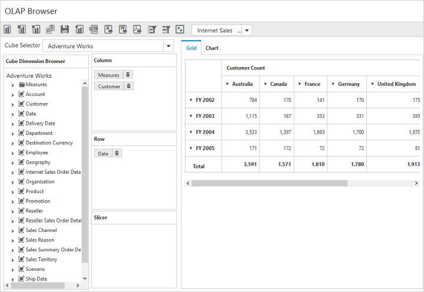

### Remove
This option allows you to remove the saved report from the report collection.  By clicking the remove icon on the toolbar, a remove dialog will be opened for user’s confirmation for removal of the report as shown below:

Clicking OK to remove the report from the collection. Otherwise, click Cancel to withdraw the cancel operation.

### Rename
Rename option allows you to rename the saved report. By clicking the rename icon on the toolbar, the following dialog will open:

After an appropriate name has been provided, click OK. The active report is refreshed with the new name.

### Report list
The report list drop-down contains the names of all reports in the report collection.

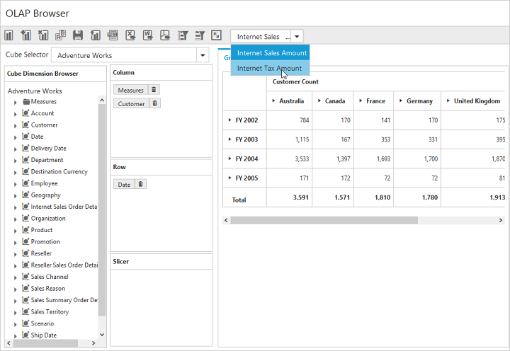

Select the required report from the report list. The selected report will be set as active report, and loaded.

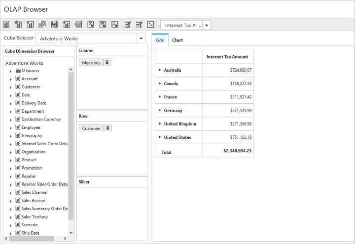

## Pivot grid and pivot chart
The [pivot grid](https://help.syncfusion.com/js/pivotgrid/overview) and [pivot chart](https://help.syncfusion.com/js/pivotchart/overview) controls will be rendered with respect to the operations done at axis element builder.
