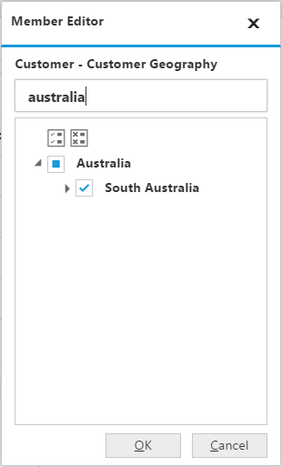

# Data exploration

## Filtering

### Filtering by member

After clicking the split button of a dimension, the member editor dialog opens through which the members are filtered by checking and unchecking the check boxes corresponding to the members. By clicking the OK button, the OLAP report gets updated and refreshes the pivot grid and pivot chart controls based on selected members in the member editor dialog.  The Cancel button is used to cancel the selection.

The above filter illustrates the members France and Germany, along with New South Wales and Queensland are excluded from the grid and chart controls.

### Filtering by value

I> This feature is applicable only for OLAP data source bound from the server-side.

The filtering tab in the sorting and filtering dialog box of the pivot client provides the options to apply custom filters on the multi-dimensional data. It enables the user to filter the rows and columns of the selected measure.

* **Column Filter** - Filters the columns related to the specified measure according to the condition applied for filtering.
* **Row Filter** - Filters the rows related to the specified measure according to the condition applied for filtering.

The sorting and filtering dialog box for rows and columns are opened by clicking the corresponding icon in the toolbar.

The following screenshot displays the filtering tab in the sorting and filtering dialog box:

The options in the filtering tab are as follows:

* **Enabling filtering** – Enables/disables the filtering option.
* **Measure** – The measure for filtering is selected from the collection of measures in drop-down list.
* **Condition** – Condition with which the filtering is applied.
* **Value** – Value to compare with each data according to the condition.

The following screenshot displays the data before filtering:

The following screenshot displays the data after filtering:

## Sorting

I> This feature is applicable only for the OLAP data source in the server mode.

The sorting tab in the sorting and filtering dialog box provides the option to sort the results by rows/columns in the ascending or descending order.

* **Column sorting** - Sorts the columns based on the summary values of each column.
* **Row sorting** - Sorts the rows based on the summary values of each row.

The sorting and filtering dialog box for rows and columns are opened by clicking the corresponding icon in the toolbar.

The following screenshot displays the sorting and filtering dialog box:

The options in the sorting tab are as follows:

* **Measure** – The measure for sorting is selected from the collection of measures in drop-down list.
* **Order** – Specifies the sorting order.
* **Preserve Hierarchy** – Sorts the records without changing the hierarchy order.

The following screenshot displays the data after applying the sorting in the ascending order for rows:

## Grouping

The data can be grouped when more than one dimension element is added to the column or row in the axis element builder.  Based on the order of addition, the data is grouped and the report is updated. In the following example, the members of the **Date** dimension get grouped with respect to the members of **Customer** dimension.  Likewise, multiple dimension members can be grouped by dragging the elements from the cube dimension browser to the axis element builder.

## Searching

The members can be searched and displayed from the members list in the member editor dialog box.

