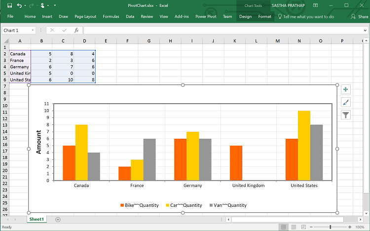
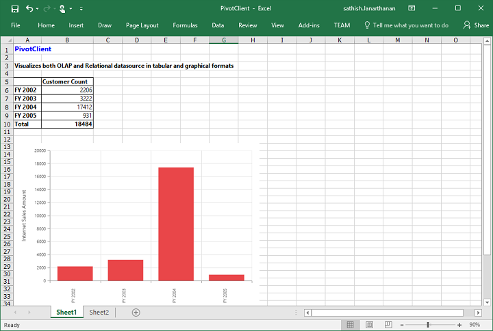
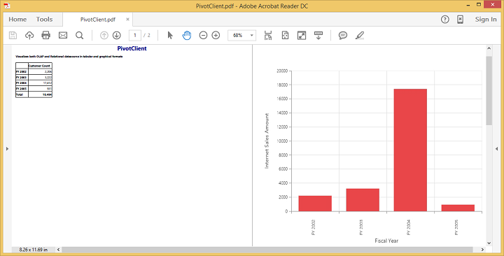

# Exporting

PivotChart and PivotGrid in the PivotClient widget can be exported to Excel, Word and PDF documents by clicking the respective toolbar icons.

 

Exporting feature provides an option that allows you to export either pivot chart or pivot grid or both with the use of the property [`clientExportMode`](/api/js/ejpivotclient#members:clientExportMode).

The property [`clientExportMode`](/api/js/ejpivotclient#members:clientExportMode) takes any one of the following value:

* **ChartAndGrid** – Exports both PivotChart and PivotGrid controls. This is the default mode.
* **ChartOnly** – Exports PivotChart control alone.
* **GridOnly** – Exports PivotGrid control alone.

## JSON Export

I> By default, exporting is done with the use of JSON Records maintained in client-side for both client and server modes.

In order to perform exporting with the use of a custom service method, the service containing the exporting method is hosted and its link is given in url as shown below.  Without giving any value to the 'url' property it takes our default exporting service link.



        $("#PivotClient1").ejPivotClient({
            //...
            beforeExport:"Export",
            clientExportMode: ej.PivotClient.ClientExportMode.ChartAndGrid
        });
        
        function Export(args) {
            args.url = "http://js.syncfusion.com/ejservices/api/PivotClient/Olap/Export";//Exporting url can be modified here
        }


### Customize the export document name

The document name could be customized. Following code sample illustrates the same.



        $("#PivotClient1").ejPivotClient({
            //...
            beforeExport:"Export",
            clientExportMode: ej.PivotClient.ClientExportMode.ChartAndGrid
        });
        
        function Export(args) {
            args.url = "http://js.syncfusion.com/ejservices/api/PivotClient/Olap/Export";
            args.fileName="File name is customized here";
        }


## PivotEngine Export

I> This feature is applicable only at server mode operation.

In order to perform exporting with the use of PivotEngine available in server-side, the 'exportMode' property obtained in the “beforeExport” event is set to "ej.PivotClient.ExportMode.PivotEngine" as shown below.



        $("#PivotClient1").ejPivotClient({
            url: "/OlapService",
            beforeExport:"Export"
        });
        
        function Export(args) {
            args.exportMode = ej.PivotClient.ExportMode.PivotEngine;
        }
        
 

For WebAPI controller, the below method needs to be added to perform exporting with PivotEngine.



    [System.Web.Http.ActionName("Export")]
    [System.Web.Http.HttpPost]
    public void Export() {
        string args = HttpContext.Current.Request.Form.GetValues(0)[0];
        OlapDataManager DataManager = new OlapDataManager(connectionString);
        string fileName = "Sample";
        olapClientHelper.ExportOlapClient(DataManager, args, fileName, System.Web.HttpContext.Current.Response);
    }



For WCF service, the below service method needs to be added to perform exporting with PivotEngine.



    public void Export(Stream stream) {
        System.IO.StreamReader sReader = new System.IO.StreamReader(stream);
        string args = System.Web.HttpContext.Current.Server.UrlDecode(sReader.ReadToEnd());
        OlapDataManager DataManager = new OlapDataManager(connectionString);
        string fileName = "OlapClient";
        olapClientHelper.ExportOlapClient(DataManager, args, fileName,
            System.Web.HttpContext.Current.Response);
    }



### File format selection

I> This option is applicable only for PivotClient when exporting to Excel document.

You can set the option for exporting the control to Excel document either in *.xls* or *.xlsx* format, using `fileFormat` property inside the `beforeExport` event.

N> By default excel document will be exported to ".xls" format using PivotEngine export.



        $("#PivotClient1").ejPivotClient({
            url: "/OlapService",
            beforeExport:"Export"
        });
        
        function Export(args) {
            args.exportMode = ej.PivotClient.ExportMode.PivotEngine;
            args.fileFormat = ".xlsx"; //you can set the excel sheet format here
        }
        
 

### Customize the export document name

The document name could be customized inside the method in WebAPI Controller. Following code sample illustrates the same.



    [System.Web.Http.ActionName("Export")]
    [System.Web.Http.HttpPost]
    public void Export() {
        string args = HttpContext.Current.Request.Form.GetValues(0)[0];
        OlapDataManager DataManager = new OlapDataManager(connectionString);
        string fileName = " File name is customized here ";
        olapClientHelper.ExportOlapClient(DataManager, args, fileName, System.Web.HttpContext.Current.Response);
    }



For customizing name in WCF Service, below code snippet is used.



    public void Export(Stream stream) {
        System.IO.StreamReader sReader = new System.IO.StreamReader(stream);
        string args = System.Web.HttpContext.Current.Server.UrlDecode(sReader.ReadToEnd()).Remove(0, 5);
        OlapDataManager DataManager = new OlapDataManager(connectionString);
        string fileName = " File name is customized here ";
        olapClientHelper.ExportOlapClient(DataManager, args, fileName, System.Web.HttpContext.Current.Response);
    }



## PivotChart - Exporting Format

I> This option is applicable only for PivotChart in PivotClient specifically when exported to Excel document.

You can set an option to export PivotChart to an Excel document, either as image or PivotChart format itself by setting the boolean property `exportChartAsImage`, inside the `beforeExport` event.

N> By default PivotChart will be exported as image format to Excel document.



        $("#PivotClient1").ejPivotClient({
            //..         
            beforeExport:"Export",
            clientExportMode: ej.PivotClient.ClientExportMode.ChartOnly
        });
        
        function Exporting(args) {
            args.exportChartAsImage = false; //You can set the chart format here
        }
        
 

The below screenshot shows the control exported to Excel document showing its own format (Pivoting Chart).

## Exporting Customization

You can add title and description to the exporting document by using title and description property obtained in the "beforeExport" event.


<html> 
    //...
<body> 
    //...
    

    
    
</body>
</html>                                            



You can also edit the exporting document with the use of a server side event for required exporting option.



//...
using Syncfusion.EJ.Export;
using Syncfusion.Compression.Base;
using Syncfusion.XlsIO;
using Syncfusion.DocIO.Base;
using Syncfusion.Pdf.Base;

 //Following service method needs to be added in WebAPI for JSON export.
 
[System.Web.Http.ActionName("Export")]
[System.Web.Http.HttpPost]
public void Export()
{
    PivotClientExport pivotClient = new PivotClientExport();
    pivotClient.ExcelExport += pivotClient_ExcelExport;
    pivotClient.WordExport += pivotClient_WordExport;
    pivotClient.AddPDFHeaderFooter += pivotClient_AddPDFHeaderFooter;
    pivotClient.PDFExport += pivotClient_PDFExport;
    string args = HttpContext.Current.Request.Form.GetValues(0)[0];
    pivotClient.ExportPivotClient(string.Empty, args, HttpContext.Current.Response);
}

void pivotClient_PDFExport(object sender, Syncfusion.Pdf.PdfDocument pdfDoc)
{
    //You can customize exporting document here.
}

void pivotClient_AddPDFHeaderFooter(object sender, Syncfusion.Pdf.PdfDocument pdfDoc)
{
    //You can add header/footer information to the PDF document.
}

void pivotClient_WordExport(object sender, Syncfusion.DocIO.DLS.WordDocument document)
{
    //You can customize exporting document here.
}

void pivotClient_ExcelExport(object sender, Syncfusion.XlsIO.IWorkbook workBook)
{
    //You can customize exporting document here.
}

 //Following service method needs to be added in WCF/WebAPI for PivotEngine export.
[System.Web.Http.ActionName("ExportOlapClient")]
[System.Web.Http.HttpPost]
public void ExportOlapClient()
{
    string args = HttpContext.Current.Request.Form.GetValues(0)[0];
    OlapDataManager DataManager = new OlapDataManager(connectionString);
    olapClientHelper.ExcelExport += olapClientHelper_ExcelExport;
    olapClientHelper.WordExport += olapClientHelper_WordExport;
    olapClientHelper.AddPDFHeaderFooter += olapClientHelper_AddPDFHeaderFooter;
    olapClientHelper.PDFExport += olapClientHelper_PDFExport;
    string fileName = "Sample";
    olapClientHelper.ExportPivotClient(DataManager, args, fileName, System.Web.HttpContext.Current.Response);
}

void olapClientHelper_PDFExport(object sender, Syncfusion.Pdf.PdfDocument pdfDoc)
{
    //You can customize exporting document here.
}

void olapClientHelper_AddPDFHeaderFooter(object sender, Syncfusion.Pdf.PdfDocument pdfDoc)
{
    //You can add header/footer information to the PDF document.
}

void olapClientHelper_WordExport(object sender, Syncfusion.DocIO.DLS.WordDocument document)
{
    //You can customize exporting document here.
}

void olapClientHelper_ExcelExport(object sender, Syncfusion.XlsIO.IWorkbook workBook)
{
    //You can customize exporting document here.
}



The below screenshot shows the PivotGrid and PivotChart controls exported to Excel document.

The below screenshot shows the PivotGrid and PivotChart controls exported to Word document.

The below screenshot shows the PivotGrid and PivotChart controls exported to PDF document.

