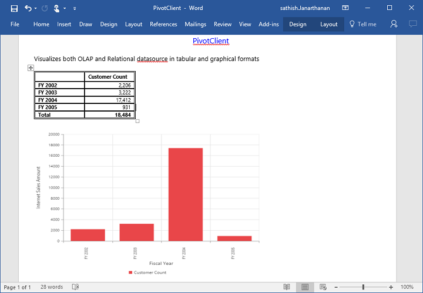

# Exporting

PivotChart and PivotGrid in the PivotClient widget can be exported to Excel, Word and PDF documents by clicking the respective toolbar icons.

 

Exporting feature provides an option that allows you to export either PivotChart or PivotGrid or both with the use of the property [`clientExportMode`](/js/api/ejpivotclient#enum:clientexportmode).

The property [`clientExportMode`](/js/api/ejpivotclient#enum:clientexportmode) takes any one of the following value:

* **ChartAndGrid** – Exports both PivotChart and PivotGrid controls. This is the default mode.
* **ChartOnly** – Exports PivotChart control alone.
* **GridOnly** – Exports PivotGrid control alone.

## JSON Export

I> By default, exporting is done with the use of JSON Records maintained in client-side for both client and server modes.

In order to perform exporting with the use of a custom service method, the service containing the exporting method is hosted and its link is given in url as shown below.  Without giving any value to the 'url' property it takes our default exporting service link.



        $("#PivotClient1").ejPivotClient({
            //...
            beforeExport:"Export",
            clientExportMode: ej.PivotClient.ClientExportMode.ChartAndGrid
        });
        
        function Export(args) {
            args.url = "http://js.syncfusion.com/demos/ejservices/api/JSPivotClientExport/ExportPivotClient";//Exporting url can be modified here
        }


### Customize the export document name

The document name could be customized. Following code sample illustrates the same.



        $("#PivotClient1").ejPivotClient({
            //...
            beforeExport:"Export",
            clientExportMode: ej.PivotClient.ClientExportMode.ChartAndGrid
        });
        
        function Export(args) {
            args.url = "http://js.syncfusion.com/demos/ejservices/api/JSPivotClientExport/ExportPivotClient";
            args.fileName="File name is customized here";
        }


## PivotEngine Export

I> This feature is applicable only at server mode operation.

In order to perform exporting with the use of PivotEngine available in server-side, the 'url' property obtained in the “beforeExport” event is set to empty as shown below.



        $("#PivotClient1").ejPivotClient({
            url: "/OlapService",
            beforeExport:"Export"
        });
        
        function Export(args) {
            args.url = "";
        }
        
 

For WebAPI controller, the below method needs to be added to perform exporting with PivotEngine.



    [System.Web.Http.ActionName("Export")]
    [System.Web.Http.HttpPost]
    public void Export() {
        string args = HttpContext.Current.Request.Form.GetValues(0)[0];
        OlapDataManager DataManager = new OlapDataManager(connectionString);
        string fileName = "Sample";
        olapClientHelper.ExportOlapClient(DataManager, args, fileName, System.Web.HttpContext.Current.Response);
    }



For WCF service, the below service method needs to be added to perform exporting with PivotEngine.



    public void Export(Stream stream) {
        System.IO.StreamReader sReader = new System.IO.StreamReader(stream);
        string args = System.Web.HttpContext.Current.Server.UrlDecode(sReader.ReadToEnd());
        OlapDataManager DataManager = new OlapDataManager(connectionString);
        string fileName = "OlapClient";
        olapClientHelper.ExportOlapClient(DataManager, args, fileName,
            System.Web.HttpContext.Current.Response);
    }



The below screenshot shows the PivotGrid and PivotChart controls exported to Excel document.

The below screenshot shows the PivotGrid and PivotChart controls exported to Word document.

The below screenshot shows the PivotGrid and PivotChart controls exported to PDF document.

### Customize the export document name

The document name could be customized inside the method in WebAPI Controller. Following code sample illustrates the same.



    [System.Web.Http.ActionName("Export")]
    [System.Web.Http.HttpPost]
    public void Export() {
        string args = HttpContext.Current.Request.Form.GetValues(0)[0];
        OlapDataManager DataManager = new OlapDataManager(connectionString);
        string fileName = " File name is customized here ";
        olapClientHelper.ExportOlapClient(DataManager, args, fileName, System.Web.HttpContext.Current.Response);
    }



For customizing name in WCF Service, below code snippet is used.



    public void Export(Stream stream) {
        System.IO.StreamReader sReader = new System.IO.StreamReader(stream);
        string args = System.Web.HttpContext.Current.Server.UrlDecode(sReader.ReadToEnd()).Remove(0, 5);
        OlapDataManager DataManager = new OlapDataManager(connectionString);
        string fileName = " File name is customized here ";
        olapClientHelper.ExportOlapClient(DataManager, args, fileName, System.Web.HttpContext.Current.Response);
    }



