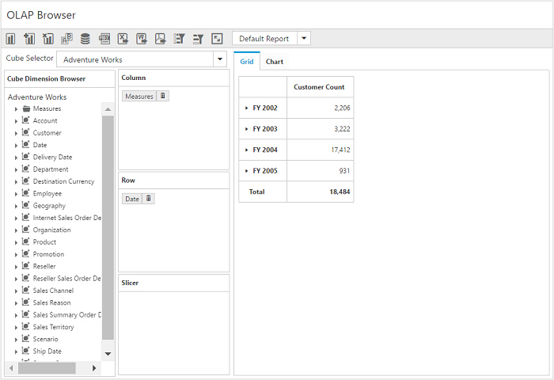

# Getting started with JavaScript PivotClient

## Creating a simple application with pivot client and OLAP data sources (client mode)

This section covers the information required to populate a simple pivot client with [`OLAP`](/api/js/ejpivotclient#members:analysisMode) data completely on the [`client-side`](/api/js/ejpivotclient#members:operationalmode).

### Scripts and CSS references

Create an HTML page and add scripts and style sheets that are required to render a pivot client widget that are listed below:

1. ej.web.all.min.css
2. jQuery-3.0.0.min.js
3. ej.web.all.min.js
4. jsrender.min.js

### Initialize pivot client

Place a div tag in the HTML page which acts as a container for the pivot client widget. Then, initialize the widget using the "ejPivotClient" method.



<!DOCTYPE html>
<html>
<head>

    <title>PivotClient - Getting Started</title>

    <link href="http://cdn.syncfusion.com/{{ site.releaseversion }}/js/web/flat-azure/ej.web.all.min.css" rel="stylesheet" type="text/css" />
    
    
    

</head>
<body>
    <!--Create a tag which acts as a container for ejPivotClient widget.-->
    

    
</body>
</html>



### Populate pivot client with data source

Initialize the [`OLAP`](/api/js/ejpivotclient#members:analysisMode) data source for pivot client widget as shown below:



<html>

//……

<body>
    

    
</body>
</html>



Now, the pivot client is rendered with the pivot chart, and the pivot grid is rendered with "Customer Geography" in the column, "Fiscal" in the row, and "Internet Sales Amount" measure in the value section.

The following table will explain the [`OLAP`](/api/js/ejpivotclient#members:analysismode) [`datasource`](/api/js/ejpivotclient#members:datasource) properties at [`client-side`](/api/js/ejpivotclient#members:operationalmode) in detail:

<table>
    <tr>
        <th>
            Properties
        </th>
        <th>
            Description
        </th>
    </tr>
    <tr>
    <td>
        {{'[`cube`](https://help.syncfusion.com/api/js/ejpivotclient#members:datasource-cube "cube")'| markdownify }}
    </td>
    <td>
        Contains the respective cube name from OLAP database as string type.
    </td>
    </tr>
    <tr>
    <td>
        {{'[`sourceInfo`](https://help.syncfusion.com/api/js/ejpivotclient#members:datasource-sourceinfo "sourceInfo")'| markdownify }}
    </td>
    <td>
        To set the data source name to fetch data from that.
    </td>
    </tr>
    <tr>
    <td>
        {{'[`providerName`](https://help.syncfusion.com/api/js/ejpivotclient#members:datasource-providername "providerName")'| markdownify }}
    </td>
    <td>
        Set the provider name for PivotClient to identify whether the provider is SSAS or Mondrian.
    </td>
    </tr>
    <tr>
    <td>
        {{'[`data`](https://help.syncfusion.com/api/js/ejpivotclient#members:datasource-data "data")'| markdownify }}
    </td>
    <td>
        Provides the raw data source for the pivot client.
    </td>
    </tr>
    <tr>
    <td>
        {{'[`catalog`](https://help.syncfusion.com/api/js/ejpivotclient#members:datasource-catalog "catalog")'| markdownify }}
    </td>
    <td>
        In connection with an OLAP database, this property contains the database name as string to fetch the data from the given connection string.
    </td>
    </tr>
    <tr>
    <td>
        {{'[`enableAdvancedFilter`](https://help.syncfusion.com/api/js/ejpivotclient#members:datasource-enableadvancedfilter "enableAdvancedFilter")'| markdownify }}
    </td>
    <td>
        Allows user to filter the members (by its name and values) through advanced filtering (excel-like) option.</td>
    </tr>
    <tr>
    <td>
        {{'[`reportName`](https://help.syncfusion.com/api/js/ejpivotclient#members:datasource-reportName "reportName")'| markdownify }}
    </td>
    <td>
        Sets a name to the report bound to the control.</td>
    </tr>
    <tr>
        <td>
            {{'[`columns`](https://help.syncfusion.com/api/js/ejpivotclient#members:datasource-columns "columns")'| markdownify }}
        </td>
        <td>
            Lists out the items to be arranged in columns section of pivot client.
             <table class="params">
            <thead>
            <tr>
            <th>Properties</th>
            <th>Description</th>
            </tr>
            </thead>
            <tbody>
            <tr>
            <td>{{'[`fieldName`](https://help.syncfusion.com/api/js/ejpivotclient#members:datasource-columns-fieldname "fieldName")'| markdownify }} </td>
            <td>Allows the user to bind the item by using its unique name as field name.</td>
            </tr>
            <tr>
            <td>{{'[`fieldCaption`](https://help.syncfusion.com/api/js/ejpivotclient#members:datasource-columns-fieldcaption "fieldCaption")'| markdownify }}</td>
            <td>Allows the user to set the display caption for an item.</td>
            </tr>
            <tr>
            <td>{{'[`isNamedSets`](https://help.syncfusion.com/api/js/ejpivotclient#members:datasource-columns-isnamedsets "isNamedSets")'| markdownify }}</td>
            <td>Allows the user to indicate whether the added item is a named set or not.</td>
            </tr>
            <tr>
            <td>{{'[`advancedFilter`](https://help.syncfusion.com/api/js/ejpivotclient#members:datasource-columns-advancedfilter "advancedFilter")'| markdownify }}</td>
            <td>Allows the user to filter the report by default using advanced filtering (excel-like) option for OLAP data source in client-mode.
            <table class="params">
            <thead>
            <tr>
            <th>Properties</th>
            <th>Description</th>
            </tr>
            </thead>
            <tbody>
            <tr>
            <td>
                {{'[`name`](https://help.syncfusion.com/api/js/ejpivotclient#members:datasource-columns-advancedfilter-name "name")'| markdownify }} </td>
            <td>Allows the user to provide level unique name to perform advanced filtering.</td>
            </tr>
            <tr>
            <td>
                {{'[`labelFilterOperator`](https://help.syncfusion.com/api/js/ejpivotclient#members:datasource-columns-advancedfilter-labelfilteroperator "labelFilterOperator")'| markdownify }} </td>
            <td>Allows the user to set the operator to perform Label Filtering.</td>
            </tr>
            <tr>
            <td>
                {{'[`valueFilterOperator`](https://help.syncfusion.com/api/js/ejpivotclient#members:datasource-columns-advancedfilter-valuefilteroperator "valueFilterOperator")'| markdownify }} </td>
            <td>Allows the user to set the operator to perform Value Filtering.</td>
            </tr>
            <tr>
            <td>
                {{'[`advancedFilterType`](https://help.syncfusion.com/api/js/ejpivotclient#members:datasource-columns-advancedfilter-advancedfiltertype "advancedFilterType")'| markdownify }} </td>
            <td>Allows the user to set the filtering type while performing advanced filtering.</td>
            </tr>
            <tr>
            <td>
                {{'[`measure`](https://help.syncfusion.com/api/js/ejpivotclient#members:datasource-columns-advancedfilter-measure "measure")'| markdownify }} </td>
            <td>In case of value filtering, this property contains the measure name to which the filter is applied.</td>
            </tr>
            <tr>
            <td>
                {{'[`values`](https://help.syncfusion.com/api/js/ejpivotclient#members:datasource-columns-advancedfilter-values "values")'| markdownify }} </td>
            <td>Allows the user to hold the filter operand values in advanced filtering.</td>
            </tr>
            </td>
            </tr>
            </tbody>
            </table>
            </td>
            </tr>
            </tbody>
            </table>
        </td>
    </tr>
    <tr>
        <td>
            {{'[`rows`](https://help.syncfusion.com/api/js/ejpivotclient#members:datasource-rows "rows")'| markdownify }}
        </td>
        <td>
            Lists out the items to be arranged in rows section of PivotClient.
             <table class="params">
            <thead>
            <tr>
            <th>Properties</th>
            <th>Description</th>
            </tr>
            </thead>
            <tbody>
            <tr>
            <td>{{'[`fieldName`](https://help.syncfusion.com/api/js/ejpivotclient#members:datasource-rows-fieldname "fieldName")'| markdownify }} </td>
            <td>Allows the user to bind the item by using its unique name as field name.</td>
            </tr>
            <tr>
            <td>{{'[`fieldCaption`](https://help.syncfusion.com/api/js/ejpivotclient#members:datasource-rows-fieldcaption "fieldCaption")'| markdownify }}</td>
            <td>Allows the user to set the display caption for an item.</td>
            </tr>
            <tr>
            <td>{{'[`isNamedSets`](https://help.syncfusion.com/api/js/ejpivotclient#members:datasource-rows-isnamedsets "isNamedSets")'| markdownify }}</td>
            <td>Allows the user to indicate whether the added item is a named set or not.</td>
            </tr>
            <tr>
            <td>{{'[`advancedFilter`](https://help.syncfusion.com/api/js/ejpivotclient#members:datasource-rows-advancedfilter "advancedFilter")'| markdownify }}</td>
            <td>Allows the user to filter the report by default using advanced filtering (excel-like) option for OLAP data source in client-mode.
            <table class="params">
            <thead>
            <tr>
            <th>Properties</th>
            <th>Description</th>
            </tr>
            </thead>
            <tbody>
            <tr>
            <td>
                {{'[`name`](https://help.syncfusion.com/api/js/ejpivotclient#members:datasource-rows-advancedfilter-name "name")'| markdownify }} </td>
            <td>Allows the user to provide level unique name to perform advanced filtering.</td>
            </tr>
            <tr>
            <td>
                {{'[`labelFilterOperator`](https://help.syncfusion.com/api/js/ejpivotclient#members:datasource-rows-advancedfilter-labelfilteroperator "labelFilterOperator")'| markdownify }} </td>
            <td>Allows the user to set the operator to perform Label Filtering.</td>
            </tr>
            <tr>
            <td>
                {{'[`valueFilterOperator`](https://help.syncfusion.com/api/js/ejpivotclient#members:datasource-rows-advancedfilter-valuefilteroperator "valueFilterOperator")'| markdownify }} </td>
            <td>Allows the user to set the operator to perform Value Filtering.</td>
            </tr>
            <tr>
            <td>
                {{'[`advancedFilterType`](https://help.syncfusion.com/api/js/ejpivotclient#members:datasource-rows-advancedfilter-advancedfiltertype "advancedFilterType")'| markdownify }} </td>
            <td>Allows the user to set the filtering type while performing advanced filtering.</td>
            </tr>
            <tr>
            <td>
                {{'[`measure`](https://help.syncfusion.com/api/js/ejpivotclient#members:datasource-rows-advancedfilter-measure "measure")'| markdownify }} </td>
            <td>In case of value filtering, this property contains the measure name to which the filter is applied.</td>
            </tr>
            <tr>
            <td>
                {{'[`values`](https://help.syncfusion.com/api/js/ejpivotclient#members:datasource-rows-advancedfilter-values "values")'| markdownify }} </td>
            <td>Allows the user to hold the filter operand values in advanced filtering.</td>
            </tr>
            </td>
            </tr>
            </tbody>
            </table>
            </td>
            </tr>
            </tbody>
            </table>
        </td>
    </tr>
    <tr>
        <td>
            {{'[`filters`](https://help.syncfusion.com/api/js/ejpivotclient#members:datasource-filters "filters")'| markdownify }}
        </td>
        <td>
            Lists out the items which supports filtering of values without displaying the members in UI in PivotClient.
             <table class="params">
            <thead>
            <tr>
            <th>Properties</th>
            <th>Description</th>
            </tr>
            </thead>
            <tbody>
            <tr>
            <td>{{'[`fieldName`](https://help.syncfusion.com/api/js/ejpivotclient#members:datasource-filters-fieldname "fieldName")'| markdownify }} </td>
            <td>Allows the user to bind the item by using its unique name as field name.</td>
            </tr>
            <tr>
            <td>{{'[`fieldCaption`](https://help.syncfusion.com/api/js/ejpivotclient#members:datasource-filters-fieldcaption "fieldCaption")'| markdownify }}</td>
            <td>Allows the user to set the display name for an item.</td>
            </tr>
            </tbody>
            </table>
            </td>
            </tr>
    <tr>
        <td>
            {{'[`values`](https://help.syncfusion.com/api/js/ejpivotclient#members:datasource-values "values")'| markdownify }}
        </td>
        <td>
            Lists out the items which supports calculation in PivotClient.
            <table class="params">
            <thead>
            <tr>
            <th>Properties</th>
            <th>Description</th>
            </tr>
            </thead>
            <tbody>
            <tr>
            <td>{{'[`axis`](https://help.syncfusion.com/api/js/ejpivotclient#members:datasource-values-axis "axis")'| markdownify }} </td>
            <td>Allows to set the axis name to place the measures items.</td>
            </tr>
            <tr>
            <td>{{'[`measures`](https://help.syncfusion.com/api/js/ejpivotclient#members:datasource-values-measures "measures")'| markdownify }}</td>
            <td>This holds the list of unique names of measures to bind them from the OLAP cube.
            <table class="params">
            <thead>
            <tr>
            <th>Property</th>
            <th>Description</th>
            </tr>
            </thead>
            <tbody>
            <tr>
            <td>
                {{'[`fieldName`](https://help.syncfusion.com/api/js/ejpivotclient#members:datasource-values-measures-fieldName "fieldName")'| markdownify }} </td>
            <td>Allows the user to bind the measure from OLAP datasource by using its unique name as field name.</td>
            </tr>
            </td>
            </tr>
            </tbody>
            </table>
            </td>
            </tr>
            </tbody>
            </table>
        </td>
        </tr>

</table>

## Creating a simple application with pivot client and OLAP data source (server mode)

This section covers the information required to create a simple pivot client bound to [`OLAP`](/api/js/ejpivotclient#members:analysisMode) data source from [`server-side`](/api/js/ejpivotclient#members:operationalmode).

N> This section is illustrated by creating a simple web application through Visual Studio IDE, since the pivot client bound with the data from server-side requires .NET dependency. The web application contains an HTML page and a service that will transfer the data to [`server-side`](/api/js/ejpivotclient#members:operationalmode), process it, and return it [`client-side`](/api/js/ejpivotclient#members:operationalmode) for control re-rendering. The service utilized for communication can be either WCF or WebAPI based on user requirement. Both are illustrated here for user convenience.

### Project initialization
Create a new **ASP.NET Empty Web Application** by using Visual Studio IDE and name the project **“PivotClientDemo.”**

Next, add an HTML page. To add an HTML page in your web application, right-click the project in the solution explorer and select **Add > New Item.** In the **Add New Item** window, select **HTML Page** and name it “GettingStarted.html,” and then click **Add.**

Now, set “GettingStarted.html” as the start-up page by right-click the “GettingStarted.html” page and select **“Set As Start Page”.**

### Scripts and CSS initialization
The scripts and style sheets that are required to render a pivot client widget in the HTML page are listed below:

1. ej.web.all.min.css
2. jQuery-3.0.0.min.js
3. ej.web.all.min.js
4. jsrender.min.js

The scripts and style sheets listed above can be found in any of the following locations:

Local disk: [Click here](https://help.syncfusion.com/js/installation-and-upgrade/install-using-the-web-installer) to know more about script and style sheets installed in the local machine.

CDN link: [Click here](https://help.syncfusion.com/js/cdn) to know more about script and style sheets available in online.

NuGet package: [Click here](https://help.syncfusion.com/js/installation-and-upgrade/install-using-the-web-installer#configuring-syncfusion-nuget-packages) to know more about script and style sheets available in the NuGet package.

### Control initialization
To initialize a pivot client widget, first you should define a div tag with an appropriate id attribute which acts as a container for the pivot client widget. Then, you can initialize the widget using the ejPivotClient method.



<!DOCTYPE html>
<html xmlns="http://www.w3.org/1999/xhtml">

<head>
    <title>PivotClient - Getting Started</title>
    <link href="http://cdn.syncfusion.com/{{ site.releaseversion }}/js/web/flat-azure/ej.web.all.min.css" rel="stylesheet" type="text/css" />
    
    
    
</head>

<body>
    

        <!--Creating a div tag, that acts as a container for ejPivotClient widget.-->
        

        
    

</body>
</html>



The [`url`](/api/js/ejpivotclient#members:url) property in the pivot client widget points to the service endpoint, where the data is processed and fetched in the form of JSON. The services used for the pivot client widget as endpoint are WCF and WebAPI.

 The [`title`](/api/js/ejpivotclient#members:title) property is used to set the title for the pivot client widget.

N> The above "GettingStarted.html" page contains WebAPI [`url`](/api/js/ejpivotclient#members:url), which is **“/Olap”**. If you are using the WCF service, then the [`url`](/api/js/ejpivotclient#members:url) will look like **“/OlapService.svc”**.

### WebAPI

**Adding a WebAPI controller**

To add a WebAPI controller in your existing web application, right-click the project in the solution explorer and select **Add > New Item.** In the **Add New Item** window, select **WebAPI Controller Class** and name it **“OlapController.cs”**, and then click **Add.**

The WebAPI controller is added to your application with the following file. The utilization of this file will be explained in the following sections:

* OlapController.cs

N> While adding the WebAPI controller class, add the mandatory suffix “Controller”. For example, in the demo, the controller is named “OlapController”.

Next, remove all the existing methods such as “Get”, “Post”, “Put”, and “Delete” that are present in the `OlapController.cs` file.



namespace PivotClientDemo
{
    public class OlapController: ApiController
    {

    }
}



**List of dependency libraries**

Next, add the following dependency libraries to the web application. You can find these libraries in the GAC (Global Assembly Cache) in the machine.

To add them to the web application, right-click **References** in the solution explorer and select **Add Reference.** In the **Reference Manager** dialog, under **Assemblies > Extension**, the following Syncfusion libraries are found.

N> If you have installed any version of SQL Server Analysis Service (SSAS) or Microsoft ADOMD.NET utility, then the location of Microsoft.AnalysisServices.AdomdClient library is [system drive:\Program Files (x86)\Microsoft.NET\ADOMD.NET]. If you have installed any version of Essential Studio, then the location of Syncfusion libraries is [system drive:\Program Files (x86)\Syncfusion\Essential Studio\{{ site.releaseversion }}\Assemblies].

* Microsoft.AnalysisServices.AdomdClient
* Syncfusion.Compression.Base
* Syncfusion.Linq.Base
* Syncfusion.Olap.Base
* Syncfusion.PivotAnalysis.Base
* System.Data.SqlServerCe (Version: 4.0.0.0)
* Syncfusion.XlsIO.Base
* Syncfusion.Pdf.Base
* Syncfusion.DocIO.Base
* Syncfusion.EJ
* Syncfusion.EJ.Export
* Syncfusion.EJ.Pivot

**List of namespaces**

The following is the list of namespaces to be added on top of the main class in the `OlapController.cs` file:



using Syncfusion.JavaScript;
using Syncfusion.Olap.Manager;
using Syncfusion.Olap.Reports;
using System;
using System.Collections.Generic;
using System.Configuration;
using System.Data;
using System.Data.SqlServerCe;
using System.Linq;
using System.Text;
using System.Web;
using System.Web.Http;
using System.Web.Script.Serialization;
using OLAPUTILS = Syncfusion.JavaScript.Olap;

namespace PivotClientDemo
{
    public class OlapController: ApiController
    {

    }
}



**Data source initialization**

The connection string to connect OLAP cube, the pivot client, and JavaScriptSerializer instances are created immediately in the main class of `OlapController.cs` file. Also, the database connection for saving and loading the reports is provided appropriately.



namespace PivotClientDemo
{
    public class OlapController: ApiController
    {
        PivotClient pivotClientHelper = new PivotClient();
        PivotTreeMap treeMapHelper = new PivotTreeMap();
        PivotChart chartHelper = new PivotChart();
        JavaScriptSerializer serializer = new JavaScriptSerializer();
        string connectionString = "Data Source=https://bi.syncfusion.com/olap/msmdpump.dll; Initial Catalog=Adventure Works DW 2008 SE;";
        string conStringforDB = "";//Enter appropriate connection string to connect database for saving and loading operation of reports
        //Other codes
    }
}



**Service methods in WebAPI controller**

You can define the service methods in the OlapController class. To do so, find the `OlapController.cs` file which was created while adding the WebAPI Controller class to your web application.



namespace PivotClientDemo
{
    public class OlapController: ApiController
    {
        PivotClient pivotClientHelper = new PivotClient();
        PivotTreeMap treeMapHelper = new PivotTreeMap();
        PivotChart chartHelper = new PivotChart();
        JavaScriptSerializer serializer = new JavaScriptSerializer();
        string connectionString = "Data Source=https://bi.syncfusion.com/olap/msmdpump.dll; Initial Catalog=Adventure Works DW 2008 SE;";
        string conStringforDB = "";//Enter appropriate connection string to connect database for saving and loading operation of reports

        [System.Web.Http.ActionName("InitializeClient")]
        [System.Web.Http.HttpPost]
        public Dictionary<string, object> InitializeClient(Dictionary<string, object> jsonResult)
        {
            OlapDataManager DataManager = null;
            DataManager = new OlapDataManager(connectionString);
            DataManager.SetCurrentReport(CreateOlapReport());
            return pivotClientHelper.GetJsonData(jsonResult["action"].ToString(), DataManager, jsonResult["clientParams"].ToString());
        }

        [System.Web.Http.ActionName("InitializeGrid")]
        [System.Web.Http.HttpPost]
        public Dictionary<string, object> InitializeGrid(Dictionary<string, object> jsonResult)
        {
            OlapDataManager DataManager = new OlapDataManager(connectionString);
            DataManager.SetCurrentReport(OLAPUTILS.Utils.DeserializeOlapReport(jsonResult["currentReport"].ToString()));
            return jsonResult.ContainsKey("gridLayout") ? pivotClientHelper.GetJsonData(jsonResult["action"].ToString(), DataManager, jsonResult["gridLayout"].ToString()) : pivotClientHelper.GetJsonData(jsonResult["action"].ToString(), DataManager);
        }

        [System.Web.Http.ActionName("InitializeChart")]
        [System.Web.Http.HttpPost]
        public Dictionary<string, object> InitializeChart(Dictionary<string, object> jsonResult)
        {
            OlapDataManager DataManager = new OlapDataManager(connectionString);
            DataManager.SetCurrentReport(OLAPUTILS.Utils.DeserializeOlapReport(jsonResult["currentReport"].ToString()));
            return chartHelper.GetJsonData(jsonResult["action"].ToString(), DataManager);
        }

        [System.Web.Http.ActionName("InitializeTreeMap")]
        [System.Web.Http.HttpPost]
        public Dictionary<string, object> InitializeTreeMap(Dictionary<string, object> jsonResult)
        {
            OlapDataManager DataManager = new OlapDataManager(connectionString);
            DataManager.SetCurrentReport(OLAPUTILS.Utils.DeserializeOlapReport(jsonResult["currentReport"].ToString()));
            return treeMapHelper.GetJsonData(jsonResult["action"].ToString(), DataManager);
        }

        [System.Web.Http.ActionName("DrillChart")]
        [System.Web.Http.HttpPost]
        public Dictionary<string, object> DrillChart(Dictionary<string, object> jsonResult)
        {
            OlapDataManager DataManager = new OlapDataManager(connectionString);
            DataManager.SetCurrentReport(OLAPUTILS.Utils.DeserializeOlapReport(jsonResult["olapReport"].ToString()));
            DataManager.Reports = pivotClientHelper.DeserializedReports(jsonResult["clientReports"].ToString());
            return chartHelper.GetJsonData(jsonResult["action"].ToString(), DataManager, jsonResult["drilledSeries"].ToString());
        }

        [System.Web.Http.ActionName("DrillTreeMap")]
        [System.Web.Http.HttpPost]
        public Dictionary<string, object> DrillTreeMap(Dictionary<string, object> jsonResult)
        {
            OlapDataManager DataManager = new OlapDataManager(connectionString);
            DataManager.SetCurrentReport(OLAPUTILS.Utils.DeserializeOlapReport(jsonResult["olapReport"].ToString()));
            DataManager.Reports = pivotClientHelper.DeserializedReports(jsonResult["clientReports"].ToString());
            return treeMapHelper.GetJsonData(jsonResult["action"].ToString(), DataManager, jsonResult["drillInfo"].ToString());
        }

        [System.Web.Http.ActionName("FilterElement")]
        [System.Web.Http.HttpPost]
        public Dictionary<string, object> FilterElement(Dictionary<string, object> jsonResult)
        {
            OlapDataManager DataManager = new OlapDataManager(connectionString);
            DataManager.SetCurrentReport(OLAPUTILS.Utils.DeserializeOlapReport(jsonResult["olapReport"].ToString()));
            DataManager.Reports = pivotClientHelper.DeserializedReports(jsonResult["clientReports"].ToString());
            return pivotClientHelper.GetJsonData(jsonResult["action"].ToString(), DataManager, jsonResult["clientParams"].ToString());
        }

        [System.Web.Http.ActionName("RemoveSplitButton")]
        [System.Web.Http.HttpPost]
        public Dictionary<string, object> RemoveSplitButton(Dictionary<string, object> jsonResult)
        {
            OlapDataManager DataManager = new OlapDataManager(connectionString);
            DataManager.SetCurrentReport(OLAPUTILS.Utils.DeserializeOlapReport(jsonResult["olapReport"].ToString()));
            DataManager.Reports = pivotClientHelper.DeserializedReports(jsonResult["clientReports"].ToString());
            return pivotClientHelper.GetJsonData(jsonResult["action"].ToString(), DataManager, jsonResult["clientParams"].ToString());
        }

        [System.Web.Http.ActionName("FetchMemberTreeNodes")]
        [System.Web.Http.HttpPost]
        public Dictionary<string, object> FetchMemberTreeNodes(Dictionary<string, object> jsonResult)
        {
            OlapDataManager DataManager = new OlapDataManager(connectionString);
            DataManager.SetCurrentReport(OLAPUTILS.Utils.DeserializeOlapReport(jsonResult["olapReport"].ToString()));
            return pivotClientHelper.GetJsonData(jsonResult["action"].ToString(), DataManager, jsonResult["dimensionName"].ToString());
        }

        [System.Web.Http.ActionName("DrillGrid")]
        [System.Web.Http.HttpPost]
        public Dictionary<string, object> DrillGrid(Dictionary<string, object> jsonResult)
        {
            OlapDataManager DataManager = new OlapDataManager(connectionString);
            DataManager.SetCurrentReport(OLAPUTILS.Utils.DeserializeOlapReport(jsonResult["currentReport"].ToString()));
            DataManager.Reports = pivotClientHelper.DeserializedReports(jsonResult["clientReports"].ToString());
            return pivotClientHelper.GetJsonData(jsonResult["action"].ToString(), DataManager, jsonResult["cellPosition"].ToString(), jsonResult["headerInfo"].ToString(), jsonResult["layout"].ToString());
        }

        [System.Web.Http.ActionName("NodeDropped")]
        [System.Web.Http.HttpPost]
        public Dictionary<string, object> NodeDropped(Dictionary<string, object> jsonResult)
        {
            OlapDataManager DataManager = new OlapDataManager(connectionString);
            DataManager.SetCurrentReport(OLAPUTILS.Utils.DeserializeOlapReport(jsonResult["olapReport"].ToString()));
            DataManager.Reports = pivotClientHelper.DeserializedReports(jsonResult["clientReports"].ToString());
            return pivotClientHelper.GetJsonData(jsonResult["action"].ToString(), DataManager, jsonResult["dropType"].ToString(), jsonResult["nodeInfo"].ToString());
        }

        [System.Web.Http.ActionName("CubeChanged")]
        [System.Web.Http.HttpPost]
        public Dictionary<string, object> CubeChanged(Dictionary<string, object> jsonResult)
        {
            OlapDataManager DataManager = new OlapDataManager(connectionString);
            if (jsonResult["olapReport"].ToString() != "")
                DataManager.SetCurrentReport(Syncfusion.JavaScript.Olap.Utils.DeserializeOlapReport(jsonResult["olapReport"].ToString()));
            if (jsonResult["clientReports"].ToString() != "")
                DataManager.Reports = pivotClientHelper.DeserializedReports(jsonResult["clientReports"].ToString());
            dynamic customData = serializer.Deserialize<dynamic>(jsonResult["customObject"].ToString());
            if (customData is Dictionary<string, object> && customData.ContainsKey("isPaging"))
            {
                DataManager.CurrentReport.EnablePaging = true;
                DataManager.CurrentReport.PagerOptions.SeriesPageSize = 5;
                DataManager.CurrentReport.PagerOptions.CategoricalPageSize = 3;
            }
            return pivotClientHelper.GetJsonData(jsonResult["action"].ToString(), DataManager, jsonResult["cubeName"].ToString(), jsonResult["clientParams"].ToString());
        }

        [System.Web.Http.ActionName("MeasureGroupChanged")]
        [System.Web.Http.HttpPost]
        public Dictionary<string, object> MeasureGroupChanged(Dictionary<string, object> jsonResult)
        {
            OlapDataManager DataManager = new OlapDataManager(connectionString);
            return pivotClientHelper.GetJsonData(jsonResult["action"].ToString(), DataManager, jsonResult["measureGroupName"].ToString());
        }

        [System.Web.Http.ActionName("ToolbarOperations")]
        [System.Web.Http.HttpPost]
        public Dictionary<string, object> ToolbarOperations(Dictionary<string, object> jsonResult)
        {
            var toolbarOperation = "";
            dynamic customData = "";
            OlapDataManager DataManager = new OlapDataManager(connectionString);
            if ((jsonResult["olapReport"]) != null && !string.IsNullOrEmpty(jsonResult["olapReport"].ToString()))
                DataManager.SetCurrentReport(OLAPUTILS.Utils.DeserializeOlapReport(jsonResult["olapReport"].ToString()));
            if ((jsonResult["clientReports"]) != null && !string.IsNullOrEmpty(jsonResult["clientReports"].ToString()))
                DataManager.Reports = pivotClientHelper.DeserializedReports(jsonResult["clientReports"].ToString());
            toolbarOperation = jsonResult["toolbarOperation"] == null ? null : jsonResult["toolbarOperation"].ToString();
            if (jsonResult.ContainsKey("customObject") && (jsonResult["customObject"]) != null && !string.IsNullOrEmpty(jsonResult["customObject"].ToString()))
                customData = serializer.Deserialize<dynamic>(jsonResult["customObject"].ToString());
            if ((customData is Dictionary<string, object> && customData.ContainsKey("isPaging") && (toolbarOperation == "Add Report" || toolbarOperation == "New Report")))
            {
                DataManager.CurrentReport.EnablePaging = true;
                DataManager.CurrentReport.PagerOptions.SeriesPageSize = 5;
                DataManager.CurrentReport.PagerOptions.CategoricalPageSize = 3;
            }
            return pivotClientHelper.GetJsonData(jsonResult["action"].ToString(), DataManager, toolbarOperation, jsonResult["clientInfo"].ToString());
        }

        [System.Web.Http.ActionName("MemberExpanded")]
        [System.Web.Http.HttpPost]
        public Dictionary<string, object> MemberExpanded(Dictionary<string, object> jsonResult)
        {
            OlapDataManager DataManager = new OlapDataManager(connectionString);
            if (!string.IsNullOrEmpty(jsonResult["olapReport"].ToString()))
                DataManager.SetCurrentReport(OLAPUTILS.Utils.DeserializeOlapReport(jsonResult["olapReport"].ToString()));
            if (!string.IsNullOrEmpty(jsonResult["clientReports"].ToString()))
                DataManager.Reports = pivotClientHelper.DeserializedReports(jsonResult["clientReports"].ToString());
            return pivotClientHelper.GetJsonData(jsonResult["action"].ToString(), DataManager, Convert.ToBoolean(jsonResult["checkedStatus"].ToString()), jsonResult["parentNode"].ToString(), jsonResult["tag"].ToString(), jsonResult["dimensionName"].ToString(), jsonResult["cubeName"].ToString());
        }

        [System.Web.Http.ActionName("UpdateReport")]
        [System.Web.Http.HttpPost]
        public Dictionary<string, object> UpdateReport(Dictionary<string, object> jsonResult)
        {
            return pivotClientHelper.GetJsonData(jsonResult["action"].ToString(), jsonResult["clientParams"].ToString(), jsonResult["olapReport"].ToString(), jsonResult["clientReports"].ToString());
        }

        [System.Web.Http.ActionName("SaveReportToDB")]
        [System.Web.Http.HttpPost]
        public Dictionary<string, object> SaveReportToDB(Dictionary<string, object> jsonResult)
        {
            string operationalMode = jsonResult["operationalMode"].ToString(), analysisMode = jsonResult["analysisMode"].ToString(), reportName = string.Empty;
            bool isDuplicate = true;
            SqlCeConnection con = new SqlCeConnection() { ConnectionString = conStringforDB };
            con.Open();
            reportName = jsonResult["reportName"].ToString() + "##" + operationalMode.ToLower() + "#>>#" + analysisMode.ToLower();
            SqlCeCommand cmd1 = null;
            foreach (DataRow row in GetDataTable().Rows)
            {
                if ((row.ItemArray[0] as string).Equals(reportName))
                {
                    isDuplicate = false;
                    cmd1 = new SqlCeCommand("update ReportsTable set Report=@Reports where ReportName like @ReportName", con);
                }
            }
            if (isDuplicate)
            {
                cmd1 = new SqlCeCommand("insert into ReportsTable Values(@ReportName,@Reports)", con);
            }
            cmd1.Parameters.Add("@ReportName", reportName);
            cmd1.Parameters.Add("@Reports", Encoding.UTF8.GetBytes(jsonResult["clientReports"].ToString()).ToArray());
            cmd1.ExecuteNonQuery();
            con.Close();
            Dictionary<string, object> dictionary = new Dictionary<string, object>();
            dictionary.Add("CurrentAction", "Save");
            return dictionary;
        }

        [System.Web.Http.ActionName("RemoveReportFromDB")]
        [System.Web.Http.HttpPost]
        public Dictionary<string, object> RemoveReportFromDB(Dictionary<string, object> jsonResult)
        {
            string operationalMode = jsonResult["operationalMode"].ToString(), analysisMode = jsonResult["analysisMode"].ToString(), reportName = string.Empty;
            SqlCeConnection con = new SqlCeConnection() { ConnectionString = conStringforDB };
            con.Open();
            reportName = jsonResult["reportName"].ToString() + "##" + operationalMode.ToLower() + "#>>#" + analysisMode.ToLower();
            SqlCeCommand cmd1 = null;
            foreach (DataRow row in GetDataTable().Rows)
            {
                if ((row.ItemArray[0] as string).Equals(reportName))
                {
                    cmd1 = new SqlCeCommand("DELETE FROM ReportsTable WHERE ReportName LIKE '%" + reportName + "%'", con);
                }
            }
            cmd1.ExecuteNonQuery();
            con.Close();
            Dictionary<string, object> dictionary = new Dictionary<string, object>();
            dictionary.Add("CurrentAction", "Remove");
            return dictionary;
        }

        [System.Web.Http.ActionName("RenameReportInDB")]
        [System.Web.Http.HttpPost]
        public Dictionary<string, object> RenameReportInDB(Dictionary<string, object> jsonResult)
        {
            string operationalMode = jsonResult["operationalMode"].ToString(), analysisMode = jsonResult["analysisMode"].ToString(), reportName = string.Empty, renameReport = string.Empty;
            SqlCeConnection con = new SqlCeConnection() { ConnectionString = conStringforDB };
            con.Open();
            reportName = jsonResult["selectedReport"].ToString() + "##" + operationalMode.ToLower() + "#>>#" + analysisMode.ToLower();
            renameReport = jsonResult["renameReport"].ToString() + "##" + operationalMode.ToLower() + "#>>#" + analysisMode.ToLower();
            SqlCeCommand cmd1 = null;
            foreach (DataRow row in GetDataTable().Rows)
            {
                if ((row.ItemArray[0] as string).Equals(reportName))
                {
                    cmd1 = new SqlCeCommand("update ReportsTable set ReportName=@RenameReport where ReportName like '%" + reportName + "%'", con);
                }
            }
            cmd1.Parameters.Add("@RenameReport", renameReport);
            cmd1.ExecuteNonQuery();
            con.Close();
            Dictionary<string, object> dictionary = new Dictionary<string, object>();
            dictionary.Add("CurrentAction", "Rename");
            return dictionary;
        }

        [System.Web.Http.ActionName("FetchReportListFromDB")]
        [System.Web.Http.HttpPost]
        public Dictionary<string, object> FetchReportListFromDB(Dictionary<string, object> jsonResult)
        {
            string reportNames = string.Empty, currentRptName = string.Empty, operationalMode = jsonResult["operationalMode"].ToString(), analysisMode = jsonResult["analysisMode"].ToString();
            foreach (System.Data.DataRow row in GetDataTable().Rows)
            {
                currentRptName = (row.ItemArray[0] as string);
                if (currentRptName.IndexOf("##" + operationalMode + "#>>#" + analysisMode) >= 0)
                {
                    currentRptName = currentRptName.Replace("##" + operationalMode + "#>>#" + analysisMode, "");
                    reportNames = reportNames == "" ? currentRptName : reportNames + "__" + currentRptName;
                }
            }
            Dictionary<string, object> dictionary = new Dictionary<string, object>();
            dictionary.Add("ReportNameList", reportNames);
            dictionary.Add("action", jsonResult["action"].ToString());
            return dictionary;
        }

        [System.Web.Http.ActionName("LoadReportFromDB")]
        [System.Web.Http.HttpPost]
        public Dictionary<string, object> LoadReportFromDB(Dictionary<string, object> jsonResult)
        {
            PivotReport report = new PivotReport();
            string operationalMode = jsonResult["operationalMode"].ToString(), analysisMode = jsonResult["analysisMode"].ToString();
            Dictionary<string, object> dictionary = new Dictionary<string, object>();
            string currentRptName = string.Empty;
            foreach (DataRow row in GetDataTable().Rows)
            {
                currentRptName = (row.ItemArray[0] as string).Replace("##" + operationalMode.ToLower() + "#>>#" + analysisMode.ToLower(), "");
                if (currentRptName.Equals(jsonResult["reportName"].ToString()))
                {
                    byte[] reportByte = new byte[2 * 1024];
                    reportByte = (row.ItemArray[1] as byte[]);
                    if (operationalMode.ToLower() == "servermode" && analysisMode == "olap")
                    {
                        var repCol = Encoding.UTF8.GetString(reportByte);
                        OlapDataManager DataManager = new OlapDataManager(connectionString);
                        if (repCol.IndexOf("<?xml version") == 0)
                        {
                            var reportString = "";
                            reportString = Syncfusion.JavaScript.Olap.Utils.CompressData(row.ItemArray[1] as byte[]);
                            DataManager.Reports = pivotClientHelper.DeserializedReports(reportString);
                            DataManager.SetCurrentReport(DataManager.Reports[0]);
                            return pivotClientHelper.GetJsonData("toolbarOperation", DataManager, "Load Report", jsonResult["reportName"].ToString());
                        }
                        else
                        {
                            dynamic customData = serializer.Deserialize<dynamic>(repCol.ToString());
                            DataManager.Reports = pivotClientHelper.DeserializedReports(customData[customData[customData.Length - 1]["cubeIndex"]]["Reports"]);
                            DataManager.SetCurrentReport(DataManager.Reports[customData[customData[customData.Length - 1]["cubeIndex"]]["ReportIndex"]]);
                            dictionary = pivotClientHelper.GetJsonData("toolbarOperation", DataManager, "Load Report", jsonResult["reportName"].ToString());
                            dictionary.Add("Collection", repCol);
                        }
                    }
                }
            }
            return dictionary;
        }

        private DataTable GetDataTable()
        {
            SqlCeConnection con = new SqlCeConnection() { ConnectionString = conStringforDB };
            con.Open();
            DataSet dSet = new DataSet();
            new SqlCeDataAdapter("Select * from ReportsTable", con).Fill(dSet);
            con.Close();
            return dSet.Tables[0];
        }

        [System.Web.Http.ActionName("Export")]
        [System.Web.Http.HttpPost]
        public void Export()
        {
            string args = HttpContext.Current.Request.Form.GetValues(0)[0];
            OlapDataManager DataManager = new OlapDataManager(connectionString);
            string fileName = "Sample";
            pivotClientHelper.ExportPivotClient(DataManager, args, fileName, System.Web.HttpContext.Current.Response);
        }

        [System.Web.Http.ActionName("GetMDXQuery")]
        [System.Web.Http.HttpPost]
        public string GetMDXQuery(Dictionary<string, object> jsonResult)
        {
            OlapDataManager DataManager = new OlapDataManager(connectionString);
            DataManager.SetCurrentReport(OLAPUTILS.Utils.DeserializeOlapReport(jsonResult["olapReport"].ToString()));
            return DataManager.GetMDXQuery();
        }

        [System.Web.Http.ActionName("ToggleAxis")]
        [System.Web.Http.HttpPost]
        public Dictionary<string, object> ToggleAxis(Dictionary<string, object> jsonResult)
        {
            OlapDataManager DataManager = new OlapDataManager(connectionString);
            DataManager.SetCurrentReport(OLAPUTILS.Utils.DeserializeOlapReport(jsonResult["currentReport"].ToString()));
            DataManager.Reports = pivotClientHelper.DeserializedReports(jsonResult["clientReports"].ToString());
            DataManager.ToggleAxis(DataManager.CurrentReport);
            return pivotClientHelper.GetJsonData(jsonResult["action"].ToString(), DataManager, jsonResult["clientReports"].ToString());
        }

        [System.Web.Http.ActionName("Paging")]
        [System.Web.Http.HttpPost]
        public Dictionary<string, object> Paging(Dictionary<string, object> jsonResult)
        {
            OlapDataManager DataManager = new OlapDataManager(connectionString);
            DataManager.SetCurrentReport(OLAPUTILS.Utils.SetPaging(jsonResult["currentReport"].ToString(), jsonResult["pagingInfo"].ToString()));
            return pivotClientHelper.GetJsonData(jsonResult["action"].ToString(), DataManager, jsonResult["layout"].ToString());
        }

        private OlapReport CreateOlapReport()
        {
            OlapReport olapReport = new OlapReport() { Name = "Default Report" };
            olapReport.CurrentCubeName = "Adventure Works";

            MeasureElements measureElement = new MeasureElements();
            measureElement.Elements.Add(new MeasureElement { UniqueName = "[Measures].[Customer Count]" });

            DimensionElement dimensionElementRow = new DimensionElement();
            dimensionElementRow.Name = "Date";
            dimensionElementRow.AddLevel("Fiscal", "Fiscal Year");

            olapReport.SeriesElements.Add(dimensionElementRow);
            olapReport.CategoricalElements.Add(measureElement);

            return olapReport;
        }
    }
}



N> The [`customObject`](../api/ejpivotclient#members:customobject) is utilized to pass the additional information between the client-end and the service-end.

**Configure routing in global application class**

To add a Global.asax in your existing web application, right-click the project in the solution explorer and select **Add > New Item.** In the **Add New Item** window, select **Global Application Class** and name it “Global.asax”, and then click **Add.**
After adding the **Global.asax** file, immediately add the namespace **“using System.Web.Http;”**, and then you can configure the routing as shown in the following code example:



public class Global: System.Web.HttpApplication
{
    protected void Application_Start(object sender, EventArgs e)
    {
        System.Web.Http.GlobalConfiguration.Configuration.Routes.MapHttpRoute(name: "DefaultApi", routeTemplate: "{controller}/{action}/{id}", defaults: new
        {
            id = RouteParameter.Optional
        });
        AppDomain.CurrentDomain.SetData("SQLServerCompactEditionUnderWebHosting", true);
    }
}



The pivot client is rendered with the pivot chart and pivot grid showing customer count over a period of fiscal years.

### WCF
This section demonstrates the utilization of the WCF service as endpoint binding OLAP data source to the simple pivot client. For more details on this topic, [click here](https://help.syncfusion.com/js/pivotclient/olap-connectivity#wcf).

