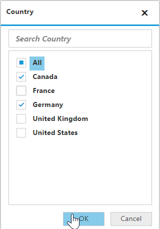

# Data Exploration

## Filtering

### Filtering by member

By clicking the split button of a field, the member editor dialog opens through which members are filtered by checking and unchecking the check boxes corresponding to the members.

By clicking OK, the pivot report gets updated and refreshes the pivot grid and pivot chart controls based on selected members in the member editor dialog.  The Cancel button is used to cancel the selection.

The above filter illustrates the members 'Canada' and 'Germany' are alone included in the grid and chart controls.

## Grouping

The data can be grouped when more than one field is added to columns or rows in the axis element builder.  Based on the order of addition, the data is grouped and the report is updated. In the following example, the **Date** field values get grouped with respect to **Country** field values.  Likewise, multiple field members can be grouped by dragging the fields from pivot fields list to axis element builder.

## Searching

Members can be searched and displayed from the members list in the member editor dialog.

