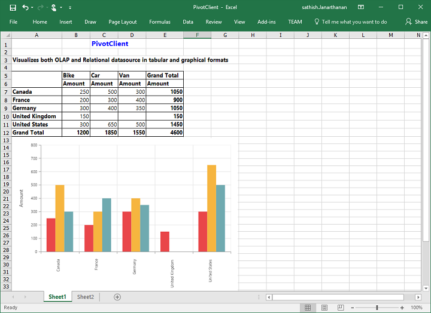

# Exporting

The chart and the grid in the pivot client widget can be exported to Microsoft Excel, Microsoft Word, and PDF documents by clicking the respective toolbar icons.

The exporting feature provides an option that allows you to export the pivot chart or pivot grid or both with the use of the [`clientExportMode`](/api/js/ejpivotclient#members:clientExportMode) property.

The [`clientExportMode`](/api/js/ejpivotclient#members:clientExportMode) property takes any one of the following value:

* **ChartAndGrid** – Exports both the pivot chart and pivot grid controls. This mode is the default mode.
* **ChartOnly** – Exports the pivot chart control alone.
* **GridOnly** – Exports the pivot grid control alone.

## JSON export

I> By default, the JSON export mode will be applied for server and client modes.

To perform exporting with the use of a custom service method, the service containing the exporting method is hosted and its link is given in url as shown below. Without giving any value to the 'url' property, it takes the default exporting service link.



        $("#PivotClient1").ejPivotClient({
            //...
            beforeExport:"Export",
            clientExportMode: ej.PivotClient.ClientExportMode.ChartAndGrid
        });

        function Export(args) {
            args.url = "https://js.syncfusion.com/ejservices/api/PivotClient/Olap/Export";
        }



### Customize the export document name

The name of the document to be exported can be customized. The following code sample illustrates this process:



        $("#PivotClient1").ejPivotClient({
            //...
            beforeExport:"Export",
            clientExportMode: ej.PivotClient.ClientExportMode.ChartAndGrid
        });

        function Export(args) {
            args.url = "https://js.syncfusion.com/ejservices/api/PivotClient/Olap/Export";
            args.fileName="File name is customized here";
        }



## Pivot engine export

I> This feature is applicable only at the server mode operation.

To perform exporting with the use of pivot engine available in server-side, the 'exportMode' property obtained in the “beforeExport” event is set to "ej.PivotClient.ExportMode.PivotEngine" as shown below:



        $("#PivotClient1").ejPivotClient({
            url: "/RelationalClient",
            beforeExport:"Export",
            clientExportMode: ej.PivotClient.ClientExportMode.ChartAndGrid
        });

        function Export(args) {
            args.exportMode = ej.PivotClient.ExportMode.PivotEngine;
        }

 

For WebAPI controller, the following method should be added to perform exporting with the pivot engine.



        [System.Web.Http.ActionName("Export")]
        [System.Web.Http.HttpPost]
        public void Export()
        {
            string args = HttpContext.Current.Request.Form.GetValues(0)[0];
            Dictionary<string, string> gridParams = serializer.Deserialize<Dictionary<string, string>>(args);
            pivotClient.PopulateData(gridParams["currentReport"]);
            string fileName = "Sample";
            pivotClient.ExportPivotClient(ProductSales.GetSalesData(), args, fileName, System.Web.HttpContext.Current.Response);
        }



For WCF service, the following service method should be added to perform exporting with the pivot engine.



       public void Export(System.IO.Stream stream)
       {
            System.IO.StreamReader sReader = new System.IO.StreamReader(stream);
            string args = System.Web.HttpContext.Current.Server.UrlDecode(sReader.ReadToEnd()).Remove(0, 5);
            Dictionary<string, string> gridParams = serializer.Deserialize<Dictionary<string, string>>(args);
            pivotClient.PopulateData(gridParams["currentReport"]);
            string fileName = "Sample";
            pivotClient.ExportPivotClient(ProductSales.GetSalesData(), args, fileName, System.Web.HttpContext.Current.Response);
       }



### File format selection

I> This option is applicable only for the pivot client when exporting to an Excel document.

You can set the option for exporting the control to the Excel document either in *.xls* or *.xlsx* format, using the `fileFormat` property in the `beforeExport` event.

N> By default, the excel document will be exported to ".xls" format using the pivot engine export.



        $("#PivotClient1").ejPivotClient({
            url: "/RelationalClient",
            beforeExport:"Export",
            clientExportMode: ej.PivotClient.ClientExportMode.ChartAndGrid
        });

        function Export(args) {
            args.exportMode = ej.PivotClient.ExportMode.PivotEngine;
            args.fileFormat = ".xlsx"; //you can set the excel sheet format here
        }

 

### Customize the export document name

The document name can be customized in the method of the WebAPI controller. The following code sample illustrates this process:



        [System.Web.Http.ActionName("Export")]
        [System.Web.Http.HttpPost]
        public void Export()
        {
            string args = HttpContext.Current.Request.Form.GetValues(0)[0];
            Dictionary<string, string> gridParams = serializer.Deserialize<Dictionary<string, string>>(args);
            pivotClient.PopulateData(gridParams["currentReport"]);
            string fileName = " File name is customized here ";
            pivotClient.ExportPivotClient(ProductSales.GetSalesData(), args, fileName, System.Web.HttpContext.Current.Response);
        }



For customizing a name in the WCF Service, the below code snippet is used.



       public void Export(System.IO.Stream stream)
       {
            System.IO.StreamReader sReader = new System.IO.StreamReader(stream);
            string args = System.Web.HttpContext.Current.Server.UrlDecode(sReader.ReadToEnd()).Remove(0, 5);
            Dictionary<string, string> gridParams = serializer.Deserialize<Dictionary<string, string>>(args);
            pivotClient.PopulateData(gridParams["currentReport"]);
            string fileName = " File name is customized here ";
            pivotClient.ExportPivotClient(ProductSales.GetSalesData(), args, fileName, System.Web.HttpContext.Current.Response);
       }



## Pivot chart - Exporting format

I> This option is applicable only for the pivot chart in the pivot client specifically when exported to the Excel document.

You can set an option to export the pivot chart to an Excel document, and you can export it as either an image or pivot chart format itself by setting the Boolean property `exportChartAsImage` in the `beforeExport` event.

N> By default, the pivot chart will be exported to image format in the Excel document.



        $("#PivotClient1").ejPivotClient({
            //..
            beforeExport:"Export",
            clientExportMode: ej.PivotClient.ClientExportMode.ChartOnly
        });

        function Exporting(args) {
            args.exportChartAsImage = false; //You can set the chart format here
        }

 

The following screenshot shows the pivot chart control exported to Excel document as chart format:

## Exporting customization

You can add title and description to the exporting document by using the title and description properties respectively obtained in the `beforeExport` event. Similarly, you can enable or disable styling on the exported document by using the `exportWithStyle` property.


<html>
    //...
<body>
    //...
    

    
</body>
</html>



You can also edit the exporting document with the use of a server-side event for required exporting option.



//...
using Syncfusion.EJ.Export;
using Syncfusion.Compression.Base;
using Syncfusion.XlsIO;
using Syncfusion.DocIO.Base;
using Syncfusion.Pdf.Base;

//Following service method needs to be added in WebAPI for JSON export.

[System.Web.Http.ActionName("Export")]
[System.Web.Http.HttpPost]
public void Export()
{
    PivotClientExport pivotClient = new PivotClientExport();
    pivotClient.ExcelExport += pivotClient_ExcelExport;
    pivotClient.WordExport += pivotClient_WordExport;
    pivotClient.AddPDFHeaderFooter += pivotClient_AddPDFHeaderFooter;
    pivotClient.PDFExport += pivotClient_PDFExport;
    string args = HttpContext.Current.Request.Form.GetValues(0)[0];
    pivotClient.ExportPivotClient(string.Empty, args, HttpContext.Current.Response);
}

void pivotClient_PDFExport(object sender, Syncfusion.Pdf.PdfDocument pdfDoc)
{
    //You can customize exporting document here.
}

void pivotClient_AddPDFHeaderFooter(object sender, Syncfusion.Pdf.PdfDocument pdfDoc)
{
    //You can add header/footer information to the PDF document.
}

void pivotClient_WordExport(object sender, Syncfusion.DocIO.DLS.WordDocument document)
{
    //You can customize exporting document here.
}

void pivotClient_ExcelExport(object sender, Syncfusion.XlsIO.IWorkbook workBook)
{
    //You can customize exporting document here.
}

//Following service method needs to be added in WCF/WebAPI for PivotEngine export.

[System.Web.Http.ActionName("Export")]
[System.Web.Http.HttpPost]
public void Export()
{
    string args = HttpContext.Current.Request.Form.GetValues(0)[0];
    Dictionary<string, string> gridParams = serializer.Deserialize<Dictionary<string, string>>(args);
    pivotClient.PopulateData(gridParams["currentReport"]);
    pivotClient.ExcelExport += pivotClient_ExcelExport;
    pivotClient.WordExport += pivotClient_WordExport;
    pivotClient.AddPDFHeaderFooter += pivotClient_AddPDFHeaderFooter;
    pivotClient.PDFExport += pivotClient_PDFExport;
    string fileName = "Sample";
    pivotClient.ExportPivotClient(ProductSales.GetSalesData(), args, fileName, System.Web.HttpContext.Current.Response);
}

void pivotClient_PDFExport(object sender, Syncfusion.Pdf.PdfDocument pdfDoc)
{
    //You can customize exporting document here.
}

void pivotClient_AddPDFHeaderFooter(object sender, Syncfusion.Pdf.PdfDocument pdfDoc)
{
    //You can add header/footer information to the PDF document.
}

void pivotClient_WordExport(object sender, Syncfusion.DocIO.DLS.WordDocument document)
{
    //You can customize exporting document here.
}

void pivotClient_ExcelExport(object sender, Syncfusion.XlsIO.IWorkbook workBook)
{
    //You can customize exporting document here.
}



The following screenshot shows the pivot grid and pivot chart controls exported to an Excel document.

The following screenshot shows the pivot grid and pivot chart controls exported to a Word document.

The following screenshot shows the pivot grid and pivot chart controls exported to a PDF document.

