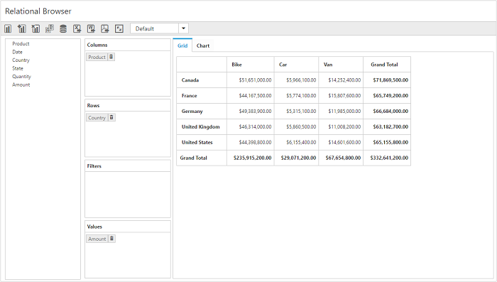

# Getting started with JavaScript PivotClient

## Creating a simple application with pivot client and relational data sources (client mode)

This section covers the information required to populate a simple pivot client with [`Relational`](/api/js/ejpivotclient#members:analysisMode) data completely on the [`client-side`](/api/js/ejpivotclient#members:operationalmode).

### Scripts and CSS references

Create an HTML page and add scripts and style sheets that are required to render a pivot client widget that are listed below in the appropriate order:

1. ej.web.all.min.css
2. jQuery-3.0.0.min.js
3. ej.web.all.min.js
4. jsrender.min.js

### Initialize pivot client

Place a div tag in the HTML page which acts as a container for the pivot client widget. Then, initialize the widget using the "ejPivotClient" method.



<!DOCTYPE html>
<html>
<head>

    <title>PivotClient - Getting Started</title>

    <link href="http://cdn.syncfusion.com/{{ site.releaseversion }}/js/web/flat-azure/ej.web.all.min.css" rel="stylesheet" type="text/css" />
    
    
    

</head>
<body>
    <!--Create a tag which acts as a container for ejPivotClient widget-->
    

    

    
</body>
</html>



### Populate pivot client with data

This section explains the steps to populate the pivot client control using a sample JSON data as shown below:



var pivotData = [
    { Amount: 100, Country: "Canada", Date: "FY 2005", Product: "Bike", Quantity: 2, State: "Alberta" },
    { Amount: 200, Country: "Canada", Date: "FY 2006", Product: "Van", Quantity: 3, State: "British Columbia" },
    { Amount: 300, Country: "Canada", Date: "FY 2007", Product: "Car", Quantity: 4, State: "Brunswick" },
    { Amount: 150, Country: "Canada", Date: "FY 2008", Product: "Bike", Quantity: 3, State: "Manitoba" },
    { Amount: 200, Country: "Canada", Date: "FY 2006", Product: "Car", Quantity: 4, State: "Ontario" },
    { Amount: 100, Country: "Canada", Date: "FY 2007", Product: "Van", Quantity: 1, State: "Quebec" },
    { Amount: 200, Country: "France", Date: "FY 2005", Product: "Bike", Quantity: 2, State: "Charente-Maritime" },
    { Amount: 250, Country: "France", Date: "FY 2006", Product: "Van", Quantity: 4, State: "Essonne" },
    { Amount: 300, Country: "France", Date: "FY 2007", Product: "Car", Quantity: 3, State: "Garonne (Haute)" },
    { Amount: 150, Country: "France", Date: "FY 2008", Product: "Van", Quantity: 2, State: "Gers" },
    { Amount: 200, Country: "Germany", Date: "FY 2006", Product: "Van", Quantity: 3, State: "Bayern" },
    { Amount: 250, Country: "Germany", Date: "FY 2007", Product: "Car", Quantity: 3, State: "Brandenburg" },
    { Amount: 150, Country: "Germany", Date: "FY 2008", Product: "Car", Quantity: 4, State: "Hamburg" },
    { Amount: 200, Country: "Germany", Date: "FY 2008", Product: "Bike", Quantity: 4, State: "Hessen" },
    { Amount: 150, Country: "Germany", Date: "FY 2007", Product: "Van", Quantity: 3, State: "Nordrhein-Westfalen" },
    { Amount: 100, Country: "Germany", Date: "FY 2005", Product: "Bike", Quantity: 2, State: "Saarland" },
    { Amount: 150, Country: "United Kingdom", Date: "FY 2008", Product: "Bike", Quantity: 5, State: "England" },
    { Amount: 250, Country: "United States", Date: "FY 2007", Product: "Car", Quantity: 4, State: "Alabama" },
    { Amount: 200, Country: "United States", Date: "FY 2005", Product: "Van", Quantity: 4, State: "California" },
    { Amount: 100, Country: "United States", Date: "FY 2006", Product: "Bike", Quantity: 2, State: "Colorado" },
    { Amount: 150, Country: "United States", Date: "FY 2008", Product: "Car", Quantity: 3, State: "New Mexico" },
    { Amount: 200, Country: "United States", Date: "FY 2005", Product: "Bike", Quantity: 4, State: "New York" },
    { Amount: 250, Country: "United States", Date: "FY 2008", Product: "Car", Quantity: 3, State: "North Carolina" },
    { Amount: 300, Country: "United States", Date: "FY 2007", Product: "Van", Quantity: 4, State: "South Carolina" }
];



Now, set the JSON data to the **"data"** property present in the **"dataSource"** object. The **"dataSource"** object allows you to set both the raw data input and fields that need to be displayed in the row, column, value, and filter sections of the pivot client control.



<!DOCTYPE html>
<html>

//……

<body>
    

    
</body>
</html>



Now, the pivot client is rendered with pivot chart, and the pivot grid is rendered with "Country" field in the row, "Product" field in the column, and "Amount" field in the value section.

The following table will explain the [`relational`](/api/js/ejpivotclient#members:analysisMode) and [`datasource`](/api/js/ejpivotclient#members:datasource) properties at [`client-side`](/api/js/ejpivotclient#members:operationalmode) in detail:

<table>
    <tr>
        <th>
            Properties
        </th>
        <th>
            Description
        </th>
    </tr>
    <tr>
        <td>
            {{'[`columns`](https://help.syncfusion.com//api/js/ejpivotclient#members:datasource-columns "columns")'| markdownify }}
        </td>
        <td>
            Lists out the items to be arranged in columns section of PivotClient.
             <table class="params">
            <thead>
            <tr>
            <th>Properties</th>
            <th>Description</th>
            </tr>
            </thead>
            <tbody>
            <tr>
            <td>{{'[`fieldName`](https://help.syncfusion.com//api/js/ejpivotclient#members:datasource-columns-fieldname "fieldName")'| markdownify }} </td>
            <td>Allows the user to bind the item by using its unique name as field name.</td>
            </tr>
            <tr>
            <td>{{'[`fieldCaption`](https://help.syncfusion.com//api/js/ejpivotclient#members:datasource-columns-fieldcaption "fieldCaption")'| markdownify }}</td>
            <td>Allows the user to set the display caption for an item.</td>
            </tr>
            <tr>
            <td>{{'[`showSubTotal`](https://help.syncfusion.com//api/js/ejpivotclient#members:datasource-columns-showsubtotal "showSubTotal")'| markdownify }}</td>
            <td>Shows/hides the sub-total of the field in PivotGrid.</td>
            </tr>
            <tr>
            <td>{{'[`format`](https://help.syncfusion.com//api/js/ejpivotclient#members:datasource-columns-format "format")'| markdownify }}</td>
            <td>Allows you to set the format for column headers.</td>
            </tr>
            <tr>
            <td>{{'[`formatString`](https://help.syncfusion.com//api/js/ejpivotclient#members:datasource-columns-formatstring "formatString")'| markdownify }}</td>
            <td>This property is set to display the formatted values with format types in the PivotGrid.</td>
            </tr>
            <tr>
            <td>{{'[`cssClass`](https://help.syncfusion.com//api/js/ejpivotclient#members:datasource-columns-cssclass "cssClass")'| markdownify }}</td>
            <td>Allows you to set the custom theme for column headers.</td>
            </tr>
            <tr>
            <td>{{'[`sortOrder`](https://help.syncfusion.com//api/js/ejpivotclient#members:datasource-columns-sortorder "sortOrder")'| markdownify }}</td>
            <td>Allows you to set the sorting order of members of the field.</td>
            </tr>
            <tr>
            <td>{{'[`drilledItems`](https://help.syncfusion.com//api/js/ejpivotclient#members:datasource-columns-drilleditems "drilledItems")'| markdownify }}</td>
            <td>Contains the list of members need to be drilled down by default in the field.</td>
            </tr>
            <tr>
            <td>{{'[`filterItems`](https://help.syncfusion.com//api/js/ejpivotclient#members:datasource-columns-filteritems "filterItems")'| markdownify }}</td>
            <td>Applies the filter to field members.
            <table class="params">
            <thead>
            <tr>
            <th>Properties</th>
            <th>Description</th>
            </tr>
            </thead>
            <tbody>
            <tr>
            <td>
                {{'[`filterType`](https://help.syncfusion.com//api/js/ejpivotclient#members:datasource-columns-filteritems-filtertype "filterType")'| markdownify }} </td>
            <td>Sets the type of filter to include/exclude the mentioned values.</td>
            </tr>
            <tr>
            <td>
                {{'[`values`](https://help.syncfusion.com//api/js/ejpivotclient#members:datasource-columns-filteritems-values "values")'| markdownify }} </td>
            <td>Contains the collection of items to be included/excluded among the field members.</td>
            </tr>
            </tbody>
            </table>
            </td>
            </tr>
            </tbody>
            </table>
            </td>
            </tr>
            <tr>
        <td>
            {{'[`rows`](https://help.syncfusion.com//api/js/ejpivotclient#members:datasource-rows "rows")'| markdownify }}
        </td>
        <td>
            Lists out the items to be arranged in rows section of PivotClient.
             <table class="params">
            <thead>
            <tr>
            <th>Properties</th>
            <th>Description</th>
            </tr>
            </thead>
            <tbody>
            <tr>
            <td>{{'[`fieldName`](https://help.syncfusion.com//api/js/ejpivotclient#members:datasource-rows-fieldname "fieldName")'| markdownify }} </td>
            <td>Allows the user to bind the item by using its unique name as field name.</td>
            </tr>
            <tr>
            <td>{{'[`fieldCaption`](https://help.syncfusion.com//api/js/ejpivotclient#members:datasource-rows-fieldcaption "fieldCaption")'| markdownify }}</td>
            <td>Allows the user to set the display caption for an item.</td>
            </tr>
            <tr>
            <td>{{'[`showSubTotal`](https://help.syncfusion.com//api/js/ejpivotclient#members:datasource-rows-showsubtotal "showSubTotal")'| markdownify }}</td>
            <td>Shows/hides the sub-total of the field in PivotGrid.</td>
            </tr>
            <tr>
            <td>{{'[`format`](https://help.syncfusion.com//api/js/ejpivotclient#members:datasource-rows-format "format")'| markdownify }}</td>
            <td>Allows to set the format for the row headers.</td>
            </tr>
            <tr>
            <td>{{'[`formatString`](https://help.syncfusion.com//api/js/ejpivotclient#members:datasource-rows-formatstring "formatString")'| markdownify }}</td>
            <td>This property is set to display the formatted values with format types in PivotGrid.</td>
            </tr>
            <tr>
            <td>{{'[`cssClass`](https://help.syncfusion.com//api/js/ejpivotclient#members:datasource-rows-cssclass "cssClass")'| markdownify }}</td>
            <td>Allows to set the custom theme for the row headers.</td>
            </tr>
            <tr>
            <td>{{'[`sortOrder`](https://help.syncfusion.com//api/js/ejpivotclient#members:datasource-rows-sortorder "sortOrder")'| markdownify }}</td>
            <td>Allows the user to set the sorting order of the members of the field.</td>
            </tr>
            <tr>
            <td>{{'[`drilledItems`](https://help.syncfusion.com//api/js/ejpivotclient#members:datasource-rows-drilleditems "drilledItems")'| markdownify }}</td>
            <td>Contains the list of members need to be drilled down by default in the field.</td>
            </tr>
            <tr>
            <td>{{'[`filterItems`](https://help.syncfusion.com//api/js/ejpivotclient#members:datasource-rows-filteritems "filterItems")'| markdownify }}</td>
            <td>Applies filter to the field members.
            <table class="params">
            <thead>
            <tr>
            <th>Properties</th>
            <th>Description</th>
            </tr>
            </thead>
            <tbody>
            <tr>
            <td>
                {{'[`filterType`](https://help.syncfusion.com//api/js/ejpivotclient#members:datasource-rows-filteritems-filtertype "filterType")'| markdownify }} </td>
            <td>Sets the type of filter whether to include/exclude the mentioned values.</td>
            </tr>
            <tr>
            <td>
                {{'[`values`](https://help.syncfusion.com//api/js/ejpivotclient#members:datasource-rows-filteritems-values "values")'| markdownify }} </td>
            <td>Contains the collection of items to be included/excluded among the field members.</td>
            </tr>
            </tbody>
            </table>
            </td>
            </tr>
            </tbody>
            </table>
            </td>
            </tr>
            <tr>
        <td>
            {{'[`values`](https://help.syncfusion.com//api/js/ejpivotclient#members:datasource-values "values")'| markdownify }}
        </td>
        <td>
            Lists out the items which supports calculation in PivotClient.
             <table class="params">
            <thead>
            <tr>
            <th>Properties</th>
            <th>Description</th>
            </tr>
            </thead>
            <tbody>
            <tr>
            <td>{{'[`fieldName`](https://help.syncfusion.com//api/js/ejpivotclient#members:datasource-values-fieldname "fieldName")'| markdownify }} </td>
            <td>Allows the user to bind the item by using its unique name as field name.</td>
            </tr>
            <tr>
            <td>{{'[`fieldCaption`](https://help.syncfusion.com//api/js/ejpivotclient#members:datasource-values-fieldcaption "fieldCaption")'| markdownify }}</td>
            <td>Allows the user to set the display caption for an item.</td>
            </tr>
            <tr>
            <td>{{'[`isCalculatedField`](https://help.syncfusion.com//api/js/ejpivotclient#members:datasource-values-iscalculatedfield "isCalculatedField")'| markdownify }}</td>
            <td>Indicates whether the field is a calculated field or not.</td>
            </tr>
            <tr>
            <td>{{'[`summaryType`](https://help.syncfusion.com//api/js/ejpivotclient#members:datasource-values-summarytype "summaryType")'| markdownify }}</td>
            <td>Allows to set the type of PivotGrid summary calculation for the value field.</td>
            </tr>
            <tr>
            <td>{{'[`format`](https://help.syncfusion.com//api/js/ejpivotclient#members:datasource-values-format "format")'| markdownify }}</td>
            <td>Allows to set the format of the values.</td>
            </tr>
            <tr>
            <td>{{'[`formatString`](https://help.syncfusion.com//api/js/ejpivotclient#members:datasource-values-formatstring "formatString")'| markdownify }}</td>
            <td>This property is set to display the formatted values with format types in PivotGrid.</td>
            </tr>
            <tr>
            <td>{{'[`formula`](https://help.syncfusion.com//api/js/ejpivotclient#members:datasource-values-formula "formula")'| markdownify }}</td>
            <td>Allows to set the formula for calculation of values for calculated members</td>
            </tr>
            <tr>
            <td>{{'[`cssClass`](https://help.syncfusion.com//api/js/ejpivotclient#members:datasource-values-cssclass "cssClass")'| markdownify }}</td>
            <td>Allows to set the custom theme for the values.</td>
            </tr>
            </tbody>
            </table>
            </td>
            </tr>
            <tr>
        <td>
            {{'[`filters`](https://help.syncfusion.com//api/js/ejpivotclient#members:datasource-filters "filters")'| markdownify }}
        </td>
        <td>
            Lists out the items which supports filtering of values without displaying the members in UI in PivotClient.
            <table class="params">
            <thead>
            <tr>
            <th>Properties</th>
            <th>Description</th>
            </tr>
            </thead>
            <tbody>
            <tr>
            <td>{{'[`fieldName`](https://help.syncfusion.com//api/js/ejpivotclient#members:datasource-filters-fieldname "fieldName")'| markdownify }} </td>
            <td>Allows the user to bind the item by using its unique name as field name.</td>
            </tr>
            <tr>
            <td>{{'[`fieldCaption`](https://help.syncfusion.com//api/js/ejpivotclient#members:datasource-filters-fieldcaption "fieldCaption")'| markdownify }} </td>
            <td>Allows the user to set the display name for an item.</td>
            </tr>
            <tr>
            <td>{{'[`filterItems`](https://help.syncfusion.com//api/js/ejpivotclient#members:datasource-filters-filteritems "filterItems")'| markdownify }}</td>
            <td>Applies filter to the field members.
            <table class="params">
            <thead>
            <tr>
            <th>Property</th>
            <th>Description</th>
            </tr>
            </thead>
            <tbody>
            <tr>
            <td>
                {{'[`filterType`](https://help.syncfusion.com//api/js/ejpivotclient#members:datasource-filters-filteritems-filtertype "filterType")'| markdownify }} </td>
            <td>Sets the type of filter whether to include/exclude the mentioned values.</td>
            </tr>
            <tr>
            <td>
                {{'[`values`](https://help.syncfusion.com//api/js/ejpivotclient#members:datasource-filters-filteritems-values "values")'| markdownify }} </td>
            <td>Contains the collection of items to be included/excluded among the field members.</td>
            </tr>
            </td>
            </tr>
            </tbody>
            </table>
            </td>
            </tr>
            </tbody>
            </table>
        </td>
        </tr>
            </table>

## Creating a simple application with pivot client and relational data source (server mode)

This section covers the information required to create a simple pivot client bound to [`Relational`](/api/js/ejpivotclient#members:analysisMode) data source from the [`server-side`](/api/js/ejpivotclient#members:operationalmode).

N> This section illustrates creating a simple web application through Visual Studio IDE, since the pivot client with [`server-side`](/api/js/ejpivotclient#members:operationalmode) data source requires .NET dependency. The web application contains an HTML page and a service that will transfer the data to [`server-side`](/api/js/ejpivotclient#members:operationalmode), process it, and return it to the client-side for control re-rendering. The service utilized for communication can be either WCF or WebAPI based on user requirement. Here, both are illustrated for user convenience.

### Project initialization

Create a new **ASP.NET Empty Web Application** by using Visual Studio IDE and name the project as **“PivotClientDemo”.**

Next, you should add an HTML page. To add an HTML page in your web application, right-click the project in the solution explorer and select **Add > New Item**. In the **Add New Item** window, select **HTML Page** and name it “GettingStarted.html,” and then click **Add.**

You can set the “GettingStarted.html” page as start-up page. To do so, right-click the “GettingStarted.html” page and select **“Set As Start Page”**.

### Scripts and CSS initialization
The scripts and style sheets that are mandatorily required to render a pivot client widget in the HTML page are highlighted below:

1. ej.web.all.min.css
2. jQuery-3.0.0.min.js
3. ej.web.all.min.js
4. jsrender.min.js

The scripts and style sheets listed above can be found in any of the following locations:

Local disk: [Click here](https://help.syncfusion.com/js/installation-and-upgrade/install-using-the-web-installer) to know more about script and style sheets installed in the local machine.

CDN link: [Click here](https://help.syncfusion.com/js/cdn) to know more about script and style sheets available in online.

NuGet package: [Click here](https://help.syncfusion.com/js/installation-and-upgrade/install-using-the-web-installer#configuring-syncfusion-nuget-packages) to know more about script and style sheets available in NuGet package.

### Control initialization

To initialize a pivot client widget, first you can define a div tag with an appropriate id attribute which acts as a container for the pivot client widget. Then, you can initialize the widget using the `ejPivotClient` method.



<!DOCTYPE html>
<html xmlns="http://www.w3.org/1999/xhtml">

<head>
    <title>PivotClient - Getting Started</title>
    <link href="http://cdn.syncfusion.com/{{ site.releaseversion }}/js/web/flat-azure/ej.web.all.min.css" rel="stylesheet" type="text/css" />
    
    
    
</head>

<body>
    

        <!--Create a tag which acts as a container for ejPivotClient widget.-->
        

        
    

</body>
</html>



The [`url`](/api/js/ejpivotclient#members:url) property in the pivot client widget points the service endpoint, where the data is processed and fetched in the form of JSON. The service used for the pivot client widget as endpoint are WCF and WebAPI.

### WebAPI

**Adding a WebAPI controller**

To add a WebAPI controller in your existing web application, right-click the project in the solution explorer and select **Add > New Item**. In the **Add New Item** window, select **WebAPI Controller Class** and name it “RelationalController.cs,” and then click **Add**.

The WebAPI controller is added to your application, which, in turn, comprises the following file. The utilization of this file will be explained in the immediate sections.

* RelationalController.cs

N> While adding the WebAPI controller class, add the mandatory suffix “Controller”. For example, in the demo, the controller is named as “RelationalController”.

Next, remove all the existing methods such as “Get”, “Post”, “Put”, and “Delete” present in the `RelationalController.cs` file.



namespace PivotClientDemo
{
    public class RelationalController: ApiController
    {

    }
}



**List of dependency libraries**

Next, you can add the below mentioned dependency libraries to your web application. These libraries can be found in the GAC (Global Assembly Cache).

To add them to your web application, right-click **References** in the solution Explorer and select **Add Reference.** In the **Reference Manager** dialog, under **Assemblies > Extension**, the following Syncfusion libraries are found.

N> If you have installed any version of Essential Studio, then the location of Syncfusion libraries is [system drive:\Program Files (x86)\Syncfusion\Essential Studio\{{ site.releaseversion }}\Assemblies].

* Syncfusion.Compression.Base
* Syncfusion.Linq.Base
* Syncfusion.Olap.Base
* Syncfusion.PivotAnalysis.Base
* System.Data.SqlServerCe (Version: 4.0.0.0)
* Syncfusion.XlsIO.Base
* Syncfusion.Pdf.Base
* Syncfusion.DocIO.Base
* Syncfusion.EJ
* Syncfusion.EJ.Export
* Syncfusion.EJ.Pivot

**List of namespaces**

The following are the list of namespaces to be added on top of the main class in the `RelationalController.cs` file.



using Syncfusion.JavaScript;
using Syncfusion.PivotAnalysis.Base;
using System;
using System.Collections.Generic;
using System.Data;
using System.Data.SqlServerCe;
using System.Linq;
using System.Net.Http;
using System.Text;
using System.Web;
using System.Web.Http;
using System.Web.Script.Serialization;
using Syncfusion.JavaScript.Olap;

namespace PivotClientDemo
{
    public class RelationalController : ApiController
    {

    }
}



**Data source initialization**

A simple collection is provided as a data source for the pivot client in this demo section. This data source is placed inside a separate class “ProductSales” in `RelationalController.cs` file. Refer to the following code example:



namespace PivotClientDemo
{
………
………
………
internal class ProductSales
    {
        public string Product { get; set; }

        public string Date { get; set; }

        public string Country { get; set; }

        public string State { get; set; }

        public int Quantity { get; set; }

        public double Amount { get; set; }

        public static ProductSalesCollection GetSalesData()
        {
            /// Geography
            string[] countries = new string[] { "Australia", "Canada", "France", "Germany", "United Kingdom", "United States" };
            string[] ausStates = new string[] { "New South Wales", "Queensland", "South Australia", "Tasmania", "Victoria" };
            string[] canadaStates = new string[] { "Alberta", "British Columbia", "Brunswick", "Manitoba", "Ontario", "Quebec" };
            string[] franceStates = new string[] { "Charente-Maritime", "Essonne", "Garonne (Haute)", "Gers", };
            string[] germanyStates = new string[] { "Bayern", "Brandenburg", "Hamburg", "Hessen", "Nordrhein-Westfalen", "Saarland" };
            string[] ukStates = new string[] { "England" };
            string[] ussStates = new string[] { "New York", "North Carolina", "Alabama", "California", "Colorado", "New Mexico", "South Carolina" };

            /// Time
            string[] dates = new string[] { "FY 2005", "FY 2006", "FY 2007", "FY 2008", "FY 2009" };

            /// Products
            string[] products = new string[] { "Bike", "Van", "Car" };
            Random r = new Random(123345345);

            int numberOfRecords = 2000;
            ProductSalesCollection listOfProductSales = new ProductSalesCollection();
            for (int i = 0; i < numberOfRecords; i++)
            {
                ProductSales sales = new ProductSales();
                sales.Country = countries[r.Next(1, countries.GetLength(0))];
                sales.Quantity = r.Next(1, 12);
                /// 1 percent discount for 1 quantity
                double discount = (30000 * sales.Quantity) * (double.Parse(sales.Quantity.ToString()) / 100);
                sales.Amount = (30000 * sales.Quantity) - discount;
                sales.Date = dates[r.Next(r.Next(dates.GetLength(0) + 1))];
                sales.Product = products[r.Next(r.Next(products.GetLength(0) + 1))];
                switch (sales.Product)
                {
                    case "Car":
                        {
                            sales.Date = "FY 2005";
                            break;
                        }
                }
                switch (sales.Country)
                {
                    case "Australia":
                        {
                            sales.State = ausStates[r.Next(ausStates.GetLength(0))];
                            break;
                        }
                    case "Canada":
                        {
                            sales.State = canadaStates[r.Next(canadaStates.GetLength(0))];
                            break;
                        }
                    case "France":
                        {
                            sales.State = franceStates[r.Next(franceStates.GetLength(0))];
                            break;
                        }
                    case "Germany":
                        {
                            sales.State = germanyStates[r.Next(germanyStates.GetLength(0))];
                            break;
                        }
                    case "United Kingdom":
                        {
                            sales.State = ukStates[r.Next(ukStates.GetLength(0))];
                            break;
                        }
                    case "United States":
                        {
                            sales.State = ussStates[r.Next(ussStates.GetLength(0))];
                            break;
                        }
                }
                listOfProductSales.Add(sales);
            }

            return listOfProductSales;
        }

        public override string ToString()
        {
            return string.Format("{0}-{1}-{2}", this.Country, this.State, this.Product);
        }

        public class ProductSalesCollection : List<ProductSales>
        {
        }
    }
}



**Service methods in WebAPI controller**

You can define the service methods in the RelationalController class. To do this, found the `RelationalController.cs` file which was created while adding the WebAPI controller class to your web application.



namespace PivotClientDemo
{
    public class RelationalController : ApiController
    {
        PivotClient pivotClient = new PivotClient();
        PivotChart pivotChart = new PivotChart();
        PivotGrid pivotGrid = new PivotGrid();
        JavaScriptSerializer serializer = new JavaScriptSerializer();
        string conStringforDB = "";//Enter appropriate connection string to connect database for saving and loading operation of reports.

        [System.Web.Http.ActionName("InitializeClient")]
        [System.Web.Http.HttpPost]
        public Dictionary<string, object> InitializeClient(Dictionary<string, object> jsonResult)
        {
            this.BindData();
            return pivotClient.GetJsonData(jsonResult["action"].ToString(), ProductSales.GetSalesData(), null);
        }

        [System.Web.Http.ActionName("FetchMembers")]
        [System.Web.Http.HttpPost]
        public Dictionary<string, object> FetchMembers(Dictionary<string, object> jsonResult)
        {
            pivotClient.PopulateData(jsonResult["currentReport"].ToString());
            return pivotClient.GetJsonData(jsonResult["action"].ToString(), ProductSales.GetSalesData(), jsonResult["headerTag"].ToString());
        }

        [System.Web.Http.ActionName("DrillChart")]
        [System.Web.Http.HttpPost]
        public Dictionary<string, object> DrillChart(Dictionary<string, object> jsonResult)
        {
            this.BindData();
            this.pivotChart.PivotEngine.PivotRows = this.pivotClient.PivotReport.PivotRows;
            this.pivotChart.PivotEngine.PivotColumns = this.pivotClient.PivotReport.PivotColumns;
            this.pivotChart.PivotEngine.PivotCalculations = this.pivotClient.PivotReport.PivotCalculations;
            return pivotChart.GetJsonData(jsonResult["action"].ToString(), ProductSales.GetSalesData(), jsonResult["drilledSeries"].ToString());
        }

        [System.Web.Http.ActionName("Filtering")]
        [System.Web.Http.HttpPost]
        public Dictionary<string, object> Filtering(Dictionary<string, object> jsonResult)
        {
            pivotClient.PopulateData(jsonResult["currentReport"].ToString());
            return pivotClient.GetJsonData(jsonResult["action"].ToString(), ProductSales.GetSalesData(), jsonResult["filterParams"].ToString());
        }

        [System.Web.Http.ActionName("NodeDropped")]
        [System.Web.Http.HttpPost]
        public Dictionary<string, object> NodeDropped(Dictionary<string, object> jsonResult)
        {
            return pivotClient.GetJsonData(jsonResult["action"].ToString(), ProductSales.GetSalesData(), jsonResult["args"].ToString());
        }

        [System.Web.Http.ActionName("ToolbarOperations")]
        [System.Web.Http.HttpPost]
        public Dictionary<string, object> ToolbarOperations(Dictionary<string, object> jsonResult)
        {
            return pivotClient.GetJsonData(jsonResult["action"].ToString(), ProductSales.GetSalesData(), jsonResult["args"].ToString());
        }

        [System.Web.Http.ActionName("SaveReportToDB")]
        [System.Web.Http.HttpPost]
        public Dictionary<string, object> SaveReportToDB(Dictionary<string, object> jsonResult)
        {
            string operationalMode = jsonResult["operationalMode"].ToString(), analysisMode = jsonResult["analysisMode"].ToString(), reportName = string.Empty;
            bool isDuplicate = true;
            SqlCeConnection con = new SqlCeConnection() { ConnectionString = conStringforDB };
            con.Open();
            reportName = jsonResult["reportName"].ToString() + "##" + operationalMode.ToLower() + "#>>#" + analysisMode.ToLower();
            SqlCeCommand cmd1 = null;
            foreach (DataRow row in GetDataTable().Rows)
            {
                if ((row.ItemArray[0] as string).Equals(reportName))
                {
                    isDuplicate = false;
                    cmd1 = new SqlCeCommand("update ReportsTable set Report=@Reports where ReportName like @ReportName", con);
                }
            }
            if (isDuplicate)
            {
                cmd1 = new SqlCeCommand("insert into ReportsTable Values(@ReportName,@Reports)", con);
            }
            cmd1.Parameters.Add("@ReportName", reportName);
            cmd1.Parameters.Add("@Reports", Encoding.UTF8.GetBytes(jsonResult["clientReports"].ToString()).ToArray());
            cmd1.ExecuteNonQuery();
            con.Close();
            Dictionary<string, object> dictionary = new Dictionary<string, object>();
            dictionary.Add("CurrentAction", "Save");
            return dictionary;
        }

        [System.Web.Http.ActionName("RemoveReportFromDB")]
        [System.Web.Http.HttpPost]
        public Dictionary<string, object> RemoveReportFromDB(Dictionary<string, object> jsonResult)
        {
  	        string operationalMode = jsonResult["operationalMode"].ToString(), analysisMode = jsonResult["analysisMode"].ToString(), reportName = string.Empty;
            SqlCeConnection con = new SqlCeConnection() { ConnectionString = conStringforDB };
            con.Open();
            reportName = jsonResult["reportName"].ToString() + "##" + operationalMode.ToLower() + "#>>#" + analysisMode.ToLower();
            SqlCeCommand cmd1 = null;
            foreach (DataRow row in GetDataTable().Rows)
            {
                if ((row.ItemArray[0] as string).Equals(reportName))
                {
                    cmd1 = new SqlCeCommand("DELETE FROM ReportsTable WHERE ReportName LIKE '%" + reportName + "%'", con);
                }
            }
            cmd1.ExecuteNonQuery();
            con.Close();
            Dictionary<string, object> dictionary = new Dictionary<string, object>();
            dictionary.Add("CurrentAction", "Remove");
            return dictionary;
        }

        [System.Web.Http.ActionName("RenameReportInDB")]
        [System.Web.Http.HttpPost]
        public Dictionary<string, object> RenameReportInDB(Dictionary<string, object> jsonResult)
        {
            string operationalMode = jsonResult["operationalMode"].ToString(), analysisMode = jsonResult["analysisMode"].ToString(), reportName = string.Empty, renameReport = string.Empty;
            SqlCeConnection con = new SqlCeConnection() { ConnectionString = conStringforDB };
            con.Open();
            reportName = jsonResult["selectedReport"].ToString() + "##" + operationalMode.ToLower() + "#>>#" + analysisMode.ToLower();
            renameReport = jsonResult["renameReport"].ToString() + "##" + operationalMode.ToLower() + "#>>#" + analysisMode.ToLower();
            SqlCeCommand cmd1 = null;
            foreach (DataRow row in GetDataTable().Rows)
            {
                if ((row.ItemArray[0] as string).Equals(reportName))
                {
                    cmd1 = new SqlCeCommand("update ReportsTable set ReportName=@RenameReport where ReportName like '%" + reportName + "%'", con);
                }
            }
            cmd1.Parameters.Add("@RenameReport", renameReport);
            cmd1.ExecuteNonQuery();
            con.Close();
            Dictionary<string, object> dictionary = new Dictionary<string, object>();
            dictionary.Add("CurrentAction", "Rename");
            return dictionary;
        }

        [System.Web.Http.ActionName("Export")]
        [System.Web.Http.HttpPost]
        public void Export()
        {
            string args = HttpContext.Current.Request.Form.GetValues(0)[0];
            Dictionary<string, string> gridParams = serializer.Deserialize<Dictionary<string, string>>(args);
            pivotClient.PopulateData(gridParams["currentReport"]);
            string fileName = "Sample";
            pivotClient.ExportPivotClient(ProductSales.GetSalesData(), args, fileName, System.Web.HttpContext.Current.Response);
        }

        [System.Web.Http.ActionName("FetchReportListFromDB")]
        [System.Web.Http.HttpPost]
        public Dictionary<string, object> FetchReportListFromDB(Dictionary<string, object> jsonResult)
        {
            string reportNames = string.Empty, currentRptName = string.Empty, operationalMode = jsonResult["operationalMode"].ToString(), analysisMode = jsonResult["analysisMode"].ToString();
            foreach (System.Data.DataRow row in GetDataTable().Rows)
            {
                currentRptName = (row.ItemArray[0] as string);
                if (currentRptName.IndexOf("##" + operationalMode + "#>>#" + analysisMode) >= 0)
                {
                    currentRptName = currentRptName.Replace("##" + operationalMode + "#>>#" + analysisMode, "");
                    reportNames = reportNames == "" ? currentRptName : reportNames + "__" + currentRptName;
                }
            }
            Dictionary<string, object> dictionary = new Dictionary<string, object>();
            dictionary.Add("ReportNameList", reportNames);
            dictionary.Add("action", jsonResult["action"].ToString());
            return dictionary;
        }

        [System.Web.Http.ActionName("LoadReportFromDB")]
        [System.Web.Http.HttpPost]
        public Dictionary<string, object> LoadReportFromDB(Dictionary<string, object> jsonResult)
        {
	        PivotReport report = new PivotReport();
            string operationalMode = jsonResult["operationalMode"].ToString(), analysisMode = jsonResult["analysisMode"].ToString();
            Dictionary<string, object> dictionary = new Dictionary<string, object>();
            string currentRptName = string.Empty;
            foreach (DataRow row in GetDataTable().Rows)
            {
                currentRptName = (row.ItemArray[0] as string).Replace("##" + operationalMode.ToLower() + "#>>#" + analysisMode.ToLower(), "");
                if (currentRptName.Equals(jsonResult["reportName"].ToString()))
                {
                    byte[] reportString = new byte[2 * 1024];
                    reportString = (row.ItemArray[1] as byte[]);
                    if (analysisMode.ToLower() == "pivot" && operationalMode.ToLower() == "servermode")
                        dictionary = pivotClient.GetJsonData("LoadReport", ProductSales.GetSalesData(), Encoding.UTF8.GetString(reportString));
                    else
                        dictionary.Add("report", Encoding.UTF8.GetString(reportString));
                    break;
                }
            }
            return dictionary;
        }
        private DataTable GetDataTable()
        {
            SqlCeConnection con = new SqlCeConnection() { ConnectionString = conStringforDB };
            con.Open();
            DataSet dSet = new DataSet();
            new SqlCeDataAdapter("Select * from ReportsTable", con).Fill(dSet);
            con.Close();
            return dSet.Tables[0];
        }

        private void BindData()
        {
            this.pivotClient.PivotReport.PivotRows.Add(new PivotItem { FieldMappingName = "Country", FieldHeader = "Country", TotalHeader = "Total" });
            this.pivotClient.PivotReport.PivotColumns.Add(new PivotItem { FieldMappingName = "Product", FieldHeader = "Product", TotalHeader = "Total" });
            this.pivotClient.PivotReport.PivotCalculations.Add(new PivotComputationInfo { CalculationName = "Amount", Description = "Amount", FieldHeader = "Amount", FieldName = "Amount", Format = "C", SummaryType = Syncfusion.PivotAnalysis.Base.SummaryType.DoubleTotalSum });
        }
    }
        .....
        ..... // Initialize the datasource
        .....
}



N> The [`customObject`](../api/ejpivotclient#members:customobject) is utilized to pass the additional information between the client-end and the service-end.

**Configure routing in global application class**

To add a Global.asax in your existing web application, right-click the project in the solution explorer and select **Add > New** item. In the **Add New Item** window, select **Global Application** class and name it **“Global.asax,”** and then click **Add.**

After adding the **Global.asax** file, immediately add the namespace **“using System.Web.Http;”**, and then you can configure the routing as shown in the following code example:



public class Global : System.Web.HttpApplication
    {
        protected void Application_Start(object sender, EventArgs e)
        {
            System.Web.Http.GlobalConfiguration.Configuration.Routes.MapHttpRoute(
                name: "DefaultApi",
                routeTemplate: "{controller}/{action}/{id}",
                defaults: new { id = RouteParameter.Optional });
            AppDomain.CurrentDomain.SetData("SQLServerCompactEditionUnderWebHosting", true);
        }
}



Now, the pivot client is rendered with the pivot chart, and the pivot grid is rendered with "Country" field in the row, "Product" field in the column, and "Amount" field in the value section.

### WCF

This section demonstrates the utilization of WCF service as endpoint binding [`Relational`](/api/js/ejpivotclient#members:analysisMode) data source to a simple pivot client. For more details on this topic, [click here](https://help.syncfusion.com/js/pivotclient/relational-connectivity#wcf-1).

