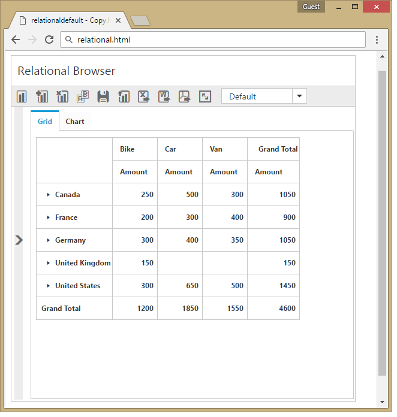

# Responsive Layout

PivotClient widget supports responsive rendering based on the target device (desktop & tablet) resolution. It supports resolution up to 1024x600. You can enable responsiveness in PivotClient by setting [`isResponsive`](/js/api/ejpivotclient#members:displaysettings-isresponsive) property to true.



            $("#PivotClient1").ejPivotClient({
                //...
                isResponsive: true,
            });



