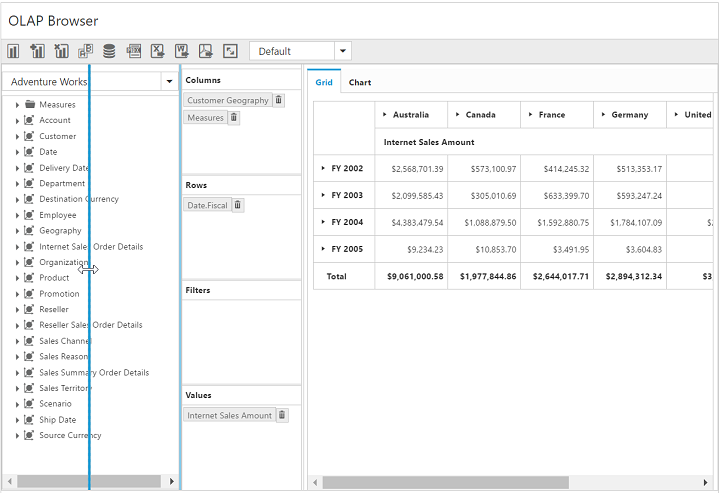

# Splitter

I> This feature is not applicable for the OLAP data source bound from the server-side. 

You can resize the cube dimension browser and the axis element builder by setting the [`enableSplitter`](/api/js/ejpivotclient#members:enableSplitter) property to true. This property is disabled by default.



            $("#PivotClient1").ejPivotClient({
                //...
                enableSplitter: true,
            });



