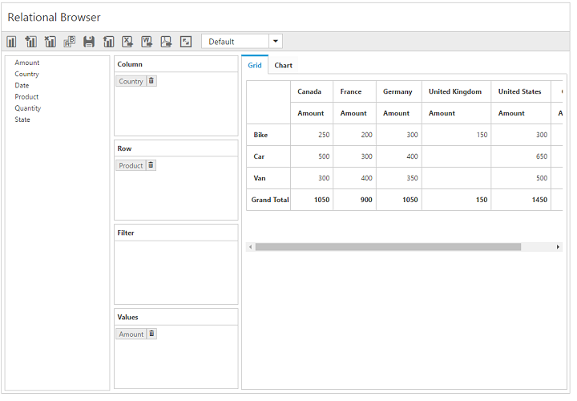

# Toggle axis

The toggle axis support swaps all axis elements between the column and row axes for refreshing the pivot chart and pivot grid views. This can be achieved with the use of a toolbar icon.

