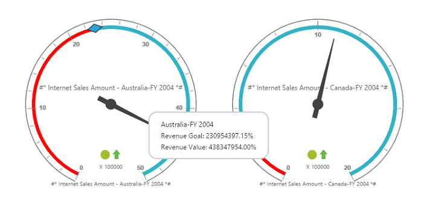

# Label Format

You can customize the format of labels displayed in the PivotGauge control using [`labelFormatSettings`](/api/js/ejpivotgauge#members:labelformatsettings) property.

Following are the formats that can be applied to labels in PivotGauge:

* [`numberFormat`](/api/js/ejpivotgauge#members:labelformatsettings-numberformat) - Allows the user to change the number format of the label values in PivotGauge.
* [`decimalPlaces`](/api/js/ejpivotgauge#members:labelformatsettings-decimalplaces) - Allows you to set the number of digits displayed after decimal point.
* [`prefixText `](/api/js/ejpivotgauge#members:labelformatsettings-prefixtext) - Allows you to add a text at the beginning of the label.
* [`suffixText `](/api/js/ejpivotgauge#members:labelformatsettings-suffixtext) - Allows you to add text at the end of the label.

Number format for the label values can be set to any of the following type:

* Default	
* Currency
* Percentage
* Fraction
* Scientific
* Text
* Notation



$(function () {
    $("#PivotGauge").ejPivotGauge({
	  //...
      labelFormatSettings: { numberFormat: ej.PivotGauge.NumberFormat.Percentage, decimalPlaces: 2, prefixText: "#*", suffixText: "*#" },
     //... 
    });
});


 
