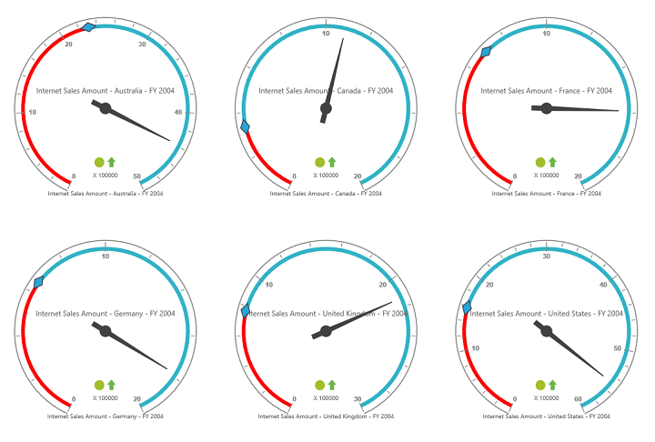

# Layout

## Row-wise Layout 

Gauges can be arranged in specified number of rows by using the [`rowsCount`](/js/api/ejpivotgauge#members:rowscount) property.



    $("#PivotGauge1").ejPivotGauge({
        //....
        rowsCount: 2
    });



 

## Column-wise Layout

Gauges can be arranged in specified number of columns by using the [`columnsCount`](/js/api/ejpivotgauge#members:columnscount) property.



    $("#PivotGauge1").ejPivotGauge({
        //....
        columnsCount: 2,
    });



