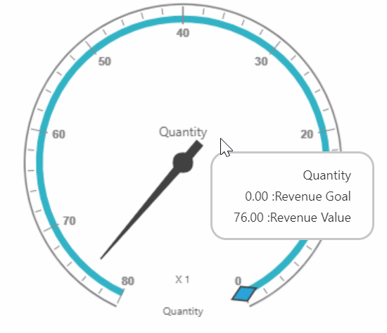

# Localization

## Localization in pivot gauge control

 You can localize the pivot gauge control texts with a [`locale`](../api/ejpivotgauge#members:locale) property and a collection of localized strings by using **"ej.PivotGauge.Locale"** for different cultures.
 
 N> By default, the pivot gauge control is localized in **"en-US"**.

Following code example illustrates how to localize the pivot gauge based on "French" culture:



    ej.PivotGauge.Locale["fr-FR"] = {
        RevenueGoal: "Objectif de chiffre d'affaires",
        RevenueValue: "Valeur du chiffre d'affaires"
    }

    $("#PivotGauge1").ejPivotGauge({
        //....
        locale: "fr-FR"
    });



Following table localizes the in-built keywords to “French” culture for the pivot gauge:

<table>
<tr>
<th>
Keywords</th><th>
Values</th></tr>
<tr>
<td>
RevenueGoal</td><td>
"Objectif de chiffre d'affaires"</td></tr>
<tr>
<td>
RevenueValue</td><td>
"Valeur du chiffre d'affaires ",</td></tr>
</table>

## Localization and globalization of cube info

The content displayed within the pivot gauge control can be obtained from the OLAP cube. The following are the steps that should be done to get the localized and globalized cube content.

To get the localized string based on different cultures, set the **"Locale Identifier"** in the connection string to a specific culture in the OLAP cube. The attribute is set for the pivot gauge in client mode as shown below:



    $("#PivotGauge1").ejPivotGauge({
        //....
        dataSource: {
            data: "http://bi.syncfusion.com/olap/msmdpump.dll;Locale Identifier=1036;"
        }
    });



In server mode, you should set **"Culture"** and **"OverrideDefaultFormatStrings"** properties in OlapDataManager class to a specific culture along with the setting **"Locale Identifier"** in the connection string.



    //1036 refers to “fr-FR” culture.
    string connectionString = "Data Source=localhost; Initial Catalog=Adventure Works DW; Locale Identifier=1036;";
    DataManager = new OlapDataManager(connectionString);
    DataManager.Culture = new System.Globalization.CultureInfo(1036);
    DataManager.OverrideDefaultFormatStrings = true;



## RTL
You can enable or disable the right to left alignment by using the [`enableRTL`](/api/js/ejpivotgauge#members:enablertl) property in the pivot gauge.



$("#PivotGauge1").ejPivotGauge({
      enableRTL: true
 });



N> RTL is applicable only for the tooltip of the pivot gauge.
