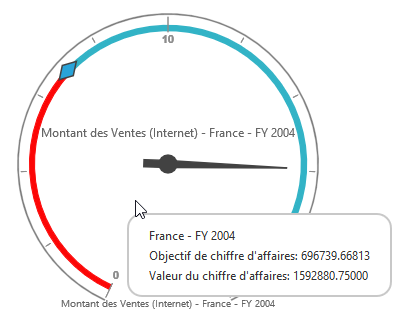

# Localization

## Localization in PivotGauge Control

 We can localize the PivotGauge control texts with a collection of localized strings using **"ej.PivotGauge.Locale"** for different cultures.
 
 N> By default, the PivotGauge control is localized in **"en-US"**.

Following code example illustrates on how to localize PivotGauge based on "French" culture.



    ej.PivotGauge.Locale["fr-FR"] = {
        RevenueGoal: "Objectif de chiffre d'affaires",
        RevenueValue: "Valeur du chiffre d'affaires"
    }

    $("#PivotGauge1").ejPivotGauge({
        //....
        locale: "fr-FR"
    });



Following table localizes the in-built keywords to “French” culture for PivotGauge.

<table>
<tr>
<th>
Keywords</th><th>
Values</th></tr>
<tr>
<td>
RevenueGoal</td><td>
"Objectif de chiffre d'affaires"</td></tr>
<tr>
<td>
RevenueValue</td><td>
"Valeur du chiffre d'affaires ",</td></tr>
</table>

## Localization and Globalization of Cube Info

Content displayed within the PivotGauge control are obtained from the OLAP Cube. So following are the steps that needs to be done to get the localized and globalized Cube content.

To get the localized string based on different cultures, from OLAP Cube, we need to set **"Locale Identifier"** in the connection string to a specific culture. The attribute is set for PivotGauge in Client Mode as shown below



    $("#PivotGauge1").ejPivotGauge({
        //....
        dataSource: {
            data: "http://bi.syncfusion.com/olap/msmdpump.dll;Locale Identifier=1036;"
        }
    });



For Server Mode, we need to set **"Culture"** and **"OverrideDefaultFormatStrings"** properties in OlapDataManager class to a specific culture along with setting **"Locale Identifier"** in connection string. 



    //1036 refers to “fr-FR” culture.
    string connectionString = "Data Source=localhost; Initial Catalog=Adventure Works DW; Locale Identifier=1036;";
    DataManager = new OlapDataManager(connectionString);
    DataManager.Culture = new System.Globalization.CultureInfo(1036);
    DataManager.OverrideDefaultFormatStrings = true;



 
