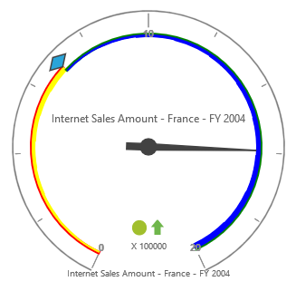

# Ranges

## Adding Range Collection

Range collection can be directly added to the scales option within the PivotGauge widget as an array.



    $("#PivotGauge1").ejPivotGauge({
        //...
        scales: [{
            //...
            ranges: [{
                distanceFromScale: 10
            }]
        }]
    });


## Appearance Customization

The appearance of the range can be customized through the following properties.

* **startValue** – defines the start position of the range.
* **endValue** – defines the end position of the range.
* **startWidth** – sets the width at starting position of the range.
* **endWidth** – sets the width at ending position of the range.
* **backgroundColor** – sets the background color of the range.
* **border** – sets the height and width of the border of the range.
* **placement** – sets the position of the range.
* **distanceFromScale** – sets the distance between the range and scale.

Positioning the range could be set either through `placement` or `distanceFromScale` property. By default, placement takes the value "near", whereas other enumeration values available are "far" and "center".



    $("#PivotGauge1").ejPivotGauge({
        //...
        scales: [{
            //...
            ranges: [{
                startValue: 20,
                endValue: 50,
                startWidth: 2,
                endWidth: 6,
                backgroundColor: "yellow",
                border: {
                    color: "red",
                    width: 2
                },
                distanceFromScale: 20
            }, 
            {
                startValue: 50,
                endValue: 100,
                startWidth: 2,
                endWidth: 7,
                backgroundColor: "blue",
                border: {
                    color: "green",
                    width: 2
                },
                placement: "near",
            }]
        }]
    });



 

N> On setting both the position properties - "distanceFromScale" and "placement" for a range, the value set in "distanceFromScale" is given preference.

## Multiple Ranges 
Multiple ranges can be added by placing an array of objects in `ranges` option.



    $("#PivotGauge1").ejPivotGauge({
        //...
        scales: [{
            //...
            ranges: [
                {
                    startValue: 0,
                    endValue: 10,
                    backgroundColor: "Green",
                    distanceFromScale: -5
                }, 
                {
                    startValue: 10,
                    endValue: 30,
                    backgroundColor: "yellow",
                    distanceFromScale: -5
                }, 
                {
                    startValue: 30,
                    endValue: 50,
                    backgroundColor: "red",
                    distanceFromScale: -5
                }
            ]
        }]
    });



 
