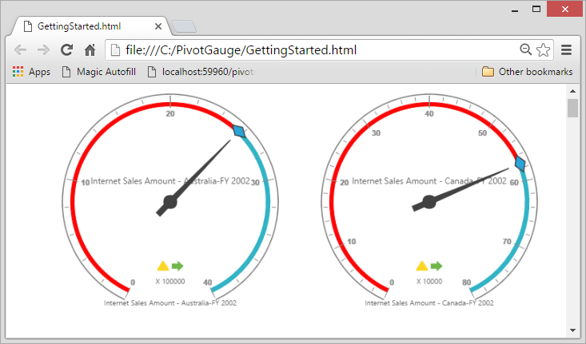

# Responsive layout

The pivot gauge widget supports responsive rendering based on the target device (desktop and tablet) resolution. It supports resolution upto 1024x600. You can enable the responsiveness in the pivot gauge by setting the [`isResponsive`](/api/js/ejpivotgauge#members:isresponsive) property to true.



    $("#PivotGauge1").ejPivotGauge({
        //....
        isResponsive: true
    });



_Normal View_

_Responsive View_

