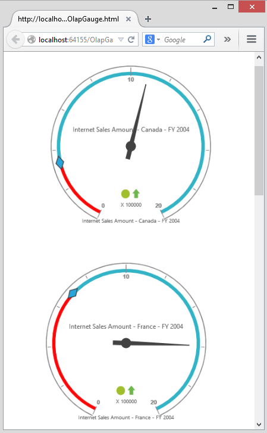

# Responsive Layout

OlapGauge widget supports responsive rendering based on the target device (desktop & tablet) resolution. It supports resolution upto 1024x600. You can enable responsiveness in OlapGauge by setting [`isResponsive`](/js/api/ejolapgauge#members:isresponsive) property to true.



$("#OlapGauge1").ejOlapGauge({
    url: "../OlapGauge",
    isResponsive: true,
    //...
});



_Normal View_

_Responsive View_

