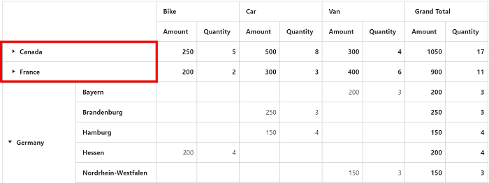

I> These features are applicable only for the relational data source.

# Collapse by default

Allows you to collapse all members displayed in the grid. You can enable collapsing all members by default in the pivot grid by setting the [`enableCollapseByDefault`](/api/js/ejpivotgrid#members:enablecollapsebydefault) property to true.



    $(function() {
        $("#PivotGrid1").ejPivotGrid({
            //..
            enableCollapseByDefault:true
        });
    });



## Collapsed members
Allows you to collapse the specified members in each field of the pivot grid control. You can collapse desired members in the pivot grid by setting the [`collapsedMembers`](/api/js/ejpivotgrid#members:collapsedmembers).



    $(function() {
        $("#PivotGrid1").ejPivotGrid({
            //..
            rows: [
                    {
                      fieldName: "Country",
                      fieldCaption: "Country"
                    },
                    {
                      fieldName: "State",
                      fieldCaption: "State"
                    }
                ]
                //..
            collapsedMembers: { Country: ["Canada", "France"] }
        });
    });



