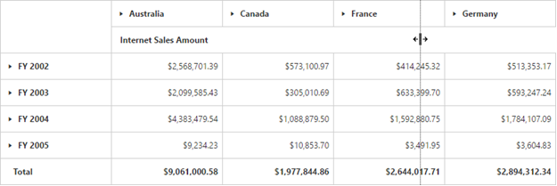

# Resizing Column

Allows the user to change the column width by holding and dragging the column border using the mouse pointer.

You can enable the resizing option in PivotGrid by setting the [`enableColumnResizing`](/api/js/ejpivotgrid#members:enablecolumnresizing) property to true.



 

Additionally, the property [`resizeColumnsToFit`](/api/js/ejpivotgrid#members:resizecolumnstofit) automatically adjusts the width of each column based on the maximum content length available in the respective column.



 