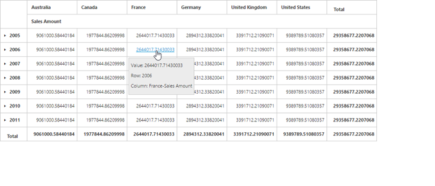
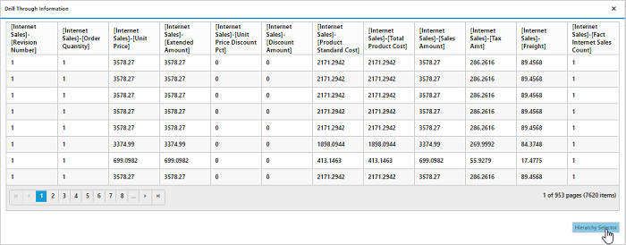
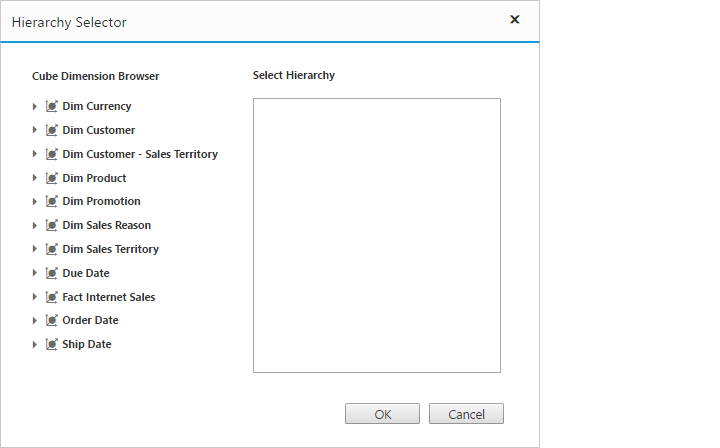
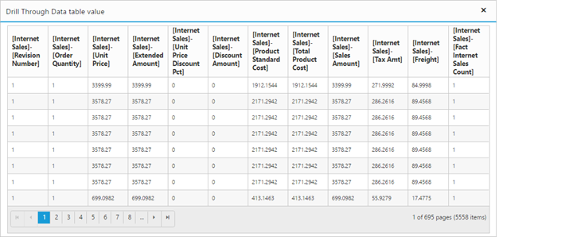

# Drill Through

The drill-through retrieves raw items that are used to create a specific cell. To enable drill-through support, you can set the [`enableDrillThrough`](/api/js/ejpivotgrid#members:enabledrillthrough) property to true. Raw items are obtained through the [`drillThrough`](/api/js/ejpivotgrid#events:drillthrough) event by which you can bind them to an external widget for a precise view.

## OLAP

N> The drill-through is supported in the pivot grid only when you configure and enable the drill-through action at the cube.

On clicking any value cell, the "Drill Through Information" dialog will be opened.  It consists of a grid with data that are associated with measure values of the clicked value cell. In this example, the measure behind the respective cell is “Sales Amount” and the values of dimensions that are associated with this measure are alone displayed in the grid.

On clicking the "Hierarchy Selector" button which is displayed below the grid, the "Hierarchy Selector" dialog will be opened. It consists of dimensions that are associated with the measure of clicked value cell. In this example, the measure behind the respective cell is “Sales Amount” and the dimensions associated with this measure are alone displayed in the dialog.

To frame and execute the drill through MDX query internally, drag and drop the respective hierarchies and click “OK”. It provides back the raw items through the "drillThrough" event. In this example, the obtained raw items are bound to the ejGrid widget. Please refer the code sample and screenshot below:

## Client mode



<!--Create a tag which acts as a container for PivotGrid-->



## Server mode



<!--Create a tag which acts as a container for PivotGrid-->



When the pivot grid is rendered in server mode, the below service methods need to be added in the WCF/WebAPI for drill-through operation.

For WebAPI controller, the below methods need to be added.



[System.Web.Http.ActionName("DrillThroughHierarchies")]
[System.Web.Http.HttpPost]
public string DrillThroughHierarchies(Dictionary<string, object> jsonResult)
{
    OlapDataManager DataManager = new OlapDataManager(connectionString);
    DataManager.SetCurrentReport(OLAPUTILS.Utils.DeserializeOlapReport(jsonResult["currentReport"].ToString()));
    return htmlHelper.DrillthroughHierarchies(DataManager, jsonResult["layout"].ToString(), jsonResult["cellPos"].ToString());
}

[System.Web.Http.ActionName("DrillThroughDataTable")]
[System.Web.Http.HttpPost]
public Dictionary<string, object> DrillThroughDataTable(Dictionary<string, object> jsonResult)
{
    OlapDataManager DataManager = new OlapDataManager(connectionString);
    DataManager.SetCurrentReport(OLAPUTILS.Utils.DeserializeOlapReport(jsonResult["currentReport"].ToString()));
    return htmlHelper.DrillthroughDataTable(DataManager, jsonResult["layout"].ToString(), jsonResult["cellPos"].ToString(), jsonResult["selector"].ToString());
}



For WCF service, the below methods need to be added.



public string DrillThroughHierarchies(string currentReport, string layout, string cellPos)
{
    OlapDataManager DataManager = new OlapDataManager(connectionString);
    DataManager.SetCurrentReport(OLAPUTILS.Utils.DeserializeOlapReport(currentReport));
    return htmlHelper.DrillthroughHierarchies(DataManager, layout, cellPos);
}

public Dictionary<string, object> DrillThroughDataTable(string currentReport, string layout, string cellPos, string selector)
{
    OlapDataManager DataManager = new OlapDataManager(connectionString);
    DataManager.SetCurrentReport(OLAPUTILS.Utils.DeserializeOlapReport(currentReport));
    return htmlHelper.DrillthroughDataTable(DataManager, layout, cellPos, selector);
}



## Relational

To enable drill-through support, you can set the [`enableDrillThrough`](/api/js/ejpivotgrid#members:enabledrillthrough) property to true. Raw items are obtained through the [`drillThrough`](/api/js/ejpivotgrid#events:drillthrough) event.





