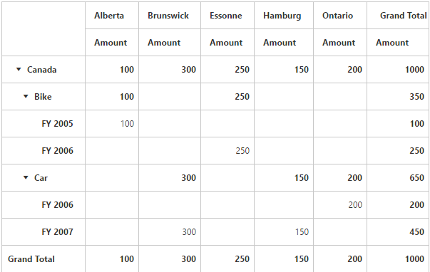

# ExcelLikeLayout

A layout in which summary cells are positioned besides each parent member and their child members appear next to them. The `layout` enumeration needs to be set to **ej.PivotGrid.Layout.ExcelLikeLayout** in-order to view PivotGrid in excel-like layout.

I> We provide excel-like layout support for both OLAP and Relational data sources in client and server mode. 



$("#PivotGrid1").ejPivotGrid({
    //...
    layout: ej.PivotGrid.Layout.ExcelLikeLayout
});



