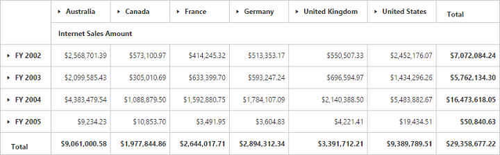
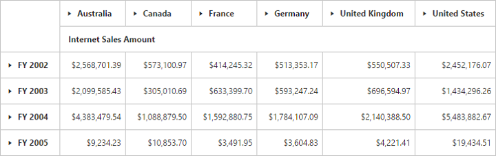

# Grid Layout in JavaScript PivotGrid

## Normal layout

A layout in summary cells, which are positioned at the bottom of each parent member and their child members appear next to them. Normal layout is the default layout in the PivotGrid control. The enumeration property [`layout`](/api/js/ejpivotgrid#members:layout) should be set to **"ej.PivotGrid.Layout.Normal"** to view the PivotGrid in the normal layout.


	$("#PivotGrid1").ejPivotGrid({
      //...
     layout: ej.PivotGrid.Layout.Normal
});



## No summaries layout

I> This feature is applicable only for the OLAP datasource.

A layout in summary cells, which are completely hidden and the child members appear next to their parent member.  The enumeration property [`layout`](/api/js/ejpivotgrid#members:layout) should be set to **"ej.PivotGrid.Layout.NoSummaries"** to view the PivotGrid without summaries.



$("#PivotGrid1").ejPivotGrid({
     //...
     layout: ej.PivotGrid.Layout.NoSummaries
});



## Excel-like layout
A layout in summary cells, which are positioned besides each parent member and their child members appear next to them. The enumeration property [`layout`](/api/js/ejpivotgrid#members:layout) should be set to **"ej.PivotGrid.Layout.ExcelLikeLayout"** to view the PivotGrid in excel-like layout.



$("#PivotGrid1").ejPivotGrid({
    //...
    layout: ej.PivotGrid.Layout.ExcelLikeLayout
});



## Top summary layout

I> This feature is applicable only for the OLAP datasource at server mode.

A layout in summary cells, which are positioned at the top of each parent member and their child members appear next to them. The enumeration property [`layout`](/api/js/ejpivotgrid#members:layout) should be set to **"ej.PivotGrid.Layout.NormalTopSummary"** to view the PivotGrid in top summaries layout.



$("#PivotGrid1").ejPivotGrid({
     url: "/OLAPService",
     layout: ej.PivotGrid.Layout.NormalTopSummary
});



