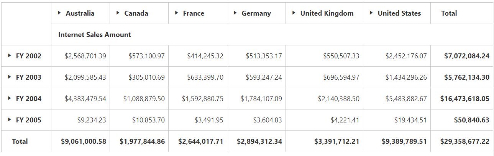

## Public Methods

### Refresh the PivotGrid with paging

The [`refreshPagedPivotGrid`](/api/js/ejpivotgrid#methods:refreshpagedpivotgrid) method is used to re-render the **PivotGrid** component with given axis and page number.





### Refresh the PivotGrid without paging

The [`refreshPivotGrid`](/api/js/ejpivotgrid#methods:refreshpivotgrid) method is used to re-render the **PivotGrid** control with modified data input in client-mode.





### Refresh the PivotGrid with modified report

The [`refreshControl`](/api/js/ejpivotgrid#methods:refreshcontrol) method is used to refresh the **PivotGrid** component with the report available at that instant.





### Returning height and width of all cells of PivotGrid

The [`calculateCellWidths`](/api/js/ejpivotgrid#methods:calculateCellWidths) method is used to return the height of all rows and width of all columns of cells in **PivotGrid** component.





### Show/Open the Conditional formatting dialog

The [`openConditionalFormattingDialog`](/api/js/ejpivotgrid#methods:openconditionalformattingdialog) method is used to create conditional formatting dialog to apply conditional formatting for the **PivotGrid** control.





### Saving the Report collection

The [`saveReport`](/api/js/ejpivotgrid#methods:saveReport) method is used to save the current report to the database/local storage.





### Render the PivotGrid in Excel Like format

The [`excelLikeLayout`](/api/js/ejpivotgrid#methods:excellikelayout) method is used to reconstruct the JSON data that is formed for rendering the **PivotGrid** in the excel-like layout format.





### Refresh the field caption dynamically

The [`refreshFieldCaption`](/api/js/ejpivotgrid#methods:refreshfieldcaption) method is used to change the caption of the pivot item (name displayed in UI) on-demand for the relational datasource in client-mode.





### Explicit asynchronous invoke

The [`doAjaxPost`](/api/js/ejpivotgrid#methods:doAjaxPost) method is used to Perform an asynchronous HTTP (AJAX) request.





### Destroying the object of PivotGrid

The [`destroy`](/api/js/ejpivotgrid#methods:destroy) method is used to destroy the **PivotGrid** widget associated events that are bound using “this._on” and brings the control to pre-init state.





### Getting JSON records from control object

The [`getJSONRecords`](/api/js/ejpivotgrid#methods:getJSONRecords) method is used to return the JSON records that are formed to render the control.





### Setting JSON records to control object

The [`setJSONRecords`](/api/js/ejpivotgrid#methods:setJSONRecords) method is used to set the JSON records that are formed to render the control.





### Rendering the widget with pre-defined JSON records

The [`renderControlFromJSON`](/api/js/ejpivotgrid#methods:rendercontrolfromjson) method is used to render the **PivotGrid** widget with the pre-defined JSON records available at that instant.





### Getting the current OLAP report
You can get the current OLAP report along with axis information by [`getOlapReport`](/api/js/ejpivotgrid#methods:getolapreport) method.





### Setting the OLAP report
You can set the OLAP report along with axis information by the [`setOlapReport`](/api/js/ejpivotgrid#methods:setolapreport) method.





### Loading the report
You can load the specified report from the database/local storage by [`loadReport`](/api/js/ejpivotgrid#methods:loadreport) method.





### Explicit asynchronous post

The [`doPostBack`](/api/js/ejpivotgrid#methods:dopostback) method is used to perform an asynchronous HTTP (AJAX) post operation.





## Events

### Invoking event before Pivot Engine population

The [`beforePivotEnginePopulate`](/api/js/ejpivotgrid#events:beforepivotenginepopulate) event is triggered before the pivot engine starts to populate.



$("#PivotGrid1").ejPivotGrid({

            //before pivot engine populate event
            beforePivotEnginePopulate: function(args) {

            },

            //...
        });



### Invoking event before saving the report in database

The [`saveReport`](/api/js/ejpivotgrid#events:saveReport) event is triggered before saving the current report to the database.



$("#PivotGrid1").ejPivotGrid({

            //save report event
            saveReport: function(args) {

            },

            //...
        });



### Triggering event before editing the cell in PivotGrid

The [`cellEdit`](/api/js/ejpivotgrid#events:celledit) event is triggered before editing the cells.



$("#PivotGrid1").ejPivotGrid({

            //cell edit event
            cellEdit: function(args) {

            },

            //...
        });



### Invoking event in client-side after service invoke

The [`afterServiceInvoke`](/api/js/ejpivotgrid#events:afterserviceinvoke) event is triggered when it is reached client-side after the AJAX request.



$("#PivotGrid1").ejPivotGrid({

            //after service invoke event
            afterServiceInvoke: function(args) {

            },

            //...
        });



### Invoking event in client-side before service invoke

The [`beforeServiceInvoke`](/api/js/ejpivotgrid#events:beforeserviceinvoke) event is triggered before any AJAX request is passed from the PivotGrid to service methods.



$("#PivotGrid1").ejPivotGrid({

            //before service invoke event
            beforeServiceInvoke: function(args) {

            },

            //...
        });



### Triggering event after performing drill operation

The [`drillSuccess`](/api/js/ejpivotgrid#events:drillsuccess) event is triggered after performing drill operation in the PivotGrid.



$("#PivotGrid1").ejPivotGrid({

            //drill success event
            drillSuccess: function(args) {

            },

            //...
        });



### Triggering event before exporting

The [`beforeExport`](/api/js/ejpivotgrid#events:beforeExport) event is triggered before performing exporting in the pivot grid.



$("#PivotGrid1").ejPivotGrid({

            //before export event
            beforeExport: function(args) {

            },

            //...
        });



### Triggering event before the PivotGrid loaded

The [`load`](/api/js/ejpivotgrid#events:load) event is triggered when the PivotGrid loading is initiated.



$("#PivotGrid1").ejPivotGrid({

            //load event
            load: function(args) {

            },

            //...
        });



### Triggering event on successful completion of AJAX request

The [`renderSuccess`](/api/js/ejpivotgrid#events:rendersuccess) event is triggered when the AJAX request returns successfully at the client-side.



    $("#PivotGrid1").ejPivotGrid({

            //render success event
            renderSuccess: function(args) {

        },

            //...
    });



### Triggering event after completing the controls rendering

The [`renderComplete`](/api/js/ejpivotgrid#events:rendercomplete) event is triggered after PivotClient gets completely rendered.



    $("#PivotGrid1").ejPivotGrid({

            //render complete event
            renderComplete: function(args) {

            },

            //...
        });



### Triggering event on failure of AJAX request

The [`renderFailure`](/api/js/ejpivotgrid#events:renderfailure) event is triggered when any error occurred during the AJAX request.



    $("#PivotGrid1").ejPivotGrid({

            //render complete event
            renderFailure: function(args) {

        },

            //...
    });



### Triggering event while loading report

The [`loadReport`](/api/js/ejpivotgrid#events:loadReport) event is triggered while loading report from database.



    $("#PivotGrid1").ejPivotGrid({

            //load report event
            loadReport: function(args) {

        },

            //...
    });



## Members

### Getting Raw items by triggering cell double click event
Cell double click on pivot grid allows you to get the raw items of cell which is clicked. To enable the cell double click event, you can use the [`enableCellDoubleClick`](/api/js/ejpivotgrid#members:enablecelldoubleclick) property. You can get the raw items of the cell through the [`cellDoubleClick`](/api/js/ejpivotgrid#events:celldoubleclick) event.



  $("#PivotGrid1").ejPivotGrid({

            enableCellDoubleClick: true,

            //cell double click event
            cellDoubleClick: function(args) {

            },

            //...
        });



### Setting custom theme
You can render the PivotClient with any one of the built-in themes by using the [`cssClass`](/api/js/ejpivotgrid#members:cssclass)property.



    



### Getting JSON format by triggering cell click event
Cell click on pivot grid allows you to get JSON format of the cell which is clicked. To enable cell click event, you can use the [`enableCellClick`](/api/js/ejpivotgrid#members:enablecellclick) property. You can get the JSON format of the value cell through the [`cellClick`](/api/js/ejpivotgrid#events:cellclick) event.



$("#PivotGrid1").ejPivotGrid({

            enableCellClick: true,

            cellClick: function (args) {

            }

            //...
        });



### Enabling XMLHttpRequest object for CORS
Allows you to enable the “withCredentials” property in the XMLHttpRequest object for CORS(Cross-Origin Resource Sharing) request. This feature can be enabled by the [`enableXHRCredentials`](/api/js/ejpivotgrid#members:enableXHRCredentials) property.



$("#PivotGrid1").ejPivotGrid({

          enableXHRCredentials: true

 });



### Enabling complete data export on pivot grid
This feature allows you to export the entire data instead of current page data, while paging option is enabled. It can be enabled by using the [`enableCompleteDataExport`](/api/js/ejpivotgrid#members:enableCompleteDataExport) property.



$("#PivotGrid1").ejPivotGrid({

          enableCompleteDataExport: true

 });



### Maximum Node limit in Member Editor
This feature allows you to set the maximum number of nodes and child nodes to be displayed in the member editor. It can be enabled by using the [`maxNodeLimitInMemberEditor`](/api/js/ejpivotgrid#members:maxNodeLimitInMemberEditor) property.



$("#PivotGrid1").ejPivotGrid({

         maxNodeLimitInMemberEditor: 1500

    });



### Rendering PivotGrid through JSON data
You have an option to render PivotGrid through JSON data by setting the [`enableJSONRendering`](/api/js/ejpivotgrid#members:enablejsonrendering) property and also you should provide [`jsonRecords`](/api/js/ejpivotgrid#members:jsonrecords).

N> URL is not necessary for JSON rendering



$("#PivotGrid1").ejPivotGrid({

            enableJSONRendering: true,

            jsonRecords: data     // JSON records

            //...
        });



### Connect the Field List with PivotGrid using its ID
You can connect PivotSchemaDesigner with specified ID to the PivotGrid control. This connection can be enabled by the [`pivotTableFieldListID`](/api/js/ejpivotgrid#members:pivottablefieldlistid) property. The
[`enablePivotFieldList`](/api/js/ejpivotgrid#members:enablepivotfieldlist) property also helps you to show/hide PivotSchemaDesigner.



<html>
//...

<body>

<!--Create a tag which acts as a container for PivotGrid-->
    

<!--Create a tag which acts as a container for PivotTable Field List-->
    

    

    

</body>

</html>



### Enabling Context Menu in PivotGrid
To improve user action, the Context Menu option in PivotGrid allows you to enable/disable the features with UI operations. This feature can be enabled by the [`enableContextMenu`](/api/js/ejpivotgrid#members:enablecontextmenu) property. The features in Context Menu is displayed with respective to the datasource (OLAP/Relational) and operational modes (client-side/server-side).



    



The following are the available features in Context Menu.

* [`Cell Selection`](/api/js/ejpivotgrid#members:enablecellselection) - Enables/Disables the cell selection for a specific range of value cells.
* [`Column Resize`](/api/js/ejpivotgrid#members:enablecolumnresizing) - Enables/Disables the width of columns dynamically within given widget size.
* [`Tool Tip`](/api/js/ejpivotgrid#members:enabletooltip) - Enables/Disables the Tooltip.
* [`Collapse By Default`](/api/js/ejpivotgrid#members:enablecollapsebydefault) - Enables/Disables to Collapse the pivot items along rows and columns by default.
* [`Advanced Filtering`](/api/js/ejpivotgrid#members:enableadvancedfilter) - Enables/Disables the filtering options.
* [`Grouping Bar`](/api/js/ejpivotgrid#members:enablegroupingbar) - Enables/Disables the display of GroupingBar allowing you to filter, sort, and remove fields obtained from the datasource.
* [`Cell Editing`](/api/js/ejpivotgrid#members:enablecellediting) - Enables/Disables to to edit value cells.
* [`Drill Through`](/api/js/ejpivotgrid#members:enabledrillthrough) - Enables/Disables to retrieve raw items by value cell click.
* [`RTL`](/api/js/ejpivotgrid#members:enablertl) - Enables/Disables the RTL.

The following are the available customizations in Context Menu.

* `Summary Customization` - Allows you to customize the row/column totals through dialog.

* `Conditional Formatting` - Allows you to format a specific set of cells based on the condition by the conditional dialog.
* `Calculated Field` - Supports to insert a new calculated field based on the existing pivot fields through the calculated field dialog.
* `Number Formatting` - Allows you to specify the required number format that should be used in values of the PivotGrid by setting the `format` through Formatting dialog.

* `Summary Types` - Allow you to specify the required [`layout`](/api/js/ejpivotgrid#members:layout) that should be used in summary cells of the PivotGrid through Summary Types dialog.

The following are the available features through sub context menu.

* `Layouts` - Allows you to specify the required [`layout`](/api/js/ejpivotgrid#members:layout) through sub menus.

* `Hyper Link` - Allows you to enable/disable hyperlink for row header, column header, value, and summary cells.

* `Exporting` - Allows you to export PivotGrid in a desired format. You have to mention the export settings through [`beforeExport`](/api/js/ejpivotgrid#events:beforeExport) event.

* `Frozen Headers` - Allows you to freeze the PivotGrid in a desired dimension row/column.

## Setting Custom Name to Service Methods
The [`serviceMethodSettings`](/api/js/ejpivotgrid#members:servicemethodsettings) allows you to set the custom name for the methods in WebAPI/WCF, communicated during AJAX post.

### Common Service Methods to OLAP and Relational datasource

| Service Methods | Description |
|---|---|
|[initialize](/api/js/ejpivotgrid#members:servicemethodsettings-initialize)|It fetches the data required to render the PivotGrid initially.|
|[fetchMembers](/api/js/ejpivotgrid#members:servicemethodsettings-fetchmembers)|It fetches the members of the selected field to render the member editor tree.|
|[filtering](/api/js/ejpivotgrid#members:servicemethodsettings-filtering)|It fetches the data required to render the PivotGrid control on performing filtering action.|
|[nodeDropped](/api/js/ejpivotgrid#members:servicemethodsettings-nodedropped)|It fetches the relational data required to render the PivotGrid control on node drop action.|
|[sorting](/api/js/ejpivotgrid#members:servicemethodsettings-sorting)|It fetches the sorted data to render the PivotGrid control on performing sorting.|
|[exportPivotGrid](/api/js/ejpivotgrid#members:servicemethodsettings-exportpivotgrid)|It is used to export the PivotGrid data to specified format.|
|[saveReport](/api/js/ejpivotgrid#members:servicemethodsettings-savereport)|It saves the current report to database with the specified name.|
|[loadReport](/api/js/ejpivotgrid#members:servicemethodsettings-loadreport)|It loads a report from the database and refreshes the control with it.|
|[deferUpdate](/api/js/ejpivotgrid#members:servicemethodsettings-deferupdate)|It fetches the data with respect to the report available at that instant (i.e) updates the control with current report.|

### Relational

| Service Methods | Description |
|---|---|
|[calculatedField](/api/js/ejpivotgrid#members:servicemethodsettings-calculatedfield)|It forms a calculated field in values area and fetches the data along with it to render the PivotGrid control.|
|[cellEditing](/api/js/ejpivotgrid#members:servicemethodsettings-cellediting)|It rewrites the content of database on editing a cell.|
|[valueSorting](/api/js/ejpivotgrid#members:servicemethodsettings-valuesorting)|It allows to perform sorting by clicking of column header.|
|[nodeStateModified](/api/js/ejpivotgrid#members:servicemethodsettings-nodestatemodified)|It fetches the relational data required to render the PivotGrid control on selecting/unselecting fields in Field list.|

### OLAP

| Service Methods | Description |
|---|---|
|[drillDown](/api/js/ejpivotgrid#members:servicemethodsettings-drilldown)|It fetches the OLAP data required to render the PivotGrid control after drilling it.|
|[Paging](/api/js/ejpivotgrid#members:servicemethodsettings-paging)|It fetches the OLAP data required to render the specific page of PivotGrid with paging enabled.|
|[removeButton](/api/js/ejpivotgrid#members:servicemethodsettings-removebutton)|It fetches the data required to render the control after removing a button.|
|[memberExpand](/api/js/ejpivotgrid#members:servicemethodsettings-memberexpand)|It fetches the data to render children nodes of a member in Member Editor Tree.|
|[drillThroughHierarchies](/api/js/ejpivotgrid#members:servicemethodsettings-drillthroughhierarchies)|It returns dimensions that are associated with the measure of clicked value cell.|
|[drillThroughDataTable](/api/js/ejpivotgrid#members:servicemethodsettings-drillthroughdatatable)|It returns a grid with data that are associated with measure values of the clicked value cell.|
|[writeBack](/api/js/ejpivotgrid#members:servicemethodsettings-writeback)|It allows you to edit the values in the PivotGrid and update a write enabled cube in the back-end (SSAS) dynamically at runtime.|

# Pivot Pager

## Public Methods

### Initialize pivot pager with page properties
The [`initPagerProperties`](/api/js/ejpivotpager#methods:initpagerproperties) method is used to initialize the page counts and page numbers of the pivot pager.



     var pagerObj = $("#PivotPager1").data("ejPivotPager");
     pagerObj.initPagerProperties(150, { CategorialPageSize: 10, SeriesPageSize: 10, CategorialCurrentPage: 1, SeriesCurrentPage: 1});



## Members

### Current page number in categorical axis
The [`categoricalCurrentPage`](/api/js/ejpivotpager#members:categoricalcurrentpage) property is used to specify the current page number in the categorical axis.





### Page count in categorical axis
The [`categoricalPageCount`](/api/js/ejpivotpager#members:categoricalpagecount) property is used to specify the total page count in the categorical axis.





### Current page number in series axis
The [`seriesCurrentPage`](/api/js/ejpivotpager#members:seriescurrentpage) property is used to specify the current page number in the series axis.





### Page count in series axis
The [`seriesPageCount`](/api/js/ejpivotpager#members:seriespagecount) property is used to specify the total page count in the series axis.





### Target control ID in pivot pager
The [`targetControlID`](/api/js/ejpivotpager#members:targetcontrolid) property is used to specify the ID of the target element for which paging needs to be done.





### Localization in pivot pager
The [`locale`](/api/js/ejpivotpager#members:locale) property is used to set the localized language for the pivot pager widget.





### Modes in pivot pager
The [`mode`](/api/js/ejpivotpager#members:mode) property is used to set the pager mode for the pivot pager. The following table will explain the available modes in the pivot pager widget.

| Mode | Description |
|---|---|
|Both|To set both categorical and series pager for paging.|
|Categorical|To set only categorical pager for paging.|
|Series|To set only series pager for paging.|





## Pivot Schema Designer

## Public Methods

### Refresh the pivot schema designer with the report

The [`refreshControl`](/api/js/ejpivotschemadesigner#methods:refreshControl) method is used to refresh the pivot schema designer component with the report available at that instant.





## Events

### Invoking event in client-side after service invoke

The [`afterServiceInvoke`](/api/js/ejpivotschemadesigner#events:afterserviceinvoke) event is triggered when it is reached client-side after the AJAX request.



$("#PivotSchemaDesigner1").ejPivotSchemaDesigner({

            //after service invoke event
            afterServiceInvoke: function(args) {

            },

            //...
        });



### Invoking event in client-side before service invoke

The [`beforeServiceInvoke`](/api/js/ejpivotschemadesigner#events:beforeserviceinvoke) event is triggered before any AJAX request is passed from the pivot schema designer to service methods.



$("#PivotSchemaDesigner1").ejPivotSchemaDesigner({

            //before service invoke event
            beforeServiceInvoke: function(args) {

            },

            //...
        });



### Triggering event while dragging the field

The [`dragMove`](/api/js/ejpivotschemadesigner#events:dragmove) event is triggered when a field in the pivot schema designer is started to drag.



$("#PivotSchemaDesigner1").$("#PivotSchemaDesigner1")  ({
        // drag move event
        dragMove: function (args) {}
});



## Members

### Localization in pivot schema designer
The [`locale`](/api/js/ejpivotschemadesigner#members:locale) property is used to set the localized language for the pivot schema designer widget.





### Setting custom theme
You can render the pivot schema designer with one of the built-in themes using the [`cssClass`](/api/js/ejpivotschemadesigner#members:cssclass) property.



    



