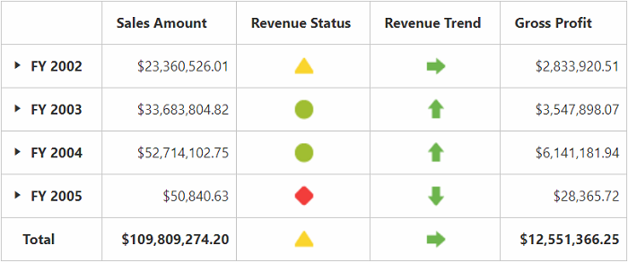

# KPI

Key Performance Indicators (KPI) are business metrics that help you to figure out the progress of an enterprise when meeting its business goals.

The different indicators available in the KPI are:

* KPI value: A physical measure or a calculated measure.
* KPI goal: Defines the target for the measure.
* KPI status: Evaluates the current status of the value compared to the goal.
* KPI trend: Evaluates the current trend of the value compared to the goal.

The **“KpiElements”** class in the OLAP base library holds the KPI name, and when its object is added to an OlapReport, you can view the resultant information in the PivotGrid.

## Client mode



<!--Create a tag which acts as a container for PivotGrid-->
 



## Server mode



OlapReport olapReport = new OlapReport();
olapReport.Name = "Sample Report";
olapReport.CurrentCubeName = "Adventure Works";

MeasureElements measureElementColumn = new MeasureElements();
measureElementColumn.Elements.Add(new MeasureElement {
    Name = "Gross Profit"
});

DimensionElement dimensionElementRow = new DimensionElement();
dimensionElementRow.Name = "Date";
dimensionElementRow.AddLevel("Fiscal", "Fiscal Year");

KpiElements kpiElement = new KpiElements();
kpiElement.Elements.Add(new KpiElement {
    Name = "Revenue", ShowKPIStatus = true, ShowKPIGoal = false, ShowKPITrend = true, ShowKPIValue = true
});

olapReport.CategoricalElements.Add(kpiElement);
olapReport.CategoricalElements.Add(measureElementColumn);
olapReport.SeriesElements.Add(dimensionElementRow);



