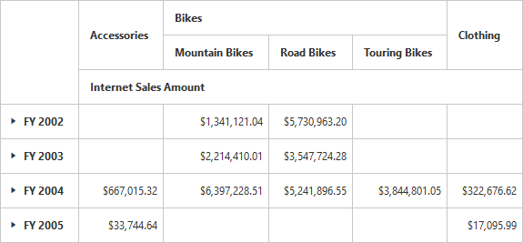

# Named Sets

Named sets is a multidimensional expression (MDX) that returns a set of dimension members, that can be created by combining cube data, arithmetic operators, numbers, and functions.

## Client mode

You can bind the named sets in the PivotGrid by setting it's unique name in the [`fieldName`](/api/js/ejpivotclient#members:datasource-columns-fieldname) property either in row or column axis and the [`isNamedSets`](/api/js/ejpivotclient#members:datasource-columns-isnamedsets) boolean property to "true".



<!--Create a tag which acts as a container for PivotGrid-->
 



## Server mode

You can add named sets in the PivotGrid by using NamedSetElement Class in the OlapReport.



OlapReport olapReport = new OlapReport();
olapReport.Name = "Customer Report";
olapReport.CurrentCubeName = "Adventure Works";

DimensionElement dimensionElementRow = new DimensionElement();
dimensionElementRow.Name = "Date";
dimensionElementRow.AddLevel("Fiscal", "Fiscal Year");

MeasureElements measureElementColumn = new MeasureElements();
measureElementColumn.Elements.Add(new MeasureElement {
Name = "Internet Sales Amount"
});

NamedSetElement dimensionElementColumn = new NamedSetElement();
dimensionElementColumn.Name = "Core Product Group";

olapReport.CategoricalElements.Add(dimensionElementColumn);
olapReport.CategoricalElements.Add(measureElementColumn);
olapReport.SeriesElements.Add(dimensionElementRow);



