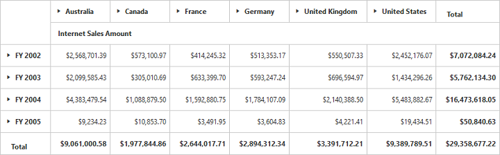

# Getting Started

## Creating a simple application with PivotGrid and OLAP datasource (Client Mode)

This section covers the information that you need to know to populate a simple PivotGrid with OLAP data completely on the client-side.  

### Scripts and CSS References

Create a HTML page and add scripts and style sheets that are mandatorily required to render a PivotGrid widget which are listed below in an appropriate order.

1. ej.web.all.min.css
2. jQuery-3.0.0.min.js
3. ej.web.all.min.js

### Initialize PivotGrid

Place a "div" tag in the HTML page which acts as a container for the PivotGrid widget. Then initialize the widget using the "ejPivotGrid" method.



<!DOCTYPE html>
<html>
<head>

    <title>PivotGrid - Getting Started</title>

    <link href="http://cdn.syncfusion.com/{{ site.releaseversion }}/js/web/flat-azure/ej.web.all.min.css" rel="stylesheet" type="text/css" />
    
    

</head>
<body>
    <!--Create a tag which acts as a container for ejPivotGrid widget.-->
    

    

    
</body>
</html>



### Populate PivotGrid with DataSource

Initializes the OLAP datasource for PivotGrid widget as shown below.



<html>

//……

<body>
    

    

    
</body>

    </html>



The above code will generate a simple PivotGrid with "Customer Geography" field in Column, "Fiscal" field in Row and "Internet Sales Amount" field in Value section.

 

## Creating a simple application with PivotGrid and OLAP datasource (Server Mode)

This section covers the information required to create a simple PivotGrid bound to OLAP datasource.  

N> We will be illustrating this section by creating a simple Web Application through Visual Studio IDE since PivotGrid is a server-side control with .NET dependency. The Web Application would contain a HTML page and a service that would transfer data to server-side, process and return back the data to client-side for control re-rendering. The service utilized for communication could be either WCF or WebAPI based on user requirement and we have illustrated both for user convenience.

### Project Initialization
Create a new **ASP.NET Empty Web Application** by using Visual Studio IDE and name the project as **“PivotGridDemo”**.

Next you need to add a HTML page. To add a HTML page in your Web Application, right-click on the project in Solution Explorer and select **Add > New Item.** In the **Add New Item** window, select **HTML Page** and name it as **“GettingStarted.html”**, click **Add.**

Now you need to set “GettingStarted.html” as start-up page. In-order to do so, right-click on “GettingStarted.html” page and select **“Set As Start Page”**.

### Scripts and CSS Initialization
The scripts and style sheets that are mandatorily required to render a PivotGrid widget inside a HTML page are listed below in an appropriate order.

1. ej.web.all.min.css
2. jQuery-3.0.0.min.js
3. ej.web.all.min.js

The scripts and style sheets listed above could be found in any of the following locations:

Local Disk: [Click here](http://helpjs.syncfusion.com/js/installation-and-deployment) to know more about script and style sheets installed in local machine.

CDN Link: [Click here](http://helpjs.syncfusion.com/js/cdn) to know more about script and style sheets available online.

NuGet Package: [Click here](http://helpjs.syncfusion.com/js/installation-and-deployment#configuring-syncfusion-nuget-packages) to know more about script and style sheets available in NuGet package. 

### Control Initialization
In-order to initialize a PivotGrid widget, first you need to define a “div” tag with an appropriate “id” attribute which acts as a container for PivotGrid widget. Then you need to initialize the widget using `ejPivotGrid` method.
    


<!DOCTYPE html>
<html xmlns="http://www.w3.org/1999/xhtml">
<head>
    <title>PivotGrid - Getting Started</title>

    <link href="http://cdn.syncfusion.com/{{ site.releaseversion }}/js/web/flat-azure/ej.web.all.min.css" rel="stylesheet" type="text/css" />
    
    
</head>

<body>
    <form id="form1" runat="server">
        

            <!--Create a tag which acts as a container for ejPivotGrid widget.-->
            
 

            
        

    </form>
</body>

</html>



The “url” property in PivotGrid widget points the service endpoint, where data are processed and fetched in the form of JSON. The service used for the PivotGrid widget as endpoint are WCF and WebAPI.

N> The above "GettingStarted.html" contains WebAPI URL, which is **“/Olap”**. Suppose if you are using WCF service then the URL would look like **"/OlapService.svc"**. 

### WebAPI

**Adding a WebAPI Controller**

To add a WebAPI controller in your existing Web Application, right-click on the project in Solution Explorer and select **Add > New Item.** In the **Add New Item** window, select **WebAPI Controller Class** and name it as “OlapController.cs”, click **Add.**

Now WebAPI controller is added into your application successfully which in-turn comprise of the following file. The utilization of this file will be explained in the following sections.
 
* OlapController.cs

N> While adding WebAPI Controller Class, name it with the suffix “Controller” that is mandatory. For example, in demo the controller is named as “OlapController”.

Next, remove all the existing methods such as “Get”, “Post”, “Put” and “Delete” present inside `OlapController.cs` file. 



namespace PivotGridDemo
{
    public class OlapController : ApiController
    {
        
    }
}



**List of Dependency Libraries**

Next you need to add the below mentioned dependency libraries into your Web Application. These libraries could be found in GAC (Global Assembly Cache) as well.

To add them to your Web Application, right-click on **References** in Solution Explorer and select **Add Reference.** Now, in the **Reference Manager** dialog, under **Assemblies > Extension**, the following Syncfusion libraries are found. 

N> When you have installed any version of SQL Server Analysis Service (SSAS) or Microsoft ADOMD.NET utility, then the location of Microsoft.AnalysisServices.AdomdClient library is [system drive:\Program Files (x86)\Microsoft.NET\ADOMD.NET]

* Microsoft.AnalysisServices.AdomdClient
* Syncfusion.Compression.Base
* Syncfusion.Linq.Base
* Syncfusion.Olap.Base
* Syncfusion.PivotAnalysis.Base
* System.Data.SqlServerCe (Version: 4.0.0.0)
* Syncfusion.XlsIO.Base
* Syncfusion.Pdf.Base
* Syncfusion.DocIO.Base
* Syncfusion.EJ
* Syncfusion.EJ.Export
* Syncfusion.EJ.Pivot

**List of Namespaces**

Following are the list of namespaces to be added on top of the main class inside `OlapController.cs` file.



using Syncfusion.Olap.Manager;
using Syncfusion.Olap.Reports;
using System;
using System.Collections.Generic;
using System.Configuration;
using System.Linq;
using System.Web.Http;
using System.Web.Script.Serialization;
using Syncfusion.JavaScript.Olap;
using System.Web;
using System.Data.SqlServerCe;
using OLAPUTILS = Syncfusion.JavaScript.Olap;
using System.Data;
using System.Text;

namespace PivotGridDemo
{
    public class OlapController : ApiController
    {

    }
}



**Datasource Initialization**

Now, the connection string to connect OLAP Cube, PivotGrid and JavaScriptSerializer instances are created immediately inside the main class in `OlapController.cs` file.



namespace PivotGridDemo
{
    public class OlapController : ApiController
    {
        Syncfusion.JavaScript.PivotGrid htmlHelper = new Syncfusion.JavaScript.PivotGrid();
        string connectionString = "Data Source=http://bi.syncfusion.com/olap/msmdpump.dll; Initial Catalog=Adventure Works DW 2008 SE;";
        JavaScriptSerializer serializer = new JavaScriptSerializer();
        string conStringforDB = ""; //Enter appropriate connection string to connect database for saving and loading operation of reports
        //Other codes

    }
}



**Service methods in WebAPI Controller**

Now you need to define the service methods inside OlapController class, found inside `OlapController.cs` file, created while adding WebAPI Controller Class to your Web Application.
 


namespace PivotGridDemo
{
    public class OlapController : ApiController
    {
        Syncfusion.JavaScript.PivotGrid htmlHelper = new Syncfusion.JavaScript.PivotGrid();
        string connectionString = "Data Source=http://bi.syncfusion.com/olap/msmdpump.dll; Initial Catalog=Adventure Works DW 2008 SE;";
        JavaScriptSerializer serializer = new JavaScriptSerializer();
        string conStringforDB = ""; //Enter appropriate connection string to connect database for saving and loading operation of reports

        [System.Web.Http.ActionName("InitializeGrid")]
        [System.Web.Http.HttpPost]
        public Dictionary<string, object> InitializeOlapGrid(Dictionary<string, object> jsonResult)
        {
            OlapDataManager DataManager = null;
            DataManager = new OlapDataManager(connectionString);
            DataManager.SetCurrentReport(CreateOlapReport());
            DataManager.OverrideDefaultFormatStrings = true;
            return htmlHelper.GetJsonData(jsonResult["action"].ToString(), DataManager, jsonResult.ContainsKey("gridLayout") ? jsonResult["gridLayout"].ToString() : null, Convert.ToBoolean(jsonResult["enablePivotFieldList"].ToString()));
        }

        [System.Web.Http.ActionName("DrillGrid")]
        [System.Web.Http.HttpPost]
        public Dictionary<string, object> DrillGrid(Dictionary<string, object> jsonResult)
        {
            OlapDataManager DataManager = new OlapDataManager(connectionString);
            DataManager = new OlapDataManager(connectionString);
            DataManager.SetCurrentReport(Utils.DeserializeOlapReport(jsonResult["currentReport"].ToString()));
            return htmlHelper.GetJsonData(jsonResult["action"].ToString(), connectionString, DataManager, jsonResult["cellPosition"].ToString(), jsonResult["headerInfo"].ToString(), jsonResult["layout"].ToString());
        }

        [System.Web.Http.ActionName("NodeDropped")]
        [System.Web.Http.HttpPost]
        public Dictionary<string, object> NodeDropped(Dictionary<string, object> jsonResult)
        {
            OlapDataManager DataManager = new OlapDataManager(connectionString);
            DataManager.SetCurrentReport(Utils.DeserializeOlapReport(jsonResult["currentReport"].ToString()));
            return htmlHelper.GetJsonData(jsonResult["action"].ToString(), DataManager, jsonResult["dropType"].ToString(), jsonResult["nodeInfo"].ToString(), jsonResult.ContainsKey("filterParams") ? jsonResult["filterParams"].ToString() : null, jsonResult["gridLayout"].ToString(), true);
        }

        [System.Web.Http.ActionName("Filtering")]
        [System.Web.Http.HttpPost]
        public Dictionary<string, object> Filtering(Dictionary<string, object> jsonResult)
        {
            OlapDataManager DataManager = new OlapDataManager(connectionString);
            DataManager.SetCurrentReport(Utils.DeserializeOlapReport(jsonResult["currentReport"].ToString()));
            return htmlHelper.GetJsonData(jsonResult["action"].ToString(), connectionString, DataManager, null, jsonResult["filterParams"].ToString(), jsonResult["gridLayout"].ToString());
        }

        [System.Web.Http.ActionName("FetchMembers")]
        [System.Web.Http.HttpPost]
        public Dictionary<string, object> FetchMembers(Dictionary<string, object> jsonResult)
        {
            OlapDataManager DataManager = new OlapDataManager(connectionString);
            DataManager.SetCurrentReport(Utils.DeserializeOlapReport(jsonResult["currentReport"].ToString()));
            return htmlHelper.GetJsonData(jsonResult["action"].ToString(), DataManager, null, jsonResult["headerTag"].ToString());
        }

        [System.Web.Http.ActionName("RemoveButton")]
        [System.Web.Http.HttpPost]
        public Dictionary<string, object> RemoveButton(Dictionary<string, object> jsonResult)
        {
            OlapDataManager DataManager = new OlapDataManager(connectionString);
            DataManager.SetCurrentReport(Utils.DeserializeOlapReport(jsonResult["currentReport"].ToString()));
            return htmlHelper.GetJsonData(jsonResult["action"].ToString(), connectionString, DataManager, null, jsonResult["headerInfo"].ToString(), jsonResult["gridLayout"].ToString());
        }

        [System.Web.Http.ActionName("MemberExpanded")]
        [System.Web.Http.HttpPost]
        public Dictionary<string, object> MemberExpanded(Dictionary<string, object> jsonResult)
        {
            OlapDataManager DataManager = new OlapDataManager(connectionString);
            if (!string.IsNullOrEmpty(jsonResult["currentReport"].ToString()))
                DataManager.SetCurrentReport(Utils.DeserializeOlapReport(jsonResult["currentReport"].ToString()));
            return htmlHelper.GetJsonData(jsonResult["action"].ToString(), DataManager, Convert.ToBoolean(jsonResult["checkedStatus"].ToString()), jsonResult["parentNode"].ToString(), jsonResult["tag"].ToString(), jsonResult["cubeName"].ToString());
        }

        [System.Web.Http.ActionName("Export")]
        [System.Web.Http.HttpPost]
        public void Export()
        {
            string args = HttpContext.Current.Request.Form.GetValues(0)[0];
            OlapDataManager DataManager = new OlapDataManager(connectionString);
            string fileName = "Sample";
            htmlHelper.ExportPivotGrid(DataManager, args, fileName, System.Web.HttpContext.Current.Response);
        }

        [System.Web.Http.ActionName("SaveReport")]
        [System.Web.Http.HttpPost]
        public Dictionary<string, object> SaveReport(Dictionary<string, object> jsonResult)
        {
            string mode = jsonResult["operationalMode"].ToString();
            SqlCeConnection con = new SqlCeConnection() { ConnectionString = conStringforDB };
            con.Open();
            SqlCeCommand cmd1 = new SqlCeCommand("insert into ReportsTable Values(@ReportName,@Reports)", con);
            cmd1.Parameters.Add("@ReportName", jsonResult["reportName"].ToString());
            if (mode == "clientMode")
                cmd1.Parameters.Add("@Reports", Encoding.UTF8.GetBytes(jsonResult["clientReports"].ToString()).ToArray());
            else if (mode == "serverMode")
                cmd1.Parameters.Add("@Reports", OLAPUTILS.Utils.GetReportStream(jsonResult["clientReports"].ToString()).ToArray());
            cmd1.ExecuteNonQuery();
            con.Close();
            return null;
        }

        [System.Web.Http.ActionName("LoadReportFromDB")]
        [System.Web.Http.HttpPost]
        public Dictionary<string, object> LoadReportFromDB(Dictionary<string, object> jsonResult)
        {
            string mode = jsonResult["operationalMode"].ToString();
            byte[] reportString = new byte[4 * 1024];
            Dictionary<string, object> dictionary = new Dictionary<string, object>();
            foreach (DataRow row in GetDataTable().Rows)
            {
                if ((row.ItemArray[0] as string).Equals(jsonResult["reportName"].ToString()))
                {
                    if (mode == "clientMode")
                    {
                        reportString = row.ItemArray[1] as byte[];
                        dictionary.Add("report", Encoding.UTF8.GetString(reportString));
                        break;
                    }
                    else if (mode == "serverMode")
                    {
                        OlapDataManager DataManager = new OlapDataManager(connectionString);
                        var reports = "";
                        if ((row.ItemArray[0] as string).Equals(jsonResult["reportName"].ToString()))
                        {
                            reports = OLAPUTILS.Utils.CompressData(row.ItemArray[1] as byte[]);
                        }
                        DataManager.SetCurrentReport(Utils.DeserializeOlapReport(reports));
                        DataManager.OverrideDefaultFormatStrings = true;
                        dictionary = htmlHelper.GetJsonData(jsonResult["action"].ToString(), DataManager, jsonResult["gridLayout"].ToString(), Convert.ToBoolean(jsonResult["enablePivotFieldList"].ToString()));
                    }
                }
            }
            return dictionary;
        }

        private DataTable GetDataTable()
        {
            SqlCeConnection con = new SqlCeConnection() { ConnectionString = conStringforDB };
            con.Open();
            DataSet dSet = new DataSet();
            new SqlCeDataAdapter("Select * from ReportsTable", con).Fill(dSet);
            con.Close();
            return dSet.Tables[0];
        }

        [System.Web.Http.ActionName("DeferUpdate")]
        [System.Web.Http.HttpPost]
        public Dictionary<string, object> DeferUpdate(Dictionary<string, object> jsonResult)
        {
            OlapDataManager DataManager = new OlapDataManager(connectionString);
            DataManager.SetCurrentReport(Utils.DeserializeOlapReport(jsonResult["currentReport"].ToString()));
            return htmlHelper.GetJsonData(jsonResult["action"].ToString(), DataManager, null, jsonResult["filterParams"].ToString());
        }

        [System.Web.Http.ActionName("Paging")]
        [System.Web.Http.HttpPost]
        public Dictionary<string, object> Paging(Dictionary<string, object> jsonResult)
        {
            OlapDataManager DataManager = new OlapDataManager(connectionString);
            DataManager.SetCurrentReport(htmlHelper.SetPaging(jsonResult["currentReport"].ToString(), jsonResult["pagingInfo"].ToString()));
            return htmlHelper.GetJsonData(jsonResult["action"].ToString(), DataManager, jsonResult["layout"].ToString());
        }

        private OlapReport CreateOlapReport()
        {
            OlapReport olapReport = new OlapReport();
            olapReport.CurrentCubeName = "Adventure Works";

            MeasureElements measureElement = new MeasureElements();
            measureElement.Elements.Add(new MeasureElement { UniqueName = "[Measures].[Internet Sales Amount]" });

            DimensionElement dimensionElementRow = new DimensionElement();
            dimensionElementRow.Name = "Date";
            dimensionElementRow.AddLevel("Fiscal", "Fiscal Year");

            DimensionElement dimensionElementColumn = new DimensionElement();
            dimensionElementColumn.Name = "Customer";
            dimensionElementColumn.AddLevel("Customer Geography", "Country");

            olapReport.SeriesElements.Add(dimensionElementRow);
            olapReport.CategoricalElements.Add(dimensionElementColumn);
            olapReport.CategoricalElements.Add(measureElement);

            return olapReport;
        }
    }
}



**Configure routing in Global Application Class**

To add a Global.asax in your existing Web Application, right-click on the project in Solution Explorer and select **Add > New Item.** In the **Add New Item** window, select **Global Application Class** and name it as “Global.asax”, click **Add.**

Once you finish adding the **Global.asax** file, immediately add the namespace **“using System.Web.Http;”** and then you can configure routing like in the following code example.



public class Global : System.Web.HttpApplication
    {
        protected void Application_Start(object sender, EventArgs e)
        {
            System.Web.Http.GlobalConfiguration.Configuration.Routes.MapHttpRoute(
                name: "DefaultApi",
                routeTemplate: "{controller}/{action}/{id}",
                defaults: new { id = RouteParameter.Optional });
            AppDomain.CurrentDomain.SetData("SQLServerCompactEditionUnderWebHosting", true);
        }
}



Now, PivotGrid will be rendered with Internet Sales Amount over a period of fiscal years across different customer geographic locations.

 

### WCF
This section demonstrates the utilization of WCF service as endpoint binding OLAP datasource to a simple PivotGrid. For more details on this topic, [click here](http://help.syncfusion.com/js/pivotgrid/olap-connectivity#wcf).

