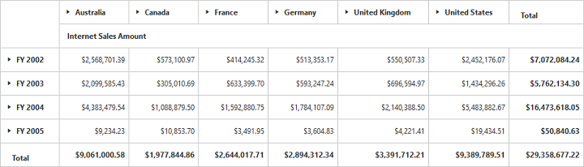

# Getting started with JavaScript PivotGrid

## Creating a simple application with pivot grid and OLAP datasource (client mode)

This section explains about how to populate a simple pivot grid with [`OLAP`](/api/js/ejpivotgrid#members:analysismode) data completely on the [`client-side`](/api/js/ejpivotgrid#members:operationalmode).

### Scripts and CSS references

Create a HTML page and add scripts and style sheets that are required to render a pivot grid widget which are listed below in an appropriate order.

1. ej.web.all.min.css
2. jQuery-3.0.0.min.js
3. ej.web.all.min.js

### Initialize pivot grid

Place a "div" tag in the HTML page which acts as a container for the pivot grid widget. Then, initialize the widget using the "ejPivotGrid" method.



<!DOCTYPE html>
<html>
<head>

    <title>PivotGrid - Getting Started</title>

    <link href="http://cdn.syncfusion.com/{{ site.releaseversion }}/js/web/flat-azure/ej.web.all.min.css" rel="stylesheet" type="text/css" />
    
    

</head>
<body>
    <!--Create a tag which acts as a container for ejPivotGrid widget.-->
    

    

    
</body>
</html>



### Populate pivot grid with data source

Initialize the [`OLAP`](/api/js/ejpivotgrid#members:analysismode) data source for the pivot grid widget as shown below:



<html>

//……

<body>
    

    

    
</body>

    </html>



The above code will generate a simple pivot grid with "Customer Geography" field in column, "Fiscal" field in row, and "Internet Sales Amount" field in the value section.

The following table will explain the [`OLAP`](/api/js/ejpivotgrid#members:analysismode) [`datasource`](/api/js/ejpivotgrid#members:datasource) properties at [`client-side`](/api/js/ejpivotgrid#members:operationalmode) in detail:

<table>
    <tr>
        <th>
            Properties
        </th>
        <th>
            Description
        </th>
    </tr>
    <tr>
    <td>
        {{'[`cube`](https://help.syncfusion.com/api/js/ejpivotgrid#members:datasource-cube "cube")'| markdownify }}
    </td>
    <td>
        Contains the respective cube name as string type in the OLAP database.
    </td>
    </tr>
    <tr>
    <td>
        {{'[`sourceInfo`](https://help.syncfusion.com/api/js/ejpivotgrid#members:datasource-sourceinfo "sourceInfo")'| markdownify }}
    </td>
    <td>
        To set the data source name to fetch the data.
    </td>
    </tr>
    <tr>
    <td>
        {{'[`providerName`](https://help.syncfusion.com/api/js/ejpivotgrid#members:datasource-providername "providerName")'| markdownify }}
    </td>
    <td>
        Sets the provider name for PivotGrid to identify whether the provider is SSAS or Mondrian.
    </td>
    </tr>
    <tr>
    <td>
        {{'[`data`](https://help.syncfusion.com/api/js/ejpivotgrid#members:datasource-data "data")'| markdownify }}
    </td>
    <td>
        Provides the raw data source for the PivotGrid.
    </td>
    </tr>
    <tr>
    <td>
        {{'[`catalog`](https://help.syncfusion.com/api/js/ejpivotgrid#members:datasource-catalog "catalog")'| markdownify }}
    </td>
    <td>
        In connection with an OLAP database, this property contains the database name as string to fetch the data from the given connection string.
    </td>
    </tr>
    <tr>
    <td>
        {{'[`enableAdvancedFilter`](https://help.syncfusion.com/api/js/ejpivotgrid#members:datasource-enableadvancedfilter "enableAdvancedFilter")'| markdownify }}
    </td>
    <td>
        Allows you to filter the members (by its name and values) through advanced filtering.</td>
    </tr>
    <tr>
    <td>
        {{'[`reportName`](https://help.syncfusion.com/api/js/ejpivotgrid#members:datasource-reportName "reportName")'| markdownify }}
    </td>
    <td>
        Sets a name to the report that is bound to the control.</td>
    </tr>
    <tr>
        <td>
            {{'[`columns`](https://help.syncfusion.com/api/js/ejpivotgrid#members:datasource-columns "columns")'| markdownify }}
        </td>
        <td>
            Lists out the items to be arranged in the columns section of the PivotGrid.
             <table class="params">
            <thead>
            <tr>
            <th>Properties</th>
            <th>Description</th>
            </tr>
            </thead>
            <tbody>
            <tr>
            <td>{{'[`fieldName`](https://help.syncfusion.com/api/js/ejpivotgrid#members:datasource-columns-fieldname "fieldName")'| markdownify }} </td>
            <td>Allows you to bind the item by using its unique name as field name.</td>
            </tr>
            <tr>
            <td>{{'[`fieldCaption`](https://help.syncfusion.com/api/js/ejpivotgrid#members:datasource-columns-fieldcaption "fieldCaption")'| markdownify }}</td>
            <td>Allows you to set the display caption for an item.</td>
            </tr>
            <tr>
            <td>{{'[`isNamedSets`](https://help.syncfusion.com/api/js/ejpivotgrid#members:datasource-columns-isnamedsets "isNamedSets")'| markdownify }}</td>
            <td>Allows you to indicate whether the added item is a named set or not.</td>
            </tr>
            <tr>
            <td>{{'[`advancedFilter`](https://help.syncfusion.com/api/js/ejpivotgrid#members:datasource-columns-advancedfilter "advancedFilter")'| markdownify }}</td>
            <td>Allows you to filter the members (by its name and values) through advanced filtering.
            <table class="params">
            <thead>
            <tr>
            <th>Properties</th>
            <th>Description</th>
            </tr>
            </thead>
            <tbody>
            <tr>
            <td>
                {{'[`name`](https://help.syncfusion.com/api/js/ejpivotgrid#members:datasource-columns-advancedfilter-name "name")'| markdownify }} </td>
            <td>Allows you to provide the level unique name to perform the advanced filtering.</td>
            </tr>
            <tr>
            <td>
                {{'[`labelFilterOperator`](https://help.syncfusion.com/api/js/ejpivotgrid#members:datasource-columns-advancedfilter-labelfilteroperator "labelFilterOperator")'| markdownify }} </td>
            <td>Allows you to set the operator to perform the label filtering.</td>
            </tr>
            <tr>
            <td>
                {{'[`valueFilterOperator`](https://help.syncfusion.com/api/js/ejpivotgrid#members:datasource-columns-advancedfilter-valuefilteroperator "valueFilterOperator")'| markdownify }} </td>
            <td>Allows you to set the operator to perform the value filtering.</td>
            </tr>
            <tr>
            <td>
                {{'[`advancedFilterType`](https://help.syncfusion.com/api/js/ejpivotgrid#members:datasource-columns-advancedfilter-advancedfiltertype "advancedFilterType")'| markdownify }} </td>
            <td>Allows you to set the filtering type while performing the advanced filtering.</td>
            </tr>
            <tr>
            <td>
                {{'[`measure`](https://help.syncfusion.com/api/js/ejpivotgrid#members:datasource-columns-advancedfilter-measure "measure")'| markdownify }} </td>
            <td>In value filtering, this property contains the measure name to which the filter is applied.</td>
            </tr>
            <tr>
            <td>
                {{'[`values`](https://help.syncfusion.com/api/js/ejpivotgrid#members:datasource-columns-advancedfilter-values "values")'| markdownify }} </td>
            <td>Allows you to hold the filter operand values in the advanced filtering.</td>
            </tr>
            </td>
            </tr>
            </tbody>
            </table>
            </td>
            </tr>
            </tbody>
            </table>
        </td>
    </tr>
    <tr>
        <td>
            {{'[`rows`](https://help.syncfusion.com/api/js/ejpivotgrid#members:datasource-rows "rows")'| markdownify }}
        </td>
        <td>
            Lists out the items to be arranged in the rows section of PivotGrid.
             <table class="params">
            <thead>
            <tr>
            <th>Properties</th>
            <th>Description</th>
            </tr>
            </thead>
            <tbody>
            <tr>
            <td>{{'[`fieldName`](https://help.syncfusion.com/api/js/ejpivotgrid#members:datasource-rows-fieldname "fieldName")'| markdownify }} </td>
            <td>Allows you to bind the item by using its unique name as field name.</td>
            </tr>
            <tr>
            <td>{{'[`fieldCaption`](https://help.syncfusion.com/api/js/ejpivotgrid#members:datasource-rows-fieldcaption "fieldCaption")'| markdownify }}</td>
            <td>Allows you to set the display caption for an item.</td>
            </tr>
            <tr>
            <td>{{'[`isNamedSets`](https://help.syncfusion.com/api/js/ejpivotgrid#members:datasource-rows-isnamedsets "isNamedSets")'| markdownify }}</td>
            <td>Allows you to indicate whether the added item is a named set or not.</td>
            </tr>
            <tr>
            <td>{{'[`advancedFilter`](https://help.syncfusion.com/api/js/ejpivotgrid#members:datasource-rows-advancedfilter "advancedFilter")'| markdownify }}</td>
            <td>Allows you to filter the members (by its name and values) through advanced filtering.
            <table class="params">
            <thead>
            <tr>
            <th>Properties</th>
            <th>Description</th>
            </tr>
            </thead>
            <tbody>
            <tr>
            <td>
                {{'[`name`](https://help.syncfusion.com/api/js/ejpivotgrid#members:datasource-rows-advancedfilter-name "name")'| markdownify }} </td>
            <td>Allows you to provide the level unique name to perform the advanced filtering.</td>
            </tr>
            <tr>
            <td>
                {{'[`labelFilterOperator`](https://help.syncfusion.com/api/js/ejpivotgrid#members:datasource-rows-advancedfilter-labelfilteroperator "labelFilterOperator")'| markdownify }} </td>
            <td>Allows you to set the operator to perform the label filtering.</td>
            </tr>
            <tr>
            <td>
                {{'[`valueFilterOperator`](https://help.syncfusion.com/api/js/ejpivotgrid#members:datasource-rows-advancedfilter-valuefilteroperator "valueFilterOperator")'| markdownify }} </td>
            <td>Allows you to set the operator to perform the value filtering.</td>
            </tr>
            <tr>
            <td>
                {{'[`advancedFilterType`](https://help.syncfusion.com/api/js/ejpivotgrid#members:datasource-rows-advancedfilter-advancedfiltertype "advancedFilterType")'| markdownify }} </td>
            <td>Allows you to set the filtering type while performing the advanced filtering.</td>
            </tr>
            <tr>
            <td>
                {{'[`measure`](https://help.syncfusion.com/api/js/ejpivotgrid#members:datasource-rows-advancedfilter-measure "measure")'| markdownify }} </td>
            <td>In value filtering, this property contains the measure name to which the filter is applied.</td>
            </tr>
            <tr>
            <td>
                {{'[`values`](https://help.syncfusion.com/api/js/ejpivotgrid#members:datasource-rows-advancedfilter-values "values")'| markdownify }} </td>
            <td>Allows you to hold the filter operand values in the advanced filtering.</td>
            </tr>
            </td>
            </tr>
            </tbody>
            </table>
            </td>
            </tr>
            </tbody>
            </table>
        </td>
    </tr>
    <tr>
        <td>
            {{'[`values`](https://help.syncfusion.com/api/js/ejpivotgrid#members:datasource-values "values")'| markdownify }}
        </td>
        <td>
            Lists out the items to be arranged in the rows section of PivotGrid.
            <table class="params">
            <thead>
            <tr>
            <th>Properties</th>
            <th>Description</th>
            </tr>
            </thead>
            <tbody>
            <tr>
            <td>{{'[`axis`](https://help.syncfusion.com/api/js/ejpivotgrid#members:datasource-values-axis "axis")'| markdownify }} </td>
            <td>Allows you to set the axis name to place measures items.</td>
            </tr>
            <tr>
            <td>{{'[`measures`](https://help.syncfusion.com/api/js/ejpivotgrid#members:datasource-values-measures "measures")'| markdownify }}</td>
            <td>This holds the list of unique names of measures to bind them from the OLAP cube.
            <table class="params">
            <thead>
            <tr>
            <th>Property</th>
            <th>Description</th>
            </tr>
            </thead>
            <tbody>
            <tr>
            <td>
                {{'[`fieldName`](https://help.syncfusion.com/api/js/ejpivotgrid#members:datasource-values-measures-fieldName "fieldName")'| markdownify }} </td>
            <td>Allows you to bind the measure from the OLAP datasource by using its unique name as field name.</td>
            </tr>
            </td>
            </tr>
            </tbody>
            </table>
            </td>
            </tr>
            </tbody>
            </table>
        </td>
        </tr>

</table>

## Creating a simple application with pivot grid and OLAP data source (server mode)

This section covers the information required to create a simple pivot grid that is bound to the [`OLAP`](/api/js/ejpivotgrid#members:analysismode) datasource.

N> This section illustrates creating a simple web application through the Visual Studio IDE, since the pivot grid is a [`server-side`](/api/js/ejpivotgrid#members:operationalmode) control with .NET dependency. The web application contains a HTML page and a service that will transfer data to the [`server-side`](/api/js/ejpivotgrid#members:operationalmode), process it, and return it back to the [`client-side`](/api/js/ejpivotgrid#members:operationalmode) for control re-rendering. The service utilized for communication can be either WCF or WebAPI based on user's requirement. Here, both WCF and WebAPI have been illustrated for user convenience.

### Project initialization
Create a new **ASP.NET Empty Web Application** by using the Visual Studio IDE and name the project as **“PivotGridDemo”**.

Next, you should add an HTML page. To add an HTML page in your web application, right-click the project in the solution explorer and select **Add > New Item.** In the **Add New Item** window, select **HTML Page** and name it as **“GettingStarted.html”**, and then click **Add.**

You can set “GettingStarted.html” page as start-up page by right-clicking the “GettingStarted.html” page and selecting the **“Set As Start Page”**.

### Scripts and CSS initialization
The scripts and style sheets that are required to render the pivot grid widget in the HTML page are listed below in an appropriate order.

1. ej.web.all.min.css
2. jQuery-3.0.0.min.js
3. ej.web.all.min.js

The scripts and style sheets listed above can be found in any of the following locations:

Local disk: [Click here](https://help.syncfusion.com/js/installation-and-upgrade/install-using-the-web-installer) to know more about script and style sheets installed in the local machine.

CDN link: [Click here](https://help.syncfusion.com/js/cdn) to know more about script and style sheets available in online.

NuGet package: [Click here](https://help.syncfusion.com/js/installation-and-upgrade/install-using-the-web-installer#configuring-syncfusion-nuget-packages) to know more about script and style sheets available in the NuGet package.

### Control initialization
To initialize a pivot grid widget, you can define a “div” tag with an appropriate “ID” attribute which acts as a container for the pivot grid widget. Then, you can initialize the widget by using the `ejPivotGrid` method.



<!DOCTYPE html>
<html xmlns="http://www.w3.org/1999/xhtml">
<head>
    <title>PivotGrid - Getting Started</title>

    <link href="http://cdn.syncfusion.com/{{ site.releaseversion }}/js/web/flat-azure/ej.web.all.min.css" rel="stylesheet" type="text/css" />
    
    
</head>

<body>

        

            <!--Create a tag which acts as a container for ejPivotGrid widget.-->
            
 

            
        

</body>

</html>



The [`url`](/api/js/ejpivotgrid#members:url) property in the pivot grid widget, points the service endpoint where the data are processed and fetched in the form of JSON. The service used for the pivot grid widget as endpoint are the WCF and WebAPI.

N> The above "GettingStarted.html" contains WebAPI URL, which is **“/Olap”**. If you are using the WCF service then the URL will look like **"/OlapService.svc"**.

### WebAPI

**Adding a WebAPI controller**

To add a WebAPI controller in your existing web application, right-click the project in the solution explorer and select **Add > New Item.** In the **Add New Item** window, select **WebAPI Controller Class** and name it “OlapController.cs”, and then click **Add.**

Now, the WebAPI controller is added to your application, which, in turn, comprise the following file. The utilization of this file will be explained in the following sections:

* OlapController.cs

N> While adding the WebAPI Controller Class, add the mandatory suffix “Controller” that is . For example, in the demo, the controller is named “OlapController”.

Remove all the existing methods such as “Get”, “Post”, “Put”, and “Delete” that are present inside the `OlapController.cs` file.



namespace PivotGridDemo
{
    public class OlapController : ApiController
    {

    }
}



**List of dependency libraries**

You can add the below mentioned dependency libraries to your web application. These libraries can be found in the GAC (Global Assembly Cache).

To add them to your web application, right-click **References** in the solution explorer and select **Add Reference.** In the **Reference Manager** dialog, under **Assemblies > Extension**, the following Syncfusion libraries are found.

N> If you have installed any version of SQL Server Analysis Service (SSAS) or Microsoft ADOMD.NET utility, then the location of the Microsoft.AnalysisServices.AdomdClient library is [system drive:\Program Files (x86)\Microsoft.NET\ADOMD.NET]. If you have installed any version of Essential Studio, then the location of Syncfusion libraries is [system drive:\Program Files (x86)\Syncfusion\Essential Studio\{{ site.releaseversion }}\Assemblies].

* Microsoft.AnalysisServices.AdomdClient
* Syncfusion.Compression.Base
* Syncfusion.Linq.Base
* Syncfusion.Olap.Base
* Syncfusion.PivotAnalysis.Base
* System.Data.SqlServerCe (Version: 4.0.0.0)
* Syncfusion.XlsIO.Base
* Syncfusion.Pdf.Base
* Syncfusion.DocIO.Base
* Syncfusion.EJ
* Syncfusion.EJ.Export
* Syncfusion.EJ.Pivot

**List of Namespaces**

Following are the list of namespaces to be added on top of the main class in the `OlapController.cs` file.



using Syncfusion.Olap.Manager;
using Syncfusion.Olap.Reports;
using System;
using System.Collections.Generic;
using System.Configuration;
using System.Linq;
using System.Web.Http;
using System.Web.Script.Serialization;
using Syncfusion.JavaScript.Olap;
using System.Web;
using System.Data.SqlServerCe;
using OLAPUTILS = Syncfusion.JavaScript.Olap;
using System.Data;
using System.Text;

namespace PivotGridDemo
{
    public class OlapController : ApiController
    {

    }
}



**Datasource initialization**

Now, the connection string to connect OLAP cube, pivot grid, and JavaScriptSerializer instances is created immediately in the main class of the `OlapController.cs` file.



namespace PivotGridDemo
{
    public class OlapController : ApiController
    {
        Syncfusion.JavaScript.PivotGrid htmlHelper = new Syncfusion.JavaScript.PivotGrid();
        string connectionString = "Data Source=https://bi.syncfusion.com/olap/msmdpump.dll; Initial Catalog=Adventure Works DW 2008 SE;";
        JavaScriptSerializer serializer = new JavaScriptSerializer();
        string conStringforDB = ""; //Enter appropriate connection string to connect database for saving and loading operation of reports
        //Other codes

    }
}



**Service methods in WebAPI controller**

You can define the service methods in the OlapController class. To do so, find the `OlapController.cs` file, which was created while adding the WebAPI controller Class from the Visual Studio to your web application.



namespace PivotGridDemo
{
    public class OlapController : ApiController
    {
        Syncfusion.JavaScript.PivotGrid htmlHelper = new Syncfusion.JavaScript.PivotGrid();
        public static int cultureIDInfoval = 1033;
        string connectionString = "Data Source=https://bi.syncfusion.com/olap/msmdpump.dll; Initial Catalog=Adventure Works DW 2008 SE;";
        JavaScriptSerializer serializer = new JavaScriptSerializer();
        string conStringforDB = ""; //Enter appropriate connection string to connect database for saving and loading operation of reports

        [System.Web.Http.ActionName("InitializeGrid")]
        [System.Web.Http.HttpPost]
        public Dictionary<string, object> InitializeOlapGrid(Dictionary<string, object> jsonResult)
        {
            OlapDataManager DataManager = new OlapDataManager(connectionString);
            DataManager.SetCurrentReport(CreateOlapReport());
            DataManager.OverrideDefaultFormatStrings = true;
            return htmlHelper.GetJsonData(jsonResult["action"].ToString(), DataManager, jsonResult.ContainsKey("gridLayout") ? jsonResult["gridLayout"].ToString() : null, Convert.ToBoolean(jsonResult["enablePivotFieldList"].ToString()));
        }

        [System.Web.Http.ActionName("DrillGrid")]
        [System.Web.Http.HttpPost]
        public Dictionary<string, object> DrillGrid(Dictionary<string, object> jsonResult)
        {
            OlapDataManager DataManager = new OlapDataManager(connectionString);
            DataManager.SetCurrentReport(Utils.DeserializeOlapReport(jsonResult["currentReport"].ToString()));
            return htmlHelper.GetJsonData(jsonResult["action"].ToString(), connectionString, DataManager, jsonResult["cellPosition"].ToString(), jsonResult["headerInfo"].ToString(), jsonResult["layout"].ToString());
        }

        [System.Web.Http.ActionName("NodeDropped")]
        [System.Web.Http.HttpPost]
        public Dictionary<string, object> NodeDropped(Dictionary<string, object> jsonResult)
        {
            OlapDataManager DataManager = new OlapDataManager(connectionString);
            DataManager.SetCurrentReport(Utils.DeserializeOlapReport(jsonResult["currentReport"].ToString()));
            return htmlHelper.GetJsonData(jsonResult["action"].ToString(), DataManager, jsonResult["dropType"].ToString(), jsonResult["nodeInfo"].ToString(), jsonResult.ContainsKey("filterParams") ? jsonResult["filterParams"].ToString() : null, jsonResult["gridLayout"].ToString(), true);
        }

        [System.Web.Http.ActionName("Filtering")]
        [System.Web.Http.HttpPost]
        public Dictionary<string, object> Filtering(Dictionary<string, object> jsonResult)
        {
            OlapDataManager DataManager = new OlapDataManager(connectionString);
            DataManager.SetCurrentReport(Utils.DeserializeOlapReport(jsonResult["currentReport"].ToString()));
            return htmlHelper.GetJsonData(jsonResult["action"].ToString(), connectionString, DataManager, null, jsonResult["filterParams"].ToString(), jsonResult["gridLayout"].ToString());
        }

        [System.Web.Http.ActionName("FetchMembers")]
        [System.Web.Http.HttpPost]
        public Dictionary<string, object> FetchMembers(Dictionary<string, object> jsonResult)
        {
            OlapDataManager DataManager = new OlapDataManager(connectionString);
            DataManager.SetCurrentReport(Utils.DeserializeOlapReport(jsonResult["currentReport"].ToString()));
            return htmlHelper.GetJsonData(jsonResult["action"].ToString(), DataManager, null, jsonResult["headerTag"].ToString());
        }

        [System.Web.Http.ActionName("RemoveButton")]
        [System.Web.Http.HttpPost]
        public Dictionary<string, object> RemoveButton(Dictionary<string, object> jsonResult)
        {
            OlapDataManager DataManager = new OlapDataManager(connectionString);
            DataManager.SetCurrentReport(Utils.DeserializeOlapReport(jsonResult["currentReport"].ToString()));
            return htmlHelper.GetJsonData(jsonResult["action"].ToString(), connectionString, DataManager, null, jsonResult["headerInfo"].ToString(), jsonResult["gridLayout"].ToString());
        }

        [System.Web.Http.ActionName("MemberExpanded")]
        [System.Web.Http.HttpPost]
        public Dictionary<string, object> MemberExpanded(Dictionary<string, object> jsonResult)
        {
            OlapDataManager DataManager = new OlapDataManager(connectionString);
            if (!string.IsNullOrEmpty(jsonResult["currentReport"].ToString()))
                DataManager.SetCurrentReport(Utils.DeserializeOlapReport(jsonResult["currentReport"].ToString()));
            return htmlHelper.GetJsonData(jsonResult["action"].ToString(), DataManager, Convert.ToBoolean(jsonResult["checkedStatus"].ToString()), jsonResult["parentNode"].ToString(), jsonResult["tag"].ToString(), jsonResult["cubeName"].ToString());
        }

        [System.Web.Http.ActionName("Export")]
        [System.Web.Http.HttpPost]
        public void Export()
        {
            string args = HttpContext.Current.Request.Form.GetValues(0)[0];
            OlapDataManager DataManager = new OlapDataManager(connectionString);
            string fileName = "Sample";
            htmlHelper.ExportPivotGrid(DataManager, args, fileName, System.Web.HttpContext.Current.Response);
        }

        [System.Web.Http.ActionName("SaveReport")]
        [System.Web.Http.HttpPost]
        public Dictionary<string, object> SaveReport(Dictionary<string, object> jsonResult)
        {
            string mode = jsonResult["operationalMode"].ToString();
            bool isDuplicate = true;
            SqlCeConnection con = new SqlCeConnection() { ConnectionString = conStringforDB };
            con.Open();
            SqlCeCommand cmd1 = null;
            foreach (DataRow row in GetDataTable().Rows)
            {
                if ((row.ItemArray[0] as string).Equals(jsonResult["reportName"].ToString()))
                {
                    isDuplicate = false;
                    cmd1 = new SqlCeCommand("update ReportsTable set Report=@Reports where ReportName like @ReportName", con);
                }
            }
            if (isDuplicate)
            {
                cmd1 = new SqlCeCommand("insert into ReportsTable Values(@ReportName,@Reports)", con);
            }
            cmd1.Parameters.Add("@ReportName", jsonResult["reportName"].ToString());
            if (mode == "clientMode")
                cmd1.Parameters.Add("@Reports", Encoding.UTF8.GetBytes(jsonResult["clientReports"].ToString()).ToArray());
            else if (mode == "serverMode")
                cmd1.Parameters.Add("@Reports", OLAPUTILS.Utils.GetReportStream(jsonResult["clientReports"].ToString()).ToArray());
            cmd1.ExecuteNonQuery();
            con.Close();
            return null;
        }

        [System.Web.Http.ActionName("LoadReportFromDB")]
        [System.Web.Http.HttpPost]
        public Dictionary<string, object> LoadReportFromDB(Dictionary<string, object> jsonResult)
        {
            string mode = jsonResult["operationalMode"].ToString();
            byte[] reportString = new byte[4 * 1024];
            var reports = "";
            Dictionary<string, object> dictionary = new Dictionary<string, object>();
            if (mode == "serverMode" && jsonResult.ContainsKey("clientReports"))
            {
                reports = jsonResult["clientReports"].ToString();
            }
            else
            {
                foreach (DataRow row in GetDataTable().Rows)
                {
                    if ((row.ItemArray[0] as string).Equals(jsonResult["reportName"].ToString()))
                    {
                        if (mode == "clientMode")
                        {
                            reportString = row.ItemArray[1] as byte[];
                            dictionary.Add("report", Encoding.UTF8.GetString(reportString));
                            break;
                        }
                        else if (mode == "serverMode")
                        {
                            reports = OLAPUTILS.Utils.CompressData(row.ItemArray[1] as byte[]);
                            break;
                        }
                    }
                }
            }
            if (reports != "")
            {
                OlapDataManager DataManager = new OlapDataManager(connectionString);
                dynamic customData = serializer.Deserialize<dynamic>(jsonResult["customObject"].ToString());
                var cultureIDInfo = new System.Globalization.CultureInfo(("en-US")).LCID;
                if (customData is Dictionary<string, object> && customData.ContainsKey("Language"))
                {
                    cultureIDInfo = new System.Globalization.CultureInfo((customData["Language"])).LCID;
                }
                connectionString = connectionString.Replace("" + cultureIDInfoval + "", "" + cultureIDInfo + "");
                cultureIDInfoval = cultureIDInfo;
                DataManager.Culture = new System.Globalization.CultureInfo((cultureIDInfo));
                DataManager.SetCurrentReport(OLAPUTILS.Utils.DeserializeOlapReport(reports));
                DataManager.OverrideDefaultFormatStrings = true;
                dictionary = htmlHelper.GetJsonData(jsonResult["action"].ToString(), DataManager, jsonResult["gridLayout"].ToString(), Convert.ToBoolean(jsonResult["enablePivotFieldList"].ToString()));
            }
            return dictionary;
        }

        private DataTable GetDataTable()
        {
            SqlCeConnection con = new SqlCeConnection() { ConnectionString = conStringforDB };
            con.Open();
            DataSet dSet = new DataSet();
            new SqlCeDataAdapter("Select * from ReportsTable", con).Fill(dSet);
            con.Close();
            return dSet.Tables[0];
        }

        [System.Web.Http.ActionName("DeferUpdate")]
        [System.Web.Http.HttpPost]
        public Dictionary<string, object> DeferUpdate(Dictionary<string, object> jsonResult)
        {
            OlapDataManager DataManager = new OlapDataManager(connectionString);
            DataManager.SetCurrentReport(Utils.DeserializeOlapReport(jsonResult["currentReport"].ToString()));
            return htmlHelper.GetJsonData(jsonResult["action"].ToString(), DataManager, null, jsonResult["filterParams"].ToString());
        }

        [System.Web.Http.ActionName("Paging")]
        [System.Web.Http.HttpPost]
        public Dictionary<string, object> Paging(Dictionary<string, object> jsonResult)
        {
            OlapDataManager DataManager = new OlapDataManager(connectionString);
            DataManager.SetCurrentReport(htmlHelper.SetPaging(jsonResult["currentReport"].ToString(), jsonResult["pagingInfo"].ToString()));
            return htmlHelper.GetJsonData(jsonResult["action"].ToString(), DataManager, jsonResult["layout"].ToString());
        }

        private OlapReport CreateOlapReport()
        {
            OlapReport olapReport = new OlapReport();
            olapReport.CurrentCubeName = "Adventure Works";

            MeasureElements measureElement = new MeasureElements();
            measureElement.Elements.Add(new MeasureElement { UniqueName = "[Measures].[Internet Sales Amount]" });

            DimensionElement dimensionElementRow = new DimensionElement();
            dimensionElementRow.Name = "Date";
            dimensionElementRow.AddLevel("Fiscal", "Fiscal Year");

            DimensionElement dimensionElementColumn = new DimensionElement();
            dimensionElementColumn.Name = "Customer";
            dimensionElementColumn.AddLevel("Customer Geography", "Country");

            olapReport.SeriesElements.Add(dimensionElementRow);
            olapReport.CategoricalElements.Add(dimensionElementColumn);
            olapReport.CategoricalElements.Add(measureElement);

            return olapReport;
        }
    }
}



N> Here, [`customObject`](/api/js/ejpivotgrid#members:customobject) is utilized to pass additional information between the client-end and the service-end.

**Configure routing in global application class**

To add a Global.asax in your existing web application, right-click the project in the solution explorer and select **Add > New Item.** In the **Add New Item** window, select **Global Application Class** and name it “Global.asax”, and then click **Add.**

After adding the **Global.asax** file, immediately add the namespace **“using System.Web.Http;”**, and then you can configure the routing as shown in the following code example:



public class Global : System.Web.HttpApplication
    {
        protected void Application_Start(object sender, EventArgs e)
        {
            System.Web.Http.GlobalConfiguration.Configuration.Routes.MapHttpRoute(
                name: "DefaultApi",
                routeTemplate: "{controller}/{action}/{id}",
                defaults: new { id = RouteParameter.Optional });
            AppDomain.CurrentDomain.SetData("SQLServerCompactEditionUnderWebHosting", true);
        }
}



The pivot grid will be rendered with internet sales amount over a period of fiscal years across different customer geographic locations.

### WCF
This section demonstrates the utilization of the WCF service as an endpoint binding the [`OLAP`](/api/js/ejpivotgrid#members:analysismode) data source to the simple pivot grid. For more details on this topic, [click here](https://help.syncfusion.com/js/pivotgrid/olap-connectivity#wcf).

