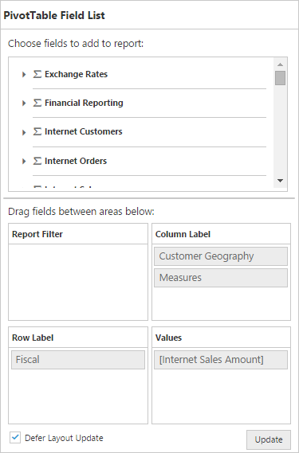

# Defer Update

I> This feature is applicable for the OLAP datasource only at server mode.

Defer update support allows you to refresh the control only on-demand and not during every UI interaction.



$(function() {
    $("#PivotGrid1").ejPivotGrid({
        url: "/OLAPService",
        afterServiceInvoke: "onServiceInvokes"
    });
});

function onServiceInvokes(args) {
    if (args.action == "initialize") $("#PivotSchemaDesigner").ejPivotSchemaDesigner({
        pivotControl: this,
        layout: ej.PivotSchemaDesigner.Layouts.Excel
    });
}



