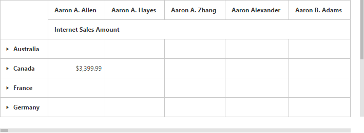

# Paging

## Pager

Paging helps you to improve the rendering performance of the pivot grid control by dividing large amount of data into sections and displaying one section at a time. You can enable the paging option in the pivot grid by setting the [`enablePaging`](/api/js/ejpivotgrid#members:enablepaging) property to true. You can provide the page size and current page details for each axis in the [`pagerOptions`](/api/js/ejpivotgrid#members:datasource-pageroptions) property.

To initialize a **Pager**, first you should define a **div** tag with an appropriate **id** attribute which acts as a container for the widget. Then, you can initialize the widget using the **ejPivotPager** method.

Inside the **ejPivotPager** method, the enumeration property mode should be set to **ej.PivotPager.Mode.Both** to display both categorical pager and series pager. The other enumerations such as **ej.PivotPager.Mode.Categorical** and **ej.PivotPager.Mode.Series** will display only the categorical pager and the series pager respectively.



<!--Create a tag which acts as a container for Pager. -->



Following are the navigation options available in the pager:

* Move first: Navigates to the first page.
* Move last: Navigates to the last page.
* Move previous: Navigates to the previous page from the current page.
* Move next: Navigates to the next page from the current page.
* Numeric box: Navigates to the desired page by entering an appropriate page number in the numeric value.

## Virtual scrolling

Virtual scrolling is a technique that allows you to view the pivot grid information page by page with the use of vertical and horizontal scrollbar. You can enable the virtual scrolling option in the pivot grid by setting the [`enableVirtualScrolling`](/api/js/ejpivotgrid#members:enablevirtualscrolling) property to true. You can provide the page size and current page details for each axis in the [`pagerOptions`](/api/js/ejpivotgrid#members:pageroptions) property.



$("#PivotGrid1").ejPivotGrid({
    dataSource: {
        //...
        pagerOptions: {
            categoricalPageSize: 3,
            seriesPageSize: 3,
            categoricalCurrentPage: 1,
            seriesCurrentPage: 1
        }
    },
    enableVirtualScrolling : true
});



## Page settings

The properties associated to paging are:

* EnablePaging: This property is used to enable/disable paging in the pivot client control.
* PagerOptions.CategoricalPageSize: Specifies the number of categorical columns to be displayed within a page of the pivot client control.
* PagerOptions.SeriesPageSize: Specifies the number of series rows to be displayed within a page of the pivot client control.
* PagerOptions.CategoricalCurrentPage: Sets the current page of the categorical axis in the pivot client control.
* PagerOptions.SeriesCurrentPage: Sets the current page of the series axis in the pivot client control.

In client mode, the page setting for categorical and series axes are needed to be set in the data source property by using the following properties:

[`categoricalPageSize`](/api/js/ejpivotgrid#members:datasource-pageroptions-categoricalpagesize) - Allows to set the number of categorical columns to be displayed in each page on applying the paging.

[`seriesPageSize`](/api/js/ejpivotgrid#members:datasource-pageroptions-seriespagesize) - Allows to set the number of series rows to be displayed in each page on applying the paging.

[`categoricalCurrentPage`](/api/js/ejpivotgrid#members:datasource-pageroptions-categoricalcurrentpage) - Allows to set the page number to be loaded in the categorical axis by default.

[`seriesCurrentPage`](/api/js/ejpivotgrid#members:datasource-pageroptions-seriescurrentpage) - Allows to set the page number to be loaded in the series axis by default.



$("#PivotGrid1").ejPivotGrid({
    dataSource: {
        //...
        pagerOptions: {
            categoricalPageSize: 3,
            seriesPageSize: 3,
            categoricalCurrentPage: 1,
            seriesCurrentPage: 1
        }
    }, enablePaging : true
});



In server mode, the page settings for categorical and series axes are done only through the report object, created in the WebAPI or WCF file.

For relational data source



PivotReport pivotReport = new PivotReport();
pivotReport.PagerOptions.SeriesPageSize = 4;
pivotReport.PagerOptions.CategoricalPageSize = 5;
pivotReport.PagerOptions.SeriesCurrentPage = 1;
pivotReport.PagerOptions.CategoricalCurrentPage = 1;



For OLAP data source



OlapReport olapReport = new OlapReport();
olapReport.CurrentCubeName = "Adventure Works";
olapReport.EnablePaging = true;
olapReport.PagerOptions.SeriesPageSize = 4;
olapReport.PagerOptions.CategoricalPageSize = 5;
olapReport.PagerOptions.CategoricalCurrentPage = 1;
olapReport.PagerOptions.SeriesCurrentPage = 1;


