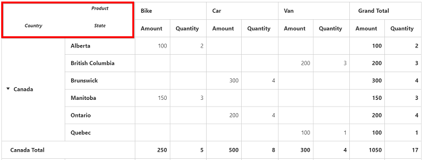
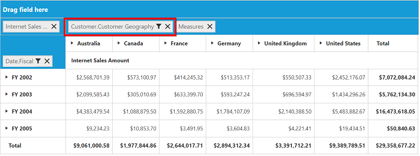
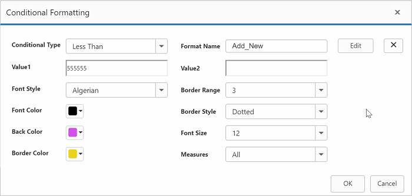
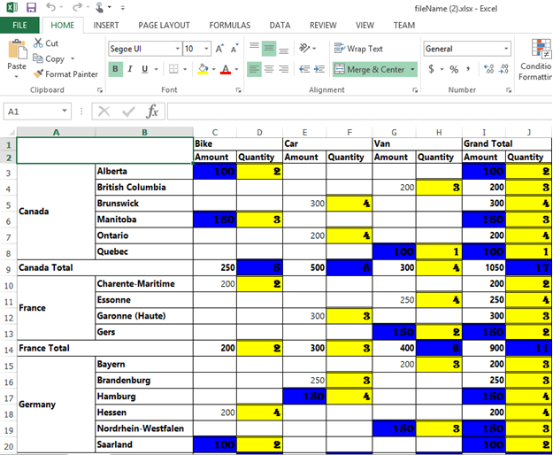

# Essential JS PivotGrid: Elements

## Hyperlink
The pivot grid control supports the hyperlink option to link data for each individual cell. The hyperlink can be enabled separately for row header, column header, value, and summary cells. The following are the respective properties and they should be declared under the property [`hyperlinkSettings`](/api/js/ejpivotgrid#members:hyperlinksettings).

* [`enableColumnHeaderHyperlink`](/api/js/ejpivotgrid#members:hyperlinksettings-enablecolumnheaderhyperlink): Enables hyperlink for column headers.
* [`enableRowHeaderHyperlink`](/api/js/ejpivotgrid#members:hyperlinksettings-enablerowheaderhyperlink): Enables hyperlink for row headers.
* [`enableSummaryCellHyperlink`](/api/js/ejpivotgrid#members:hyperlinksettings-enablesummarycellhyperlink): Enables hyperlink for the summary cell.
* [`enableValueCellHyperlink`](/api/js/ejpivotgrid#members:hyperlinksettings-enablevaluecellhyperlink): Enables hyperlink for the value cell.

Also, the hyperlink option provides separate events for row header, column header, value, and summary cells as mentioned below:

* [`columnHeaderHyperlinkClick`](/api/js/ejpivotgrid#events:columnheaderhyperlinkclick): Returns column header information through event when clicking the hyperlink.
* [`rowHeaderHyperlinkClick`](/api/js/ejpivotgrid#events:rowheaderhyperlinkclick): Returns row header information through event when clicking the hyperlink.
* [`summaryCellHyperlinkClick`](/api/js/ejpivotgrid#events:summarycellhyperlinkclick): Returns summary cell information through event when clicking the hyperlink.
* [`valueCellHyperlinkClick`](/api/js/ejpivotgrid#events:valuecellhyperlinkclick): Returns value cell information through event when clicking the hyperlink.



$(function() {

    $("#PivotGrid1").ejPivotGrid({
        //...
		hyperlinkSettings: {
            enableValueCellHyperlink: true,
            enableRowHeaderHyperlink: true,
            enableColumnHeaderHyperlink: true,
            enableSummaryCellHyperlink: true
        },
        valueCellHyperlinkClick: "CellClickEvent",
        rowHeaderHyperlinkClick: "CellClickEvent",
        columnHeaderHyperlinkClick: "CellClickEvent",
        summaryCellHyperlinkClick: "CellClickEvent",
    });

    CellClickEvent = function(evt) {
        alert("Cell click event is fired.");
    }

});



## Header Settings
The [`headerSettings`](/api/js/ejpivotgrid#members:headersettings) property allows you to enable/disable row/column header names in the pivot grid control. This feature can be enabled separately for row header and column header. The following are the respective properties:

* [`showRowItems`](/api/js/ejpivotgrid#members:headersettings-showrowitems): Allows you to enable/disable the row header names in the PivotGrid control.

* [`showColumnItems`](/api/js/ejpivotgrid#members:headersettings-showcolumnitems): Allows you to enable/disable the column header names in the PivotGrid control.



$(function() {

    $("#PivotGrid1").ejPivotGrid({
        //...
        headerSettings: {
            showRowItems: true,
            showColumnItems: true
        }
    });


## Show unique name on pivot button
The [`showUniqueNameOnPivotButton`](/api/js/ejpivotgrid#members:showUniqueNameOnPivotButton) property allows you to show the appropriate unique name in the pivot button.



$(function() {

    $("#PivotGrid1").ejPivotGrid({
        //...
        enableGroupingBar: true,
        showUniqueNameOnPivotButton: true
    });


## Selection
You can select a particular range of value cells from the pivot grid and manipulate/display them. Cell selection is applicable only for value cells, and you can enable this functionality by setting the [`enableCellSelection`](/api/js/ejpivotgrid#members:enablecellselection) property to true.

The [`cellSelection`](/api/js/ejpivotgrid#events:cellselection) event will be triggered after the selection process, that is, when the mouse left click is released. The event argument contains a collection of JSON records and header values, which contains information about selected cells.



$(function() {

    $("#PivotGrid1").ejPivotGrid({
        //...
        enableCellSelection: true,
        cellSelection: "valueCellClick"
    });

    valueCellClick = function(evt) {
        //This event lets you to perform required operation with the selected range of cells.
        cellvalue = evt.JSONRecords;
        rowheaders = evt.rowHeader;
        colheaders = evt.columnHeader;
    }
});



## Cell context
The cell context allows you to perform any custom operation by right-clicking the cell. For example, you can create and display the context menu by right-clicking the cell.

The cell context is enabled by setting the [`enableCellContext`](/api/js/ejpivotgrid#members:enablecellcontext) property to true. The [`cellContext`](/api/js/ejpivotgrid#events:cellcontext) event will be enabled by right-clicking for provided cell information through the event argument.



$(function() {

    $("#PivotGrid1").ejPivotGrid({
    	//...
        enableCellContext: true,
        cellContext: "cell_RightClick"
    });
});

cell_RightClick = function(evt) {
    //You can write your code here
}



## Conditional formatting
The conditional formatting in the pivot grid allows you to highlight particular cells with certain color, font-style, font-family, etc., based on the applied condition.  Also, the condition can be applied for certain measure alone.

The conditional formatting is enabled by setting the [`enableConditionalFormatting`](/api/js/ejpivotgrid#members:enableconditionalformatting) property to true and the formatting dialog is launched when the **"createConditionalDialog"** method is invoked.



<html>
//...

<body>
    
 

    <button id="Button1">Apply formatting</button>

   
</body>

</html>



### Export

You can export the pivot grid with highlighted particular cells along with its formatting styles.

Limitations for Word:

The following border styles are not supported:

* Solid
* Groove
* Ridge

Limitations for PDF:

Border styles are not applicable.

Limitations for Excel:

The following border styles are alone supported:

* Dashed
* Dotted
* Double

Also border size is not supported.

