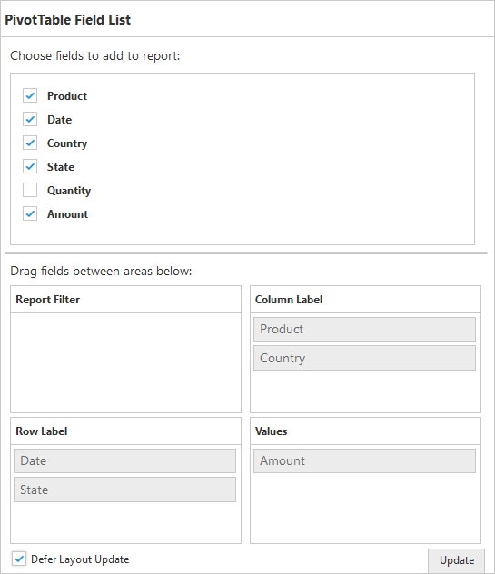

# Defer Update

I> This feature is applicable for the relational datasource only at server mode.

Defer update support allows you to refresh the control only on-demand and not during every UI interaction.



  $(function() {
      $("#PivotGrid1").ejPivotGrid({
          url: "/RelationalService",
          afterServiceInvoke: "onServiceInvokes"
      });
  });

  function onServiceInvokes(args) {
      if (args.action == "initialize")
          $("#PivotSchemaDesigner1").ejPivotSchemaDesigner({
              pivotControl: this,
              layout: ej.PivotSchemaDesigner.Layouts.Excel
          });
  }



