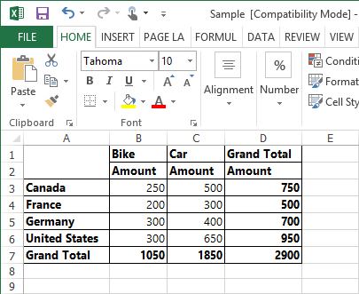
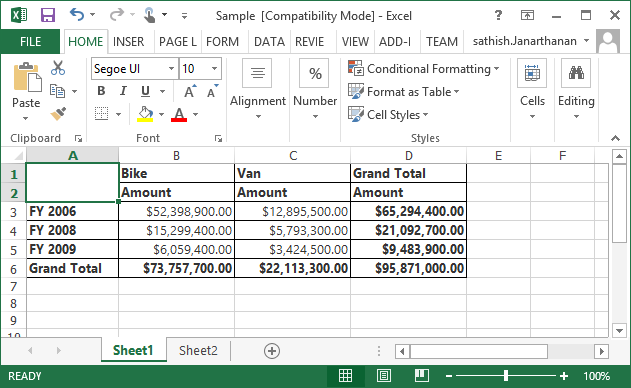
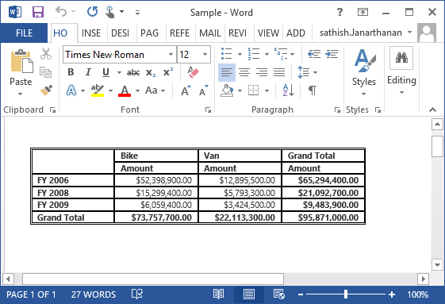
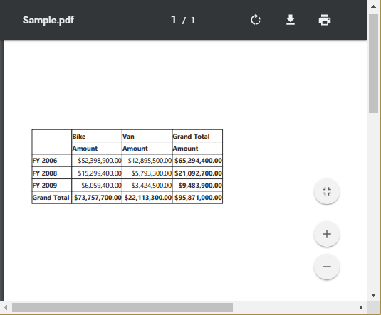

# Exporting

The following table lists the exported file format for both Client and Server Mode of Relational datasource.

<table>
<tr>
<th>
Mode
</th>
<th>
File Formats
</th>
</tr>
<tr>
<td>
Client Mode
</td>
<td>
Excel
</td>
</tr>
<tr>
<td>
Server Mode
</td>
<td>
Excel, Word and PDF
</td>
</tr>
</table>

The PivotGrid control can be exported by invoking **"exportPivotGrid"** method, with an appropriate export option as parameter.

## Client Mode

For client side, Relational datasource contents can be exported only to Excel. The document can be saved from the browser to the local disk drive for later use.

To achieve Excel export, we need to add the following dependency library into the application.

* Syncfusion.EJ.Export



<html>
//...

<body>
    //...
    

    <button id="btnExport">Export</button>
    
</body>

</html>



## Server Mode



<html>
    //...
    <body>
       //...
       

       <button id="exportBtn">Export</button>
       
    </body>
</html>                                            



For WebAPI controller, the below method needs to be added to perform exporting.



public class JSPivotGridExportController : ApiController
{
PivotGridExport pGrid = new PivotGridExport();
[System.Web.Http.ActionName("Export")]
[System.Web.Http.HttpPost]
public void Export()
{
string args = HttpContext.Current.Request.Form.GetValues(0)[0];
string fileName = "Sample";
pGrid.ExportToExcel(fileName, args, HttpContext.Current.Response);
}
}



### Excel Export
User can export contents of the PivotGrid to Excel document for future archival, references and analysis purposes. To achieve Excel export, we need to add the following dependency libraries into the application.

* Syncfusion.Compression.Base
* Syncfusion.XlsIO.Base

For Excel export, **"ej.PivotGrid.ExportOptions.Excel"** enumeration value is sent as the parameter.



function exportBtnClick(args) {
   var gridObj = $('#PivotGrid1').data("ejPivotGrid");
   gridObj.exportPivotGrid(ej.PivotGrid.ExportOptions.Excel);
}

  

### Word Export
User can export contents of the PivotGrid to Word document for future archival, references and analysis purposes. To achieve Word export, we need to add the following dependency libraries into the application.

* Syncfusion.Compression.Base
* Syncfusion.DocIo.Base

For Word export, **"ej.PivotGrid.ExportOptions.Word"** enumeration value is sent as the parameter.



function exportBtnClick(args) {
   var gridObj = $('#PivotGrid1').data("ejPivotGrid");
   gridObj.exportPivotGrid(ej.PivotGrid.ExportOptions.Word);
}



### PDF Export  
User can export contents of the PivotGrid to PDF document for future archival, references and analysis purposes. To achieve PDF export, we need to add the following dependency libraries into the application.

* Syncfusion.Compression.Base
* Syncfusion.Pdf.Base

For PDF export, **"ej.PivotGrid.ExportOptions.PDF"** enumeration value is sent as the parameter.



function exportBtnClick(args) {
   var gridObj = $('#PivotGrid1').data("ejPivotGrid");
   gridObj.exportPivotGrid(ej.PivotGrid.ExportOptions.PDF);
}

 

### Customize the export document name

The document name could be customized inside the method in WebAPI Controller. Following code sample illustrates the same.



[System.Web.Http.ActionName("Export")]
[System.Web.Http.HttpPost]
public void Export() {
    string args = HttpContext.Current.Request.Form.GetValues(0)[0];
    OlapDataManager DataManager = new OlapDataManager(connectionString);
    string fileName = " File name is customized here ";
    htmlHelper.ExportPivotGrid(DataManager, args, fileName, System.Web.HttpContext.Current.Response);
}



For customizing name in WCF Service, below code snippet is used.



public void Export(System.IO.Stream stream) {
    System.IO.StreamReader sReader = new System.IO.StreamReader(stream);
    string args = System.Web.HttpContext.Current.Server.UrlDecode(sReader.ReadToEnd()).Remove(0, 5);;
    OlapDataManager DataManager = new OlapDataManager(connectionString);
    string fileName = " File name is customized here ";
    htmlHelper.ExportPivotGrid(DataManager, args, fileName, System.Web.HttpContext.Current.Response);
}



