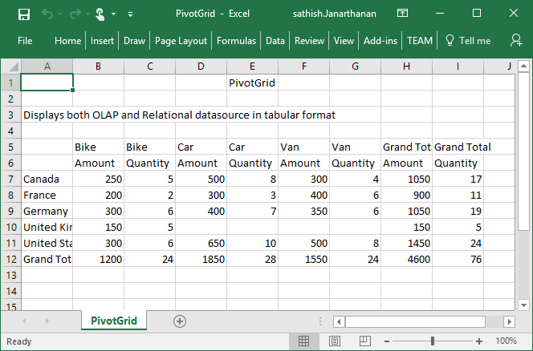

# Exporting

The PivotGrid control can be exported to the following file formats.

* Excel
* Word
* PDF
* CSV

The PivotGrid control can be exported by invoking **"exportPivotGrid"** method, with an appropriate export option as parameter.

## JSON Export

I> By default JSON export mode will be applied for server and client mode.



    

    <button id="btnExport">Export</button>
    
                                           



### Excel Export

User can export the contents of PivotGrid to an Excel document for future archival, references and analysis purposes.

To achieve Excel export, service URL and file name is sent as the parameter.



    function exportBtnClick(args)
    {
        var pGridObj = $('#PivotGrid1').data("ejPivotGrid");
        pGridObj.exportPivotGrid("http://js.syncfusion.com/demos/ejservices/api/JSPivotGridExport/ExcelExport", "fileName");
    }

  

### Word Export

User can export the contents of PivotGrid to a Word document for future archival, references and analysis purposes.

To achieve Word export, service URL and file name is sent as the parameter.



    function exportBtnClick(args)
    {
        var pGridObj = $('#PivotGrid1').data("ejPivotGrid");
        pGridObj.exportPivotGrid("http://js.syncfusion.com/demos/ejservices/api/JSPivotGridExport/WordExport", "fileName");
    }

  

### PDF Export

User can export the contents of PivotGrid to a PDF document for future archival, references and analysis purposes.

To achieve PDF export, service URL and file name is sent as the parameter.



    function exportBtnClick(args)
    {
        var pGridObj = $('#PivotGrid1').data("ejPivotGrid");
        pGridObj.exportPivotGrid("http://js.syncfusion.com/demos/ejservices/api/JSPivotGridExport/PDFExport", "fileName");
    }

  

### CSV Export

User can export the contents of PivotGrid to a CSV document for future archival, references and analysis purposes.

To achieve CSV export, service URL and file name is sent as the parameter.



    function exportBtnClick(args)
    {
        var pGridObj = $('#PivotGrid1').data("ejPivotGrid");
        pGridObj.exportPivotGrid("http://js.syncfusion.com/demos/ejservices/api/JSPivotGridExport/CSVExport", "fileName");
    }

  

### Customize the export document name

For customizing file name, we need to send file name as parameter to the **exportPivotGrid**  method along with service URL.



    function exportBtnClick(args)
    {
        var pGridObj = $('#PivotGrid1').data("ejPivotGrid");
        pGridObj.exportPivotGrid("http://js.syncfusion.com/demos/ejservices/api/JSPivotGridExport/ExcelExport", "fileName");
    }
    


## PivotEngine Export

I> This feature is applicable only at server mode operation.

In order to perform exporting with the use of PivotEngine available in server-side, the 'url' property obtained in the “beforeExport” event is set to the value "server" as shown below.



    

    <button id="btnExport">Export</button>
    
    
    </body>
</html>                                            



A service method needs to be added in WCF/WebAPI for server side operations.

For WebAPI controller, the below method needs to be added.



//...
using Syncfusion.Compression.Base;
using Syncfusion.XlsIO;
using Syncfusion.DocIO.Base;
using Syncfusion.Pdf.Base;

[System.Web.Http.ActionName("Export")]
[System.Web.Http.HttpPost]
public void Export()
{
    string args = HttpContext.Current.Request.Form.GetValues(0)[0];
    Dictionary<string, string> gridParams = serializer.Deserialize<Dictionary<string, string>>(args);
    htmlHelper.PopulateData(gridParams["currentReport"]);
    string fileName = "Sample";
    htmlHelper.ExportPivotGrid(ProductSales.GetSalesData(), args, fileName, HttpContext.Current.Response);
}



For WCF service, the below method needs to be added.



//...
using Syncfusion.Compression.Base;
using Syncfusion.XlsIO;
using Syncfusion.DocIO.Base;
using Syncfusion.Pdf.Base;

public void Export(System.IO.Stream stream)
{
    System.IO.StreamReader sReader = new System.IO.StreamReader(stream);
    string args = System.Web.HttpContext.Current.Server.UrlDecode(sReader.ReadToEnd()).Remove(0, 5);
    Dictionary<string, string> gridParams = serializer.Deserialize<Dictionary<string, string>>(args);
    htmlHelper.PopulateData(gridParams["currentReport"]);
    string fileName = "Sample";
    htmlHelper.ExportPivotGrid(ProductSales.GetSalesData(), args, fileName, System.Web.HttpContext.Current.Response);
}



### Excel Export

User can export the contents of PivotGrid to an Excel document for future archival, references and analysis purposes.

To achieve Excel export, we need to add the following dependency libraries into the application.

* Syncfusion.Compression.Base
* Syncfusion.XlsIO.Base

For Excel export, **“ej.PivotGrid.ExportOptions.Excel”** enumeration value is sent as the parameter.



function exportBtnClick(args)
{
    var pGridObj = $('#PivotGrid1').data("ejPivotGrid");
    //Setting export option as Excel in the exportPivotGrid method for ServerMode
    pGridObj.exportPivotGrid(ej.PivotGrid.ExportOptions.Excel);
}

  

### Word Export

User can export the contents of PivotGrid to a Word document for future archival, references and analysis purposes.

 To achieve Word export, we need to add the following dependency libraries into the application.

* Syncfusion.Compression.Base
* Syncfusion.DocIO.Base

For Word export, **“ej.PivotGrid.ExportOptions.Word”** enumeration value is sent as the parameter.



function exportBtnClick(args)
{
    var pGridObj = $('#PivotGrid1').data("ejPivotGrid");
    //Setting export option as Word in the exportPivotGrid method
    pGridObj.exportPivotGrid(ej.PivotGrid.ExportOptions.Word);
}



### PDF Export

User can export the contents of PivotGrid to a PDF document for future archival, references and analysis purposes.

To achieve PDF export, we need to add the following dependency libraries into the application.

* Syncfusion.Compression.Base
* Syncfusion.Pdf.Base

For PDF export, **“ej.PivotGrid.ExportOptions.PDF”** enumeration value is sent as the parameter.



function exportBtnClick(args)
{
    var pGridObj = $('#PivotGrid1').data("ejPivotGrid");
    //Setting export option as PDF in the exportPivotGrid method
    pGridObj.exportPivotGrid(ej.PivotGrid.ExportOptions.PDF);
}

 

### CSV Export

User can export the contents of PivotGrid to a CSV document for future archival, references and analysis purposes.

For CSV export, **“ej.PivotGrid.ExportOptions.CSV"** enumeration value is sent as the parameter.



function exportBtnClick(args)
{
    var pGridObj = $('#PivotGrid1').data("ejPivotGrid");
    //Setting export option as CSV in the exportPivotGrid method
    pGridObj.exportPivotGrid(ej.PivotGrid.ExportOptions.CSV);
}

 

### Customize the export document name

For customizing name in WebAPI controller, below code sample is used.



//...
using Syncfusion.Compression.Base;
using Syncfusion.XlsIO;
using Syncfusion.DocIO.Base;
using Syncfusion.Pdf.Base;

[System.Web.Http.ActionName("Export")]
[System.Web.Http.HttpPost]
public void Export()
{
    string args = HttpContext.Current.Request.Form.GetValues(0)[0];
    Dictionary<string, string> gridParams = serializer.Deserialize<Dictionary<string, string>>(args);
    htmlHelper.PopulateData(gridParams["currentReport"]);
    string fileName = " File name is customized here ";
    htmlHelper.ExportPivotGrid(ProductSales.GetSalesData(), args, fileName, HttpContext.Current.Response);
}



For customizing name in WCF Service, below code sample is used.



//...
using Syncfusion.Compression.Base;
using Syncfusion.XlsIO;
using Syncfusion.DocIO.Base;
using Syncfusion.Pdf.Base;

public void Export(System.IO.Stream stream)
{
    System.IO.StreamReader sReader = new System.IO.StreamReader(stream);
    string args = System.Web.HttpContext.Current.Server.UrlDecode(sReader.ReadToEnd()).Remove(0, 5);
    Dictionary<string, string> gridParams = serializer.Deserialize<Dictionary<string, string>>(args);
    htmlHelper.PopulateData(gridParams["currentReport"]);
    string fileName = " File name is customized here ";
    htmlHelper.ExportPivotGrid(ProductSales.GetSalesData(), args, fileName, System.Web.HttpContext.Current.Response);
}



The below screenshot shows the PivotGrid control exported to Excel document.

The below screenshot shows the PivotGrid control exported to Word document.

The below screenshot shows the PivotGrid control exported to PDF document.

The below screenshot shows the PivotGrid control exported to CSV document.

