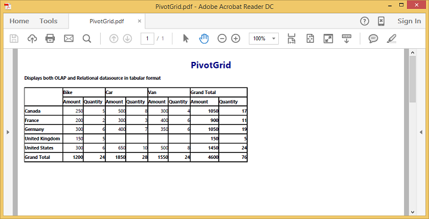

# Exporting

The pivot grid control can be exported to the following file formats:

* Microsoft Excel
* Microsoft Word
* PDF
* CSV

The pivot grid control can be exported by invoking the [`exportPivotGrid`](/api/js/ejpivotgrid#methods:exportpivotgrid) public method, with an appropriate export option as a parameter.

## JSON export

I> By default, the JSON export mode will be applied for server and client modes.



    

    <button id="btnExport">Export</button>

    



### Excel export

You can export the contents of the pivot grid to a Microsoft Excel document for future archival, references, and analysis purposes.

To achieve Excel export, the service URL and the file name are set as parameters.



    function exportBtnClick(args)
    {
        var pGridObj = $('#PivotGrid1').data("ejPivotGrid");
        pGridObj.exportPivotGrid("https://js.syncfusion.com/ejservices/api/PivotGrid/Olap/ExcelExport", "fileName");
    }



### Word export

You can export the contents of the pivot grid to a Word document for future archival, references, and analysis purposes.

To achieve Word export, the service URL and the file name are set as parameters.



    function exportBtnClick(args)
    {
        var pGridObj = $('#PivotGrid1').data("ejPivotGrid");
        pGridObj.exportPivotGrid("https://js.syncfusion.com/ejservices/api/PivotGrid/Olap/WordExport", "fileName");
    }



### PDF export

You can export the contents of the pivot grid to a PDF document for future archival, references, and analysis purposes.

To achieve PDF export, the service URL and the file name are set as parameters.



    function exportBtnClick(args)
    {
        var pGridObj = $('#PivotGrid1').data("ejPivotGrid");
        pGridObj.exportPivotGrid("https://js.syncfusion.com/ejservices/api/PivotGrid/Olap/PDFExport", "fileName");
    }



### CSV export

You can export the contents of the pivot grid to a CSV document for future archival, references, and analysis purposes.

To achieve CSV export, the service URL and the file name are set as parameters.



    function exportBtnClick(args)
    {
        var pGridObj = $('#PivotGrid1').data("ejPivotGrid");
        pGridObj.exportPivotGrid("https://js.syncfusion.com/ejservices/api/PivotGrid/Olap/CSVExport", "fileName");
    }



### Customize the export document name

For customizing the file name, you should set the file name as parameter to **exportPivotGrid**  method along with the service URL.



    function exportBtnClick(args)
    {
        var pGridObj = $('#PivotGrid1').data("ejPivotGrid");
        pGridObj.exportPivotGrid("https://js.syncfusion.com/ejservices/api/PivotGrid/Olap/ExcelExport", "fileName");
    }



## PivotEngine export

I> This feature is applicable only at the server mode operation.

To perform exporting with the use of PivotEngine available in the server-side, the 'exportMode' property that is obtained in the “beforeExport” event is set to the "ej.PivotGrid.ExportMode.PivotEngine" value as shown below:



    

    <button id="btnExport">Export</button>

    
    </body>
</html>



A service method should be added to the WCF/WebAPI for server side operations.

For WebAPI controller, the following method needs to be added:



//...
using Syncfusion.Compression.Base;
using Syncfusion.XlsIO;
using Syncfusion.DocIO.Base;
using Syncfusion.Pdf.Base;

[System.Web.Http.ActionName("Export")]
[System.Web.Http.HttpPost]
public void Export()
{
    string args = HttpContext.Current.Request.Form.GetValues(0)[0];
    Dictionary<string, string> gridParams = serializer.Deserialize<Dictionary<string, string>>(args);
    htmlHelper.PopulateData(gridParams["currentReport"]);
    string fileName = "Sample";
    htmlHelper.ExportPivotGrid(ProductSales.GetSalesData(), args, fileName, HttpContext.Current.Response);
}



For WCF service, the following method needs to be added:



//...
using Syncfusion.Compression.Base;
using Syncfusion.XlsIO;
using Syncfusion.DocIO.Base;
using Syncfusion.Pdf.Base;

public void Export(System.IO.Stream stream)
{
    System.IO.StreamReader sReader = new System.IO.StreamReader(stream);
    string args = System.Web.HttpContext.Current.Server.UrlDecode(sReader.ReadToEnd()).Remove(0, 5);
    Dictionary<string, string> gridParams = serializer.Deserialize<Dictionary<string, string>>(args);
    htmlHelper.PopulateData(gridParams["currentReport"]);
    string fileName = "Sample";
    htmlHelper.ExportPivotGrid(ProductSales.GetSalesData(), args, fileName, System.Web.HttpContext.Current.Response);
}



### Excel export

You can export the contents of the pivot grid to an Excel document for future archival, references, and analysis purposes.

To achieve Excel export, you should add the following dependency libraries to the application.

* Syncfusion.Compression.Base
* Syncfusion.XlsIO.Base

For Excel export, the **“ej.PivotGrid.ExportOptions.Excel”** enumeration value is set as parameter.



function exportBtnClick(args)
{
    var pGridObj = $('#PivotGrid1').data("ejPivotGrid");
    //Setting export option as Excel in the exportPivotGrid method for ServerMode
    pGridObj.exportPivotGrid(ej.PivotGrid.ExportOptions.Excel);
}



### Word export

You can export the contents of the pivot grid to a Word document for future archival, references, and analysis purposes.

 To achieve Word export, you should add the following dependency libraries to the application.

* Syncfusion.Compression.Base
* Syncfusion.DocIO.Base

For Word export, the **“ej.PivotGrid.ExportOptions.Word”** enumeration value is set as parameter.



function exportBtnClick(args)
{
    var pGridObj = $('#PivotGrid1').data("ejPivotGrid");
    //Setting export option as Word in the exportPivotGrid method
    pGridObj.exportPivotGrid(ej.PivotGrid.ExportOptions.Word);
}



### PDF export

You can export the contents of the pivot grid to a PDF document for future archival, references, and analysis purposes.

To achieve PDF export, you can add the following dependency libraries to the application.

* Syncfusion.Compression.Base
* Syncfusion.Pdf.Base

For PDF export, the **“ej.PivotGrid.ExportOptions.PDF”** enumeration value is set as parameter.



function exportBtnClick(args)
{
    var pGridObj = $('#PivotGrid1').data("ejPivotGrid");
    //Setting export option as PDF in the exportPivotGrid method
    pGridObj.exportPivotGrid(ej.PivotGrid.ExportOptions.PDF);
}



### CSV export

You can export the contents of the pivot grid to a CSV document for future archival, references, and analysis purposes.

For CSV export, the **“ej.PivotGrid.ExportOptions.CSV"** enumeration value is set as parameter.



function exportBtnClick(args)
{
    var pGridObj = $('#PivotGrid1').data("ejPivotGrid");
    //Setting export option as CSV in the exportPivotGrid method
    pGridObj.exportPivotGrid(ej.PivotGrid.ExportOptions.CSV);
}



### File format selection

I> This option is applicable only for the pivot grid when exporting to Excel document.

You can set this option for exporting the widget to Excel document either in *.xls* or *.xlsx* format by using the `fileFormat` property in the `beforeExport` event.

N> By default, the excel document will be exported to ".xls" format using the PivotEngine export.



$("#PivotGrid1").ejPivotGrid({
    //..
    beforeExport: "Export"
});

function Export(args) {
    args.exportMode = ej.PivotGrid.ExportMode.PivotEngine;
    args.fileFormat = ".xlsx"; //you can set the excel sheet format here
}

 

### Customize the export document name

For customizing name in the WebAPI controller, the below code sample is used:



//...
using Syncfusion.Compression.Base;
using Syncfusion.XlsIO;
using Syncfusion.DocIO.Base;
using Syncfusion.Pdf.Base;

[System.Web.Http.ActionName("Export")]
[System.Web.Http.HttpPost]
public void Export()
{
    string args = HttpContext.Current.Request.Form.GetValues(0)[0];
    Dictionary<string, string> gridParams = serializer.Deserialize<Dictionary<string, string>>(args);
    htmlHelper.PopulateData(gridParams["currentReport"]);
    string fileName = " File name is customized here ";
    htmlHelper.ExportPivotGrid(ProductSales.GetSalesData(), args, fileName, HttpContext.Current.Response);
}



For customizing name in the WCF Service, the below code sample is used:



//...
using Syncfusion.Compression.Base;
using Syncfusion.XlsIO;
using Syncfusion.DocIO.Base;
using Syncfusion.Pdf.Base;

public void Export(System.IO.Stream stream)
{
    System.IO.StreamReader sReader = new System.IO.StreamReader(stream);
    string args = System.Web.HttpContext.Current.Server.UrlDecode(sReader.ReadToEnd()).Remove(0, 5);
    Dictionary<string, string> gridParams = serializer.Deserialize<Dictionary<string, string>>(args);
    htmlHelper.PopulateData(gridParams["currentReport"]);
    string fileName = " File name is customized here ";
    htmlHelper.ExportPivotGrid(ProductSales.GetSalesData(), args, fileName, System.Web.HttpContext.Current.Response);
}



## Exporting customization

You can add title and description to the exporting document by using the title and description properties respectively obtained in the `beforeExport` event. Similarly, you can enable or disable styling on the exported document by using the `exportWithStyle` property.


<html>
    //...
<body>
    //...
    

    <button id="btnExport">Export</button>

</body>
</html>



You can also edit the exporting document with the use of a server-side event for the required exporting option.



//...
using Syncfusion.EJ.Export;
using Syncfusion.Compression.Base;
using Syncfusion.XlsIO;
using Syncfusion.DocIO.Base;
using Syncfusion.Pdf.Base;

 //Following service method needs to be added in the WebAPI for JSON export.

[System.Web.Http.ActionName("ExcelExport")]
[System.Web.Http.HttpPost]
public void ExcelExport()
{
    PivotGridExcelExport pGrid = new PivotGridExcelExport();
    pGrid.ExcelExport += pGrid_ExcelExport;
    string args = HttpContext.Current.Request.Form.GetValues(0)[0];
    pGrid.ExportToExcel(string.Empty, args, HttpContext.Current.Response);
}

void pGrid_ExcelExport(object sender, Syncfusion.XlsIO.IWorkbook workBook)
{
    //You can customize exporting document here.
}
[System.Web.Http.ActionName("PdfExport")]
[System.Web.Http.HttpPost]
public void PdfExport()
{
    PivotGridPDFExport pGrid = new PivotGridPDFExport();
    pGrid.AddPDFHeaderFooter += pGrid_AddPDFHeaderFooter;
    pGrid.PDFExport += pGrid_PDFExport;
    string args = HttpContext.Current.Request.Form.GetValues(0)[0];
    pGrid.ExportToPDF(string.Empty, args, HttpContext.Current.Response);
}

void pGrid_PDFExport(object sender, Syncfusion.Pdf.PdfDocument pdfDoc)
{
    //You can customize exporting document here.
}

void pGrid_AddPDFHeaderFooter(object sender, Syncfusion.Pdf.PdfDocument pdfDoc)
{
    //You can add header/footer information to the PDF document.
}

[System.Web.Http.ActionName("WordExport")]
[System.Web.Http.HttpPost]
public void WordExport()
{
    PivotGridWordExport pGrid = new PivotGridWordExport();
    pGrid.WordExport += pGrid_WordExport;
    string args = HttpContext.Current.Request.Form.GetValues(0)[0];
    pGrid.ExportToWord(string.Empty, args, HttpContext.Current.Response);
}

void pGrid_WordExport(object sender, Syncfusion.DocIO.DLS.WordDocument document)
{
    //You can customize exporting document here.
}

[System.Web.Http.ActionName("CsvExport")]
[System.Web.Http.HttpPost]
public void CsvExport()
{
    PivotGridCSVExport pGrid = new PivotGridCSVExport();
    pGrid.CSVExport += pGrid_CSVExport;
    string args = HttpContext.Current.Request.Form.GetValues(0)[0];
    pGrid.ExportToCSV(string.Empty, args, HttpContext.Current.Response);
}

void pGrid_CSVExport(object sender, string csvString)
{
    //You can customize exporting document here.
}

//Following service method needs to be added in the WCF/WebAPI for PivotEngine export.

[System.Web.Http.ActionName("Export")]
[System.Web.Http.HttpPost]
public void Export()
{
    string args = HttpContext.Current.Request.Form.GetValues(0)[0];
    Dictionary<string, string> gridParams = serializer.Deserialize<Dictionary<string, string>>(args);
    htmlHelper.PopulateData(gridParams["currentReport"]);
    htmlHelper.ExcelExport += htmlHelper_ExcelExport;
    htmlHelper.WordExport += htmlHelper_WordExport;
    htmlHelper.AddPDFHeaderFooter += htmlHelper_AddPDFHeaderFooter;
    htmlHelper.PDFExport += htmlHelper_PDFExport;
    htmlHelper.CSVExport += htmlHelper_CSVExport;
    string fileName = "Sample";
    htmlHelper.ExportPivotGrid(ProductSales.GetSalesData(), args, fileName, System.Web.HttpContext.Current.Response);
}

void htmlHelper_ExcelExport(object sender, Syncfusion.XlsIO.IWorkbook workBook)
{
    //You can customize exporting document here.
}
void htmlHelper_WordExport(object sender, Syncfusion.DocIO.DLS.WordDocument document)
{
    //You can customize exporting document here.
}
void htmlHelper_AddPDFHeaderFooter(object sender, Syncfusion.Pdf.PdfDocument pdfDoc)
{
    //You can add header/footer information to the PDF document.
}
void htmlHelper_PDFExport(object sender, Syncfusion.Pdf.PdfDocument pdfDoc)
{
    //You can customize exporting document here.
}
void htmlHelper_CSVExport(object sender, string csvString)
{
    //You can customize exporting document here.
}



### Exporting complete data on Paging

When paging is enabled, you can export the complete data by enabling the [enableCompleteDataExport](/api/js/ejpivotclient#members:enablecompletedataexport) property. It is supported in both types of JSON and PivotEngine export and it is applicable for all kinds of exporting formats available in PivotGrid.


<html>
    

    //...
    
</html>



The following screenshot shows the pivot grid control exported to the Excel document:

The following screenshot shows the pivot grid control exported to the Word document:

The following screenshot shows the pivot grid control exported to the PDF document:

The following screenshot shows the pivot grid control exported to the CSV document:

N> Grand total and sub-totals can be hidden while exporting the document.