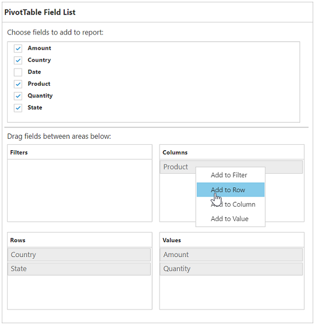

# PivotTable field list

## Initialization
The field list, also known as Pivot Schema Designer, allows you to add, rearrange, filter, and remove fields to show the data in the pivot grid as exactly you want.

Based on the data source and relational bound to the pivot grid control, the PivotTable field list will be automatically populated with the cube information or field names. The PivotTable field list provides an Excel like appearance and behavior.

To initialize the PivotTable field list, first you should define a “div” tag with an appropriate “id” attribute which acts as a container for the widget. Then, you can initialize the PivotTable field list by using the **“ejPivotSchemaDesigner”** method.

### Client mode



<html>
//...

<body>

    <!--Create a tag which acts as a container for PivotGrid-->
    

    <!--Create a tag which acts as a container for PivotTable Field List-->
    

    

</body>

</html>



### Server mode



<html>
//...

<body>

    <!--Create a tag which acts as a container for PivotGrid-->
    

    <!--Create a tag which acts as a container for PivotTable Field List-->
    

    

    
</body>

</html>



N> The [`url`](/api/js/ejpivotschemadesigner#members:url) property is used to connect the service by using the specified URL for any server updates.

## Service Method Settings
The [`serviceMethods`](/api/js/ejpivotschemadesigner#members:servicemethods) allows the user to set custom name for service methods at service-end.





The following table will explain the available service methods in the pivot schema designer:

| Service Methods | Description |
|---|---|
|[fetchMembers](/api/js/ejpivotschemadesigner#members:servicemethod-fetchmembers)|It is responsible for getting the values for the tree-view in the filter dialog.|
|[filtering](/api/js/ejpivotschemadesigner#members:servicemethod-filtering)|It is responsible for filtering operation in the field list.|
|[memberExpand](/api/js/ejpivotschemadesigner#members:servicemethod-memberexpand)|It is responsible for the server-side action when expanding members in the field list.|
|[nodeDropped](/api/js/ejpivotschemadesigner#members:servicemethod-nodedropped)|It is responsible for the server-side action when dropping a node into the field list.|
|[nodeStateModified](/api/js/ejpivotschemadesigner#members:servicemethod-nodestatemodified)|It is responsible for the server-side action when changing the checked state of a node in the field list.|
|[removeButton](/api/js/ejpivotschemadesigner#members:servicemethod-removebutton)|It is responsible for button removing operation in the field list.|

N> The [`customObject`](/api/js/ejpivotschemadesigner#members:customobject) property in pivot schema designer is used to pass additional information between the client-end and the service-end.

## Layout
The top portion of the layout shows field or cube items in a categorized way. They can be dynamically added to the report either by drag and drop option or through the simple check box selection.

On item(s) selection, they will be placed in the row section except numeric based item(s) or measures, which will alone be placed in the value section, by default.

The bottom portion of the layout is segregated as follows:

* Report filter: Filters an item(s) placed in the particular position of the layout.
* Value section: The value label usually displays the numeric value item(s) present in the report.
* Column section: Displays the item(s) as column header and values in the pivot grid control.
* Row section: Displays the item(s) as row header and values in the pivot grid control.

### Height of the pivot schema designer
The [`height`](/api/js/ejpivotschemadesigner#members:height) property is used to set the height of the pivot schema designer.



$("#PivotSchemaDesigner1").ejPivotSchemaDesigner({

     height: "630px"

     });



### Width of the pivot schema designer
The [`width`](/api/js/ejpivotschemadesigner#members:width) property is used to set the width of the pivot schema designer.



$("#PivotSchemaDesigner1").ejPivotSchemaDesigner({

     width: "415px"

     });



### Types of layout in pivot schema designer
The [`layout`](/api/js/ejpivotschemadesigner#members:layout) property is used to set the layout for pivot schema designer. The following table will explain the available types in the pivot schema designer along with the pivot grid.

| Layout | Description |
|---|---|
|Excel|To set the layout as same in the Excel.|
|Normal|To set normal layout for the field list.|

## UI interactions

### By drag and drop

You can alter the report on fly through the drag-and-drop operation. You can drag any item from the field list and drop it into the column, row, value, or filter section available at the bottom of the field list.

N> You can enable/disable the drag and drop operation by using the [`enableDragDrop`](/api/js/ejpivotschemadesigner#members:enabledragdrop) property.

### By drag and drop to grid headers

You can also drag and drop elements from the field list to grid headers.

### By tree view selection

You can alter the report on fly through the check and uncheck option as an alternate. By default, fields will be added to the row label when checked.

### By context menu

You can also alter the report by using the context menu.

## Searching values
The search option in the field list allows you to search a specific value that needs to be filtered from the list of values in the filter pop-up window.

## Filtering
Values can be filtered by checking/unchecking the check box besides them, in the filter pop-up window. At least, one value should be present in checked state while filtering. Otherwise “Ok” will be disabled.

## Defer update
Defer update in the field list allows you to refresh the control on-demand and not during every UI operation. This operation can be enabled/disabled through [`enableDeferUpdate`](/api/js/ejpivotgrid#members:enabledeferupdate) property internally.

