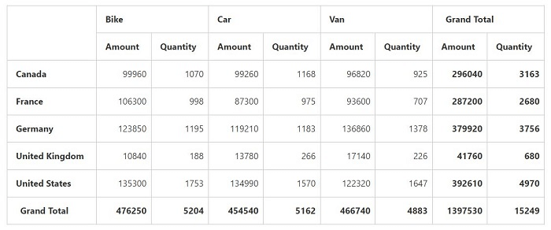

# Value sorting

I> This feature is applicable for the relational data source.

The value sorting allows you to sort columns and rows based on value fields.

The headers of the column to be sorted are given in the [`headerText`](/api/js/ejpivotgrid#members:valueSortSettings-headerText) property under [`valueSortSettings`](/api/js/ejpivotgrid#members:valueSortSettings) in field wise order, separated by a string.  The string which is used to separate the headers is given in the [`headerDelimiters`](/api/js/ejpivotgrid#members:valueSortSettings-headerDelimiters) property.
Also, you can sort the column by clicking the column header. By clicking the same header once again, will reverse the sorting direction. The sorting operation is performed by this property [`sortOrder`](/api/js/ejpivotgrid#members:valueSortSettings-sortOrder)



  



The below screenshot shows pivot grid before applying value sorting.

The below screenshot shows pivot grid after applying value sorting.

