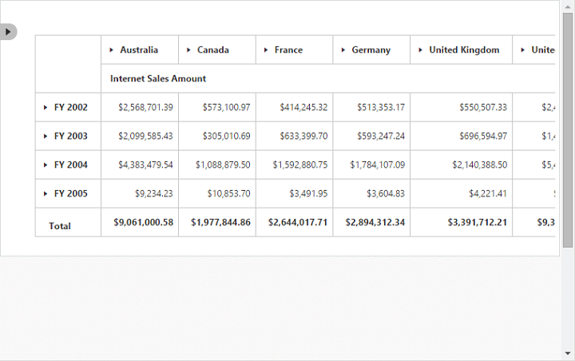
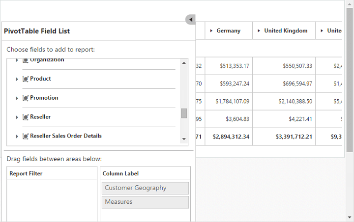

# Responsive

PivotGrid and PivotTable field list control supports responsive rendering based on the target device (desktop and tablet) resolution. It supports resolution upto 1024x600. You can enable the responsiveness in PivotGrid by setting the [`isResponsive`](/api/js/ejpivotgrid#members:isresponsive) property to true.

On resizing the browser, the PivotTable field list will get collapse and an icon will appear on the left-hand side of the browser. You can toggle its view and perform the UI interaction.



$(function() {
    $("#PivotGrid1").ejPivotGrid({
        url: "/OLAPService",
        isResponsive: true
    });
});



_Normal PivotGrid_
{:.caption}

_Responsive PivotGrid_
{:.caption}

_Responsive PivotTable Field List - Collapsed_
{:.caption}

_Responsive PivotTable Field List - Expanded_
{:.caption}

