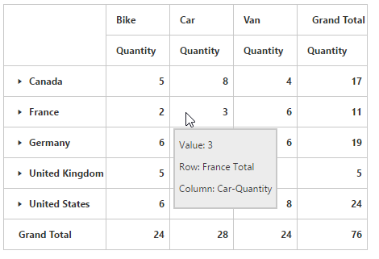

# ToolTip

Allows you to display details of the cell on hovering value cells. By default, the tooltip is enabled. You can disable the tooltip in the pivot grid by setting the [`enableToolTip`](/api/js/ejpivotgrid#members:enabletooltip)  property to false.



    $(function() {
        $("#PivotGrid1").ejPivotGrid({
             //..
             enableToolTip:false
        });
    });



## Tooltip animation

The pivot grid provides option to animate the tooltip that is displayed in the grid. The animation enhances the appearance of tooltip by displaying it slowly. You can enable the animation in the tooltip by setting the [`enableToolTipAnimation`](/api/js/ejpivotgrid#members:enabletooltipanimation) property to true.



    $(function() {
        $("#PivotGrid1").ejPivotGrid({
            //..
            enableToolTipAnimation: true
        });
    });


