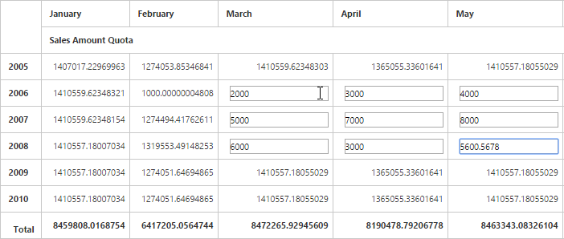

# Write-back

I> This feature is applicable only for OLAP datasource only at Server Mode.

We can now edit the values in PivotGrid and update a write enabled Cube at the back-end (SSAS) dynamically at runtime.

N> Write-back is only supported for measures that use the **SUM** aggregation.



$(function() {
    $("#PivotGrid1").ejPivotGrid({
        ...
        ...
        enableCellEditing : true
    });
});





public Dictionary < string, object > WriteBack(string action, string value, string rowUniqueName, string columnUniqueName, string currentReport) {
    OlapDataManager DataManager = new OlapDataManager(connectionString);
    DataManager.SetCurrentReport(Syncfusion.JavaScript.Olap.Utils.DeserializeOlapReport(currentReport));
    return htmlHelper.GetJsonData(action, DataManager, value, rowUniqueName, columnUniqueName);
}
        


